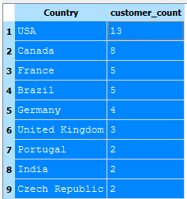

# UE03-01-A-Ranking Table

!!! example "Aufgabe"

     Mit SQLite-**chinook.db**:
     
     Erstellen Sie eine Tabelle, welche jedes Land auflistet mit der Anzahl der Kunden in diesem Land. Sie sollen nur Länder auflisten, welche mehr als einen Kunden haben. Die Liste soll in absteigender Form dargestellt werden, d.h. das Land mit den meisten Kunden steht an erster Stelle.

     Verwenden Sie dazu die SQL-Befehle **GROUP BY** und **HAVING**. Die Informationen finden Sie in der Tabelle *customers*.

??? abstract "Antwort "
    <figure markdown="span">
    { width="300" align=right }
    <figcaption>Output SQLite-Browser</figcaption>
    </figure>


??? success "Lösungsvorschlag"

    ```sql
    SELECT country,count(CustomerId) AS customer_count FROM customers 
    GROUP BY country HAVING customer_count > 1 
    ORDER BY customer_count DESC;
    ```

## GROUP BY und Aggregatfunktionen in SQL
!!! info "Beachte !"

    Experimentieren Sie mit dem Befehl *GROUP BY* !

    Sie stellen fest: *GROUP BY* liefert nur dann sinnvolle Ergebnisse, wenn die anzuzeigenden Attribute für einen GROUP BY-Output geeignet sind. 
    
    Was heisst das? 
    
    Eine GROUP-BY-Anweisung fasst Records zusammen. Hier also alle Kunden, welche zu einem bestimmten Land gehören (..GROUP BY country..). Das Land wird nur 1x angezeigt also muss auch das Attribut zu diesem Land mit einem "Wert" angezeigt werden können, in unserem Fall also die Anzahl der Kunden. Im Zusammenhang mit GROUP BY wird also immer auch eine **Aggregatsfunktion** verwendet. In diesem Fall hier der `COUNT()`-Befehl, welchen wir im SELECT ... definieren. 
    
    **Beachten Sie dazu auch die Frage 5 von  UE02-2: Hier ist die Aggregatsfunktion SUM().**

    AGGREGATFUNKTIONEN IN SQL:

    |Aggregatfunktion in SQL| Beschreibung                          |
    | --------------------- | ------------------------------------- |
    | `AVG()`                 | :material-check: Mittelwert, ermittelt über alle Zeilen       |
    | `COUNT()`               | :material-check: Anzahl aller Zeilen |
    | `MAX()`                 | :material-check:     Maximalwert aller Zeilen |
    | `MIN()`                 | :material-check:     Minimalwert aller Zeilen |
    | `SUM()`                 | :material-check:     Summenwert, summiert über alle Zeilen |

    BEISPIEL:

    SELECT Persnr, Name, 13 * Gehalt + 1000 * (Bonuslevel) **AS Jahresgehalt** FROM Personal;

    SELECT SUM(12 * Gehalt +1000 * (Bonuslevel)) **AS Jahrespersonalkosten** FROM Personal ;

    Studieren Sie zum GROUP BY-Befehl weitere Beispiele! ChatGPT liefert Ihnen dazu gute Beispiele...

## UE03-01-B-View definieren


!!! example "View definieren"

    Erstellen Sie eine View dieser Ranking-Tabelle von oben mit dem Namen *customer_ranking* !
    Überprüfen Sie das Resultat anschliessend mit
    
    SELECT * FROM customer_ranking;


??? success "Lösungsvorschlag"

    ```sql
    CREATE VIEW customer_ranking AS
       SELECT country,count(CustomerId) AS customer_count FROM customers 
          GROUP BY country HAVING customer_count > 1 
          ORDER BY customer_count DESC;
    ```

    Der Test mit

    ```sql
    SELECT * FROM customer_ranking;
    ```

    muss dasselbe  Resultat liefern wie

    ```sql
    SELECT country,count(CustomerId) AS customer_count FROM customers 
       GROUP BY country HAVING customer_count > 1 
       ORDER BY customer_count DESC;
    ```

    Result:

       <figure markdown="span">
    { width="300" align=right }
    <figcaption>Output SQLite-Browser</figcaption>
    </figure>
