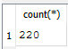
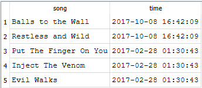
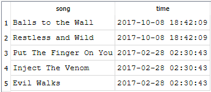
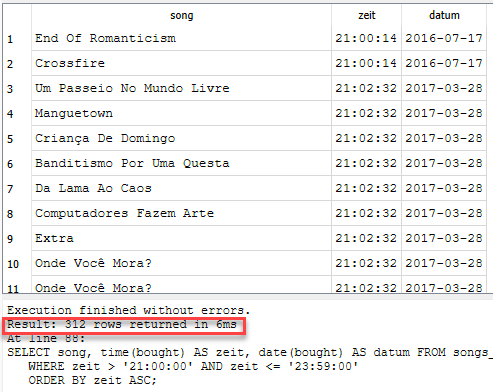
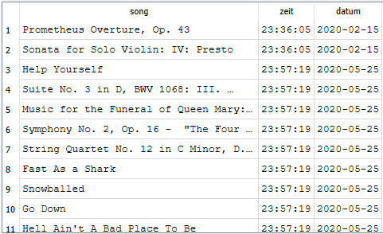
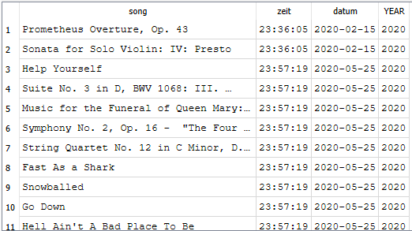

# UE03-02 - Datum und Zeit

!!! example "SQLs mit Datum und Zeiten anwenden"

     Mit SQLite-**chinook_v2.db**:
     
     Die Tabelle *songs_bought* besteht aus zwei Spalten: Name und Zeitpunkt des Verkaufs. Schreibe Sie nun die benötigten Queries, wenn folgendes Abfragen erreicht werden sollen:

     1. Wie viele Verkäufe gab es im Jahre 2020?
     2. Beim Anzeigen der Verkäufe soll die UTC-Zeit in schweizerische Lokalzeit angezeigt werden
     3. Alle Verkäufe zwischen 21:00 und 23:59 sollen angezeigt werden
     4. Alle Verkäufe zwischen 21:00 und 23:59 im Jahre 2020 sollen angezeigt werden
     
     Hinweis: Die Tabelle *songs_bought* wurde neu hinzugefügt - verwende dazu die Version *chinook_v2.db*.

??? abstract "Antworten"
    1. Wie viele Verkäufe gab es im Jahre 2020
    <figure markdown="span">
    { width="200" align=right }
    <figcaption>Output SQLite-Browser</figcaption>
    </figure>
    2. Beim Anzeigen der Verkäufe soll die UTC-Zeit in Lokalzeit-Schweiz angezeigt werden
    <figure markdown="span">
    { width="300" align=right }
    <figcaption>Anzeige des Datums wie in der DB abgespeichert</figcaption>
    { width="300" align=right }
    <figcaption>und nun konvertiert in Schweizerzeit. </figcaption>
    </figure>
    Beachte die Zeitdifferenz von einer Stunde im Februar. Warum? Februar ist Winterzeit!
    3. Alle Verkäufe zwischen 21:00 und 23:59, hier sortiert nach aufsteigender Zeit:
    <figure markdown="span">
    { width="400" align=right }
    <figcaption>Alle Verkäufe zwischen 21:00:00 und 23:59:00</figcaption>
    </figure>
    4. Alle Verkäufe zwischen 21:00 und 23:59 im Jahre 2020
    <figure markdown="span">
    { width="400" align=right }
    <figcaption>dito, nur fürs Jahr 2020, sortiert datum und zeit ASC</figcaption>
    </figure>


??? success "Lösungsvorschläge"
    
    1. Wie viele Verkäufe gab es im Jahre 2020
    ```sql
    SELECT count(*) FROM songs_bought WHERE bought > '2020-01-01 00:00:00' and bought < '2021-01-01 00:00:00'
    ```

    2. Beim Anzeigen der Verkäufe soll die UTC-Zeit in schweizerische Lokalzeit angezeigt werden
    ```sql
    -- show time as saved in Database
    SELECT song, datetime(bought) AS time FROM songs_bought LIMIT 5;
    ```
    ```sql
    -- show time converted in localtime
    SELECT song, datetime(bought,'localtime') AS time FROM songs_bought LIMIT 5;
    ```


    3. Alle Verkäufe zwischen 21:00 und 23:59
    ```sql
    SELECT song, time(bought) AS zeit, date(bought) AS datum FROM songs_bought
    WHERE zeit > '21:00:00' AND zeit <= '23:59:00'
    ORDER BY zeit ASC;
    ```

    4. Alle Verkäufe zwischen 21:00 und 23:59 im Jahre 2020
    ```sql
    SELECT song, time(bought) AS zeit, date(bought) AS datum FROM songs_bought
    WHERE zeit > '21:00:00' AND zeit <= '23:59:00' AND datum > '2020-01-01' AND datum < '2021-01-01'
    ORDER BY datum ASC, zeit ASC;
    ```
    mit extrahiertem Jahr - nur als Anschauung, wie man einen Substring in einem Attribut verwenden kann:
    ```sql
    SELECT song, time(bought) AS zeit, date(bought) AS datum, substr(bought,1,4) AS YEAR FROM songs_bought
    WHERE zeit > '21:00:00' AND zeit <= '23:59:00' AND YEAR = '2020'
    ORDER BY datum ASC, zeit ASC;
    ```
    <figure markdown="span">
    { width="400" align=right }
    <figcaption>Jahr extrahiert vom datum</figcaption>
    </figure>


