# CSV in SQLite-DB

!!! example "Überführung einer CSV-Datei in eine SQLite Datenbank"

    Überführen Sie die CSV Dateien *NEW_PLZ1* und *NEW_STR* (Aufgabe UE01-1, Punkt 3) in eine SQLite Datenbank.
    Verwenden Sie dazu die Import-Funktion des DB Browsers for SQLite.
    Benennen Sie die Spalten gemäss Beschreibung der Post. Sie können dazu die Funktion *Modify Table* im DB Browser verwenden.

??? abstract "SQLite-Import-Schritte für CSV-Dateien"

    Jede importierte CSV-Datei kreiert automatisch eine Tabelle in SQLite. Auf diese Tabellen werden wir dann SQL-Befehle anwenden.

    1. Kreieren Sie eine neue Datenbank und vergeben Sie einen beliebigen Namen
    <figure markdown="span">
    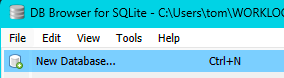{ width="400" align=right }
    <figcaption>.</figcaption>
    </figure>
    2. Die Tabellen lassen wir durch den Import generieren, daher hier Cancel klicken
    <figure markdown="span">
    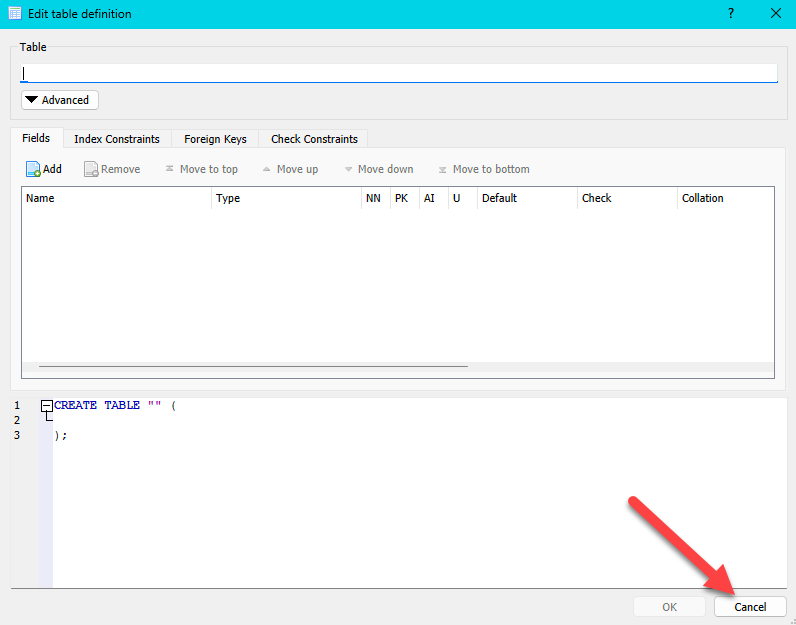{ width="400" align=right }
    <figcaption>.</figcaption>
    3. Wir sehen hier, dass noch keine Tabelle für die DB existiert. Den DB-Namen haben Sie im vorherigen Schritt vergeben.
    <figure markdown="span">
    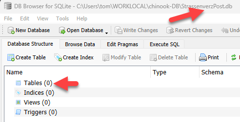{ width="400" align=right }
    <figcaption>.</figcaption>
    </figure>
    4. Import der CSV-Datei, welche daraus eine Tabelle erstellt
    <figure markdown="span">
    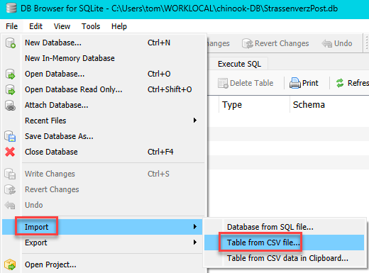{ width="400" align=right }
    <figcaption>.</figcaption>
    </figure>
    5. Wählen Sie NEW_PLZ1
    <figure markdown="span">
    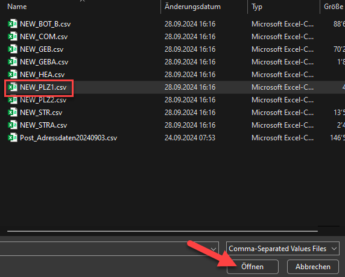{ width="400" align=right }
    <figcaption>.</figcaption>
    </figure>
    6. Empfohlene Einstellungen für den Import
    <figure markdown="span">
    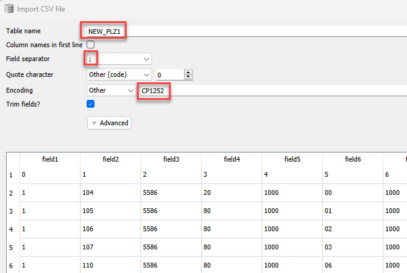{ width="400" align=right }
    <figcaption>.</figcaption>
    </figure>
    7. Wir wollen die Tabelle modifizieren, um die Spaltennamen anzupassen
    <figure markdown="span">
    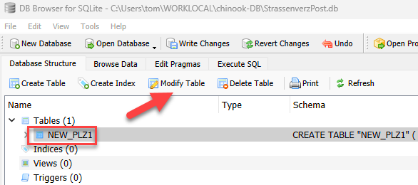{ width="400" align=right }
    <figcaption>.</figcaption>
    </figure>
    8. Mit Hilfe der Tabellenbeschreibung der Post vergeben wir die korrekten Spaltennamen. Der Datentyp der Spalte wird meist schon korrekt vorgeschlagen. Sie sehen auch im Fenster unten das CREATE TABLE - Statement, welches nach den Änderungen im Hintergrund ausgeführt wird.
    <figure markdown="span">
    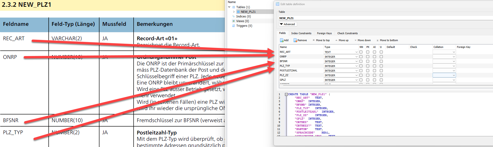{ width="400" align=right }
    <figcaption>.</figcaption>
    </figure>
    9. Kontrolle der Änderungen via Button "Database Structure"
    <figure markdown="span">
    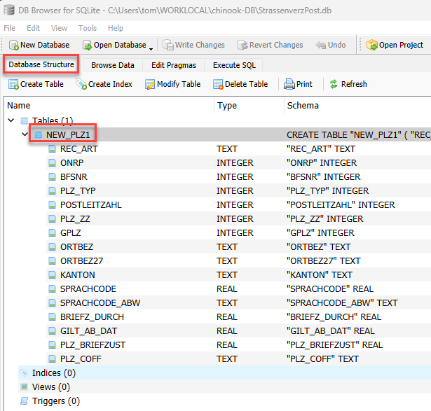{ width="400" align=right }
    <figcaption>.</figcaption>
    </figure>
    10. Daten wurden geladen? Kontrolle mit Button "Browse Data". Anschliessend sind wir bereit für die CSV-Datei NEW_STR
    <figure markdown="span">
    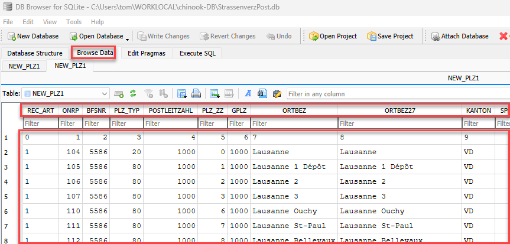{ width="400" align=right }
    <figcaption>.</figcaption>
    </figure>
    11. Importieren Sie nun die CSV-Datei NEW_STR und modifizieren Sie die Spaltennamen gemäss Beschreibung der Post
    <figure markdown="span">
    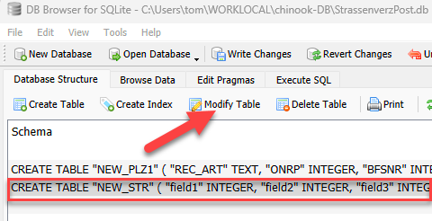{ width="400" align=right }
    <figcaption>.</figcaption>
    </figure>
    12. Nach dem Import der beiden CSV-Dateien und den Anpassungen der Spaltennamen sind wir bereit, die Daten mit SQL abzufragen
    <figure markdown="span">
    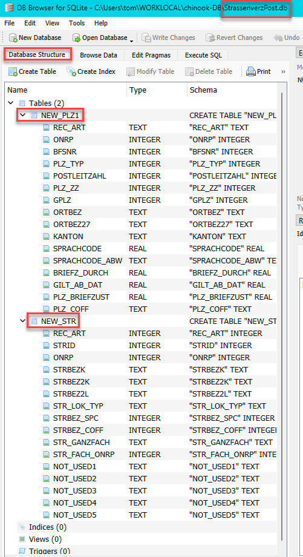{ width="400" align=right }
    <figcaption>.</figcaption>
    </figure>
    