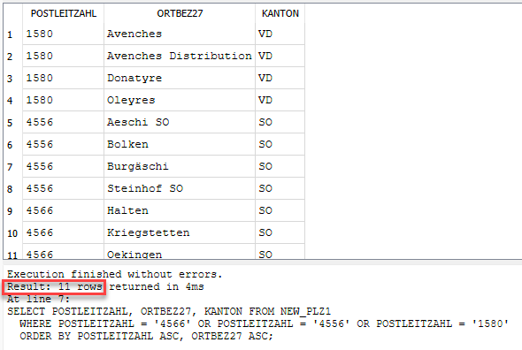
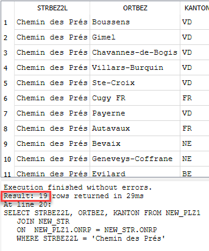
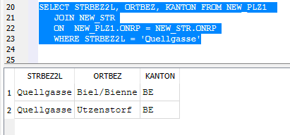
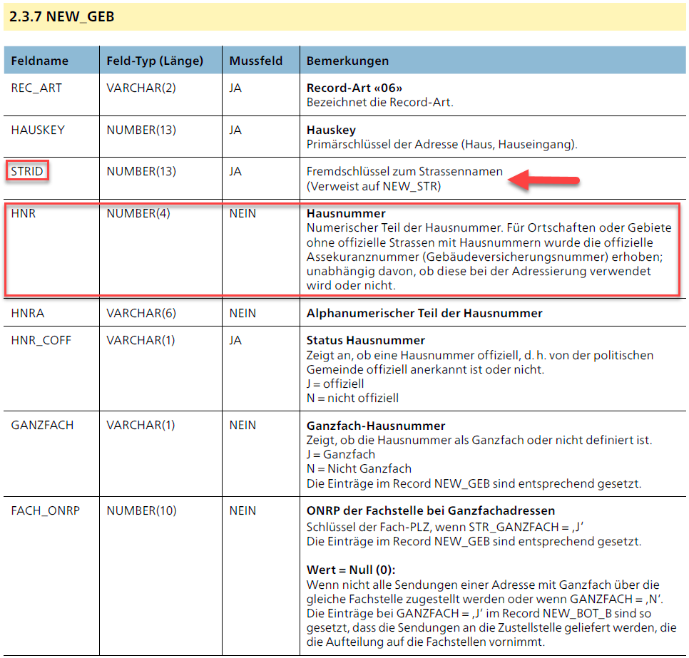

# SQL Abfragen Strassenverzeichnis


!!! example "SQL Abfragen zum Strassenverzeichnis der Post"

    Beantworten Sie nun die Fragen aus UE01-1 mit Hilfe von SQL-Abfragen!

    1. Wie viele verschiedene Postleitzahlen gibt es in der Schweiz und im Fürstentum Lichtenstein?
    2. Wie viele Gemeinden tragen die Postleitzahl 4566, 4556 und 1580 und in welchen Kantonen befinden sich diese?
    3. Wie viele Gemeinden haben dieselbe PLZ wie ihre Wohngemeinde?
    4. In welchen Gemeinden mit Kanton existiert dieselbe Strasse ihrer Wohnadresse?
    5. In welchen Gemeinden gibt es ebenfalls eine "Quellgasse"?
    6. Wird die Quellgasse 12 (unser Gebäude) mit Post bedient? Warum offenbar nicht?


??? success "Lösungsvorschläge"
    
    1. Wie viele verschiedene Postleitzahlen gibt es in der Schweiz und im Fürstentum Lichtenstein?
    ```sql
    -- Resultat: 3483 verschiedene PLZ in CH und Li
    SELECT COUNT(DISTINCT POSTLEITZAHL) FROM NEW_PLZ1;
    ```
    

    2. Wie viele Gemeinden tragen die Postleitzahl 4566, 4556 und 1580 und in welchen Kantonen befinden sich diese?
    ```sql
    -- 1 SQL-Statement für Liste mit allen Ortschaften sortiert nach PLZ und Ort
    SELECT POSTLEITZAHL, ORTBEZ27, KANTON FROM NEW_PLZ1
       WHERE POSTLEITZAHL = '4566' OR POSTLEITZAHL = '4556' OR POSTLEITZAHL = '1580'
       ORDER BY POSTLEITZAHL ASC, ORTBEZ27 ASC;
    ```
    <figure markdown="span">
    { width="400" align=right }
    <figcaption>.</figcaption>
    </figure>
    ```sql
    -- nebenbei: hier noch ein Beispiel, das zeigt, dass sich PLZ nicht an Kantonsgrenzen halten
    SELECT POSTLEITZAHL, ORTBEZ27, KANTON FROM NEW_PLZ1
       WHERE POSTLEITZAHL = '1595';
    ```
    3. Wie viele Gemeinden haben dieselbe PLZ wie ihre Wohngemeinde?
    ```sql
    -- gleich wie 2 mit Ihrer PLZ.
    SELECT ...
    ```

    4. In welchen Gemeinden mit Kanton existiert dieselbe Strasse ihrer Wohnadresse?
    ```sql
    -- Variante einfach. Das Attribut ONRP ist die Verbindung zwischen PLZ- und Strassentabelle! Siehe Beschreibung der Post.
    SELECT STRBEZ2L, ORTBEZ, KANTON FROM NEW_PLZ1, NEW_STR 
       WHERE STRBEZ2L = 'Chemin des Prés' AND NEW_PLZ1.ONRP = NEW_STR.ONRP;
    ```
    ```sql
    -- Variante mit JOIN. Wird noch behandelt...
    SELECT STRBEZ2L, ORTBEZ, KANTON FROM NEW_PLZ1 
       JOIN NEW_STR
       ON  NEW_PLZ1.ONRP = NEW_STR.ONRP
          WHERE STRBEZ2L = 'Chemin des Prés';
    ```
    <figure markdown="span">
    { width="400" align=right }
    <figcaption>.</figcaption>
    </figure>


    5. In welchen Gemeinden gibt es ebenfalls eine "Quellgasse"?
    ```sql
    -- mit JOIN
    SELECT STRBEZ2L, ORTBEZ, KANTON FROM NEW_PLZ1 
       JOIN NEW_STR
       ON  NEW_PLZ1.ONRP = NEW_STR.ONRP
       WHERE STRBEZ2L = 'Quellgasse';
    ```
    oder
    ```sql
    -- ohne JOIN, Resultat ist identisch
    SELECT STRBEZ2L, ORTBEZ, KANTON FROM NEW_PLZ1, NEW_STR 
       WHERE STRBEZ2L = 'Quellgasse' AND NEW_PLZ1.ONRP = NEW_STR.ONRP;
    ```
    <figure markdown="span">
    { width="400" align=right }
    <figcaption>da Biel offiziell 2-sprachig ist, ist die Ortsbezeichnung Biel/Bienne</figcaption>
    </figure>
    Einfach noch etwas zum Staunen: die Tabelle *NEW_STR* enthält 167887 und die *NEW_PLZ1* 5139 Einträge. Abfragen, welche beide Tabellen berücksichtigen, dauern wenige Millisekunden. (ca 30ms) 

    6. Wird die Quellgasse 12 (unser Gebäude) mit Post bedient? Warum offenbar nicht?
    
    Diese Frage kann mit diesen 2 Tabellen nicht beantwortet werden, weil die Hausnummern nicht enthalten sind. 
    
    Dazu benötigen wir die Tabelle NEW_GEB. Hier ist Die Hausnummer über die STRID mit den Strassennamen verbunden. Siehe Beschreibung der Post.

    <figure markdown="span">
    { width="400" align=right }
    <figcaption>.</figcaption>
    </figure>

    Aber noch zur Frage "Warum offenbar nicht?": Die Quellgasse 12 wird von der Post tatsächlich nicht bedient. Sie finden auch keinen Briefkasten am Eingang. Alle Post für die BFH an der Quellgasse in Biel wird an die Hausnummer 21 geliefert und von dort BFH-intern verteilt.


