# DOCKER-Installationsanleitung MySQL mit phpmyadmin

Führen Sie folgende Schritte aus:

## Start Docker-Desktop auf Ihrem Notebook

Stellen Sie sicher, dass Sie eingeloggt sind:

<figure markdown="span">
  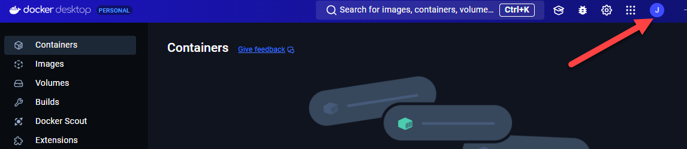{ width="600" }
  <figcaption>Docker-Desktop gestartet und angemeldet</figcaption>
</figure>

Führen Sie ein update des Docker-Desktops aus, falls das notwendig ist. Die aktuelle Version zum Zeitpunkt dieses Dokumentes ist 4.34.3 (Windows)

## Verzeichniss erstellen für Ihre Docker-Files

```
mkdir docker-compose-files
cd .\docker-compose-files\
mkdir mysql
cd mysql
```

## Erstellung des docker-compose-Files

unter Windows:

`notepad docker-compose.yml`
oder unter MacOS mit Text-Editor.

Wir werden mit diesem compose-file 2 Container erstellen:

* Container mit dem RDBMS  MySQL, Version 8.0.40. Der Name des Containers ist `mysql` 
* Container mit phpmyadmin. Dies ist ein *webbasiertes Management-Interface*, um MySQL zu administrieren. Name des Containers: `phpmyadmin-container`

!!! Note "Aktionen,ausgelöst durch docker-compose.yml"

    Versuchen Sie die Aussagen unten im docker-compose.yml zu verifizieren. 

    * MySQL läuft als Docker-Container mit dem Namen «mysql».
    * Als MySQL-Version wird 8.0.40 gewählt
    * phpmyadmin, als webbasiertes Verwaltungstool, läuft als Web-Dienst auf Port 80 und verbindet sich auf die DB mit dem User `root` und dem Passwort `btw2201btw2201`. Die Angabe unter Ports `80:80` heisst, dass der externe Port 80 auf den Container-Port 80 verbunden wird.
    * Als Version für phpmyadmin wird `latest` gewählt 
    * MySQL verwendet den Standard-Port 3306. Der externe Port lautet ebenfalls 3306.
    * Der Hostname der MySQL-Instanz läuft aus Sicht Ihrer Installation unter `localhost` 
    * Die IP-Adresse lautet 127.0.0.1
    * Das root-Passwort lautet: btw2201btw2201
    * Ein User `student` wird angelegt mit Passwort `btw2201btw2201`
    * Eine Datenbank mit dem Namen `MYDB` wird angelegt
    * Beide Container werden immer automatisch gestartet
    * Die Daten von MySQL werden auf dem Host unter mysql-data gespeichert.
    * Das virtuelle Container-Verzeichnis /var/lib/mysql zeigt auf das physische Volume mysql-data der Docker-Installation.


Inhalt von 

```yaml title="docker-compose.yml"
services:
  mysql:
    image: mysql:8.0.40
    container_name: mysql
    restart: always
    environment:
      MYSQL_ROOT_PASSWORD: btw2201btw2201
      MYSQL_DATABASE: MYDB
      MYSQL_USER: student
      MYSQL_PASSWORD: btw2201btw2201
    ports:
      - "3306:3306"
    volumes:
      - mysql_data:/var/lib/mysql
    networks:
      - mysql-phpmyadmin

  phpmyadmin:
    image: phpmyadmin/phpmyadmin:latest
    container_name: phpmyadmin-container
    restart: always
    depends_on:
      - mysql
    ports:
      - "80:80"
    environment:
      PMA_HOST: mysql
      PMA_PORT: 3306
      MYSQL_ROOT_PASSWORD: btw2201btw2201
    networks:
      - mysql-phpmyadmin

volumes:
  mysql_data:
networks:
  mysql-phpmyadmin:
```


## Docker-Container starten

Im Verzeichnis, wo das docker-compose.yml liegt, starten Sie die Container mit

`docker compose up -d`

Kontrolle, ob Container laufen mit

`docker ps -a`


<figure markdown="span">
  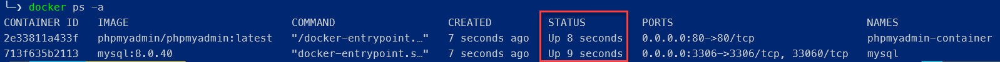{ width="800" }
  <figcaption>Container running?</figcaption>
</figure>


Auch im Docker-Desktop sind die laufenden Container sichtbar:


<figure markdown="span">
  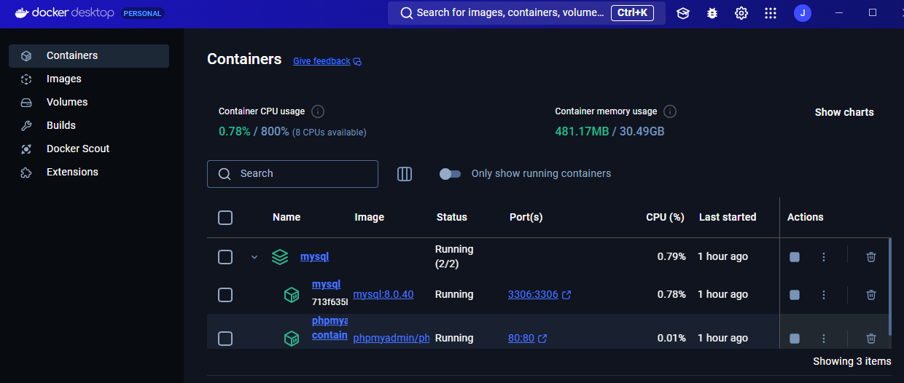{ width="800" }
  <figcaption>Container running?</figcaption>
</figure>


## Varianten der MySQL-Administration

Es gibt nun 3 Möglichkeiten auf die Datenbank zuzugreifen und zu administrieren

1. Via Web-Anwendung phpmyadmin. Diese läuft auf http://localhost:80
2. Via MySQL Workbench
3. Zugriff mit mysql-client im Container. Dieser Client wird mit Konsolenbefehlen bedient.

Versuchen Sie die Zugriffe in dieser Reihenfolge gemäss folgenden Anleitungen

### Variante 1: phpMyAdmin

Mit Browser Zugriff auf `http://localhost:80`

Login mit user `root`, Passwort: `btw2201btw2201`. Dies Credentials haben wir im `docker-compose.yml` definiert.

Geben Sie dem User `student` alle Privilegien:

<figure markdown="span">
  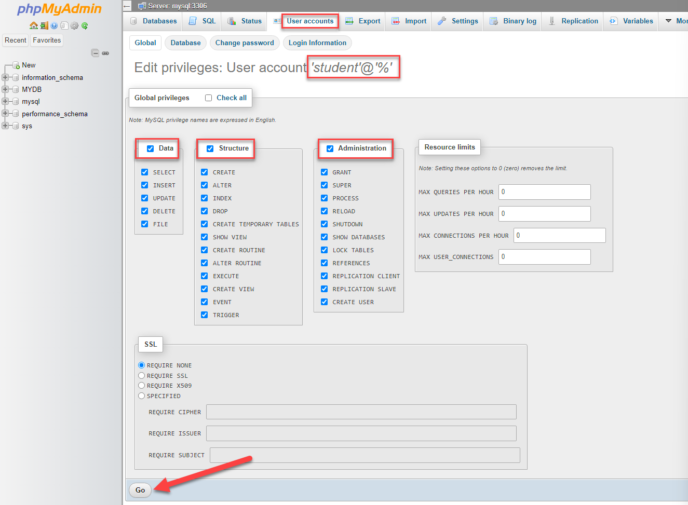{ width="800" }
  <figcaption>phpMyAdmin Interface für Anpassung des User-Privilegien</figcaption>
</figure>


<figure markdown="span">
  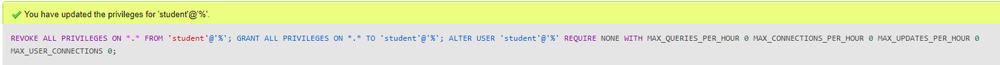{ width="800" }
  <figcaption>Erfolgsmeldung nach Go. Das angewendete SQL ist sichtbar.</figcaption>
</figure>


Nun als `root` abmelden und sich mit `student` wieder neu anmelden:

<figure markdown="span">
  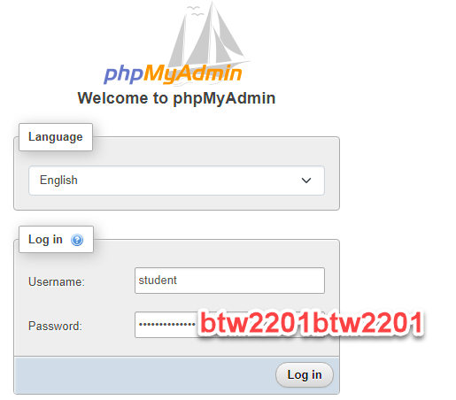{ width="500" }
  <figcaption>Anmeldung als User student.</figcaption>
</figure>


Sie haben nun mit diesem Datenbank-User «student» alle Privilegien, um die Datenbank zu administrieren:

<figure markdown="span">
  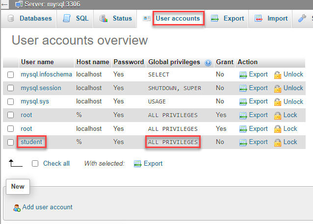{ width="500" }
  <figcaption>Ansicht `User accounts` in phpMyAdmin</figcaption>
</figure>

phpMyAdmin eignet sich gut, um MySQL-Datenbanken zu administrieren. Es können damit auch SQL-Befehle für Datenanalysen gemacht werden.

[Dokumentation phpMyAdmin](https://www.phpmyadmin.net/docs/){:target="_blank"}


### Variante 2: MySQL Workbench

MySQL-Workbench-
[Download](https://dev.mysql.com/downloads/workbench/){:target="_blank"}


<figure markdown="span">
  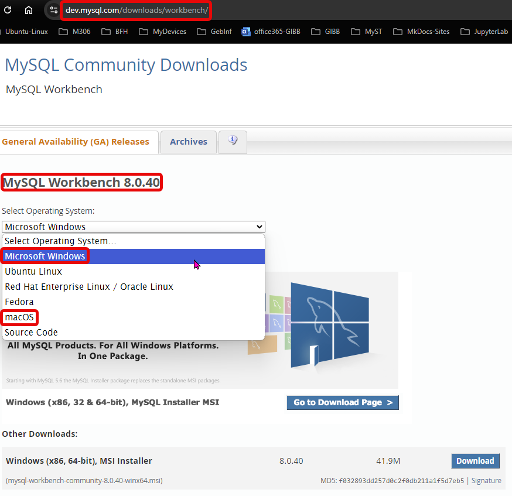{ width="500" }
  <figcaption></figcaption>
</figure>


Erstellen Sie eine Verbindung auf die lokale MySQL-Installation mit

<figure markdown="span">
  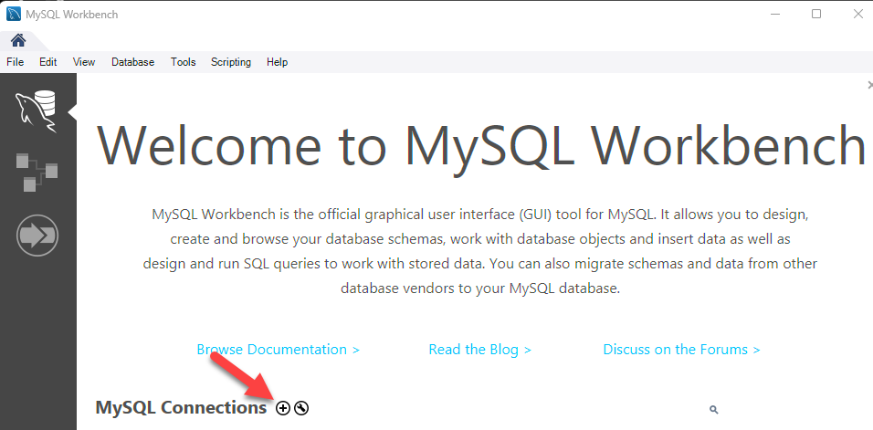{ width="700" }
  <figcaption>Erstellung einer Verbindung` in phpMyAdmin</figcaption>
</figure>

Verbindungsdetails:

<figure markdown="span">
  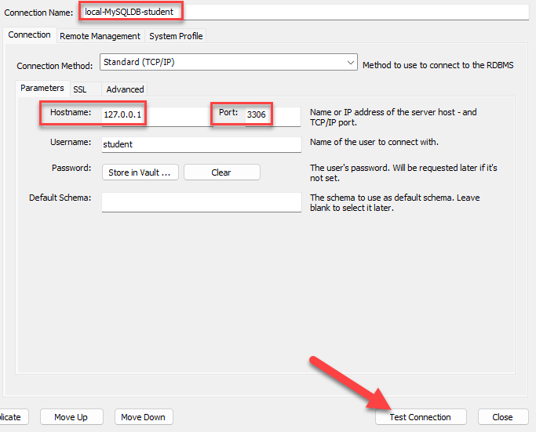{ width="700" }
  <figcaption>Verbindungsdetails für die lokale MySQL-Installation</figcaption>
</figure>


das Passwort wird dann abgefragt und ein Eintrag bei den Verbindungen wird gemacht.

Starten Sie die Verbindung und machen Sie sich mit der Oberfläche vertraut.
Weitere Erklärungen erfolgen in der Vorlesung.

[Dokumentation MySQL Workbench](https://dev.mysql.com/doc/workbench/en/){:target="_blank"}


<figure markdown="span">
  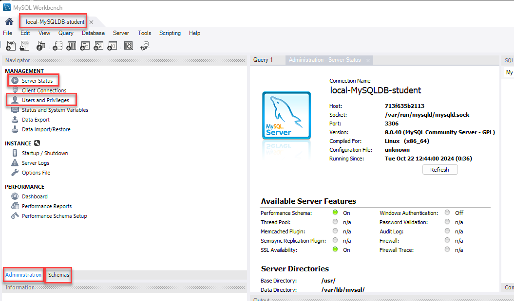{ width="700" }
  <figcaption>MySQL Workbench Admin-Screen</figcaption>
</figure>

### Variante 3: mysql-client in der MySQL-Container-Konsole

Die Verbindung erfolgt aus der Powershell in Windows 11 oder dem Terminal in MacOS auf den Docker-Container mit MySQL:

`docker exec -it mysql mysql -u student -p`

Passwort: `btw2201btw2201`

Mit dem SQL-Befehl `show databases;` können Sie die vorhandenen Datenbanken abfragen. 

Die Möglichkeiten, um die Datenbak zu administrieren und zu bearbeiten sind mit dieser Variante genau gleich, wie mit den anderen Varianten.
Es ist ein Command-Line-Interface (CLI) ohne jegliche grafische Möglichkeiten.

<figure markdown="span">
  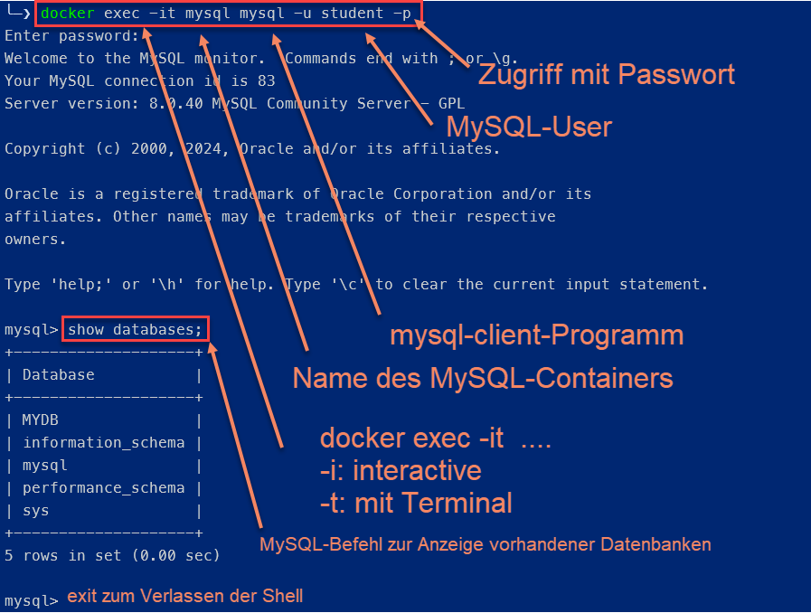{ width="700" }
  <figcaption>mysql-Client als CLI</figcaption>
</figure>


