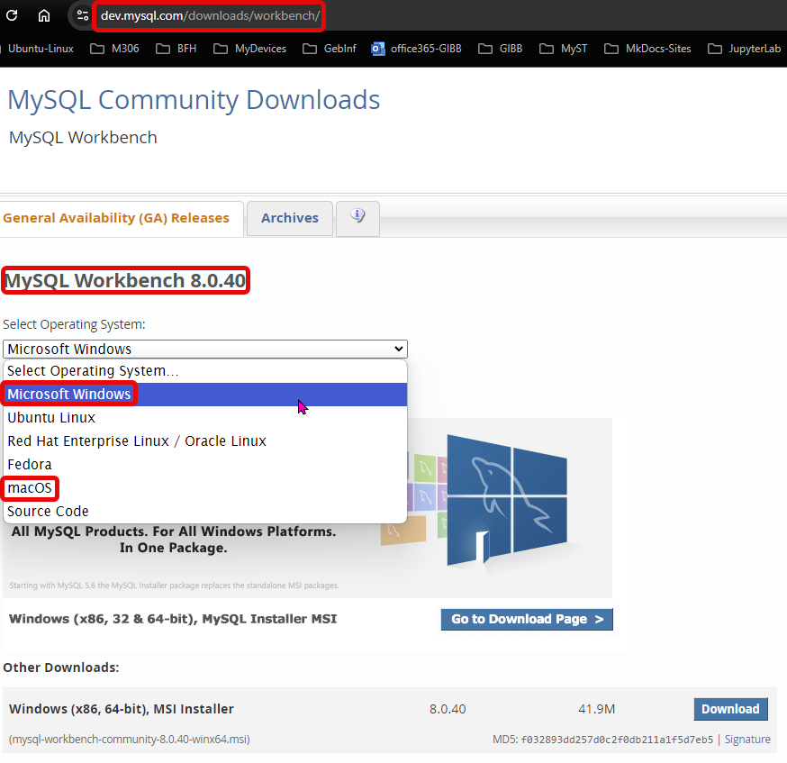

# UE05-01-MySQL und erste Datenbank

In Aufgabe UE03-03 haben wir CSV-Dateien in SQLite importiert. Bei diesem Vorgang liessen wir die Tabellen automatisch erstellen und haben dann die Spaltennamen manuell angepasst gemäss Beschreibung des Datenbankschemas. 

Nun wollen wir die Datenbank in MySQL nachbauen. Entsprechend sollst du eine Datenbank `StrassenCH` erstellen, die für den Moment zwei Tabellen enthält: `new_PLZ1` und `new_STR`.

Der MySQL-Client, kann via Docker wie folgt gestartet werden:

```
docker exec -ti mysql mysql -uroot -ppassword
```

Folgende MySQL-Befehle können zusätzlich aushelfen:

`USE database_name; --- Wechseln der momentan aktiven Datenbank`

`CREATE DATABASE database_name; --- Erstellt eine neue/leere Datenbank`

`SHOW DATABASES; --- Zeigt die aktuell vorhandenen Datenbanken an`

`SHOW TABLES; --- Zeigt die aktuell vorhandenen Tabellen an`

**ALTERNATIVE: grafisches MySQL-Management-Tool**

MySQL-Workbench-
[Download](https://dev.mysql.com/downloads/workbench/){:target="_blank"}

MySQL-Workbench-
[Documentation](https://www.mysql.com/products/workbench/){:target="_blank"}


<figure markdown="span">
  { width="500" }
  <figcaption></figcaption>
</figure>

