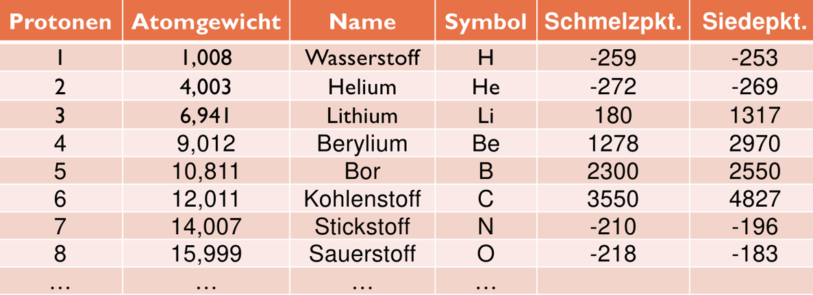

# UE05-03-Aufgaben zum Relationenmodell

## Aufgabe 1
Erklären Sie folgende Begriffe: *Tupel*, *Attribut*, *Relation*, *Domain* (Gebiet), *Grad*, *Kardinalität*.

## Aufgabe 2
Warum ist die Wahl problematisch, den Schlüsselkandidaten *Symbol* in der Relation *chemischeElemente* als Primärschlüssel zu wählen?


<figure markdown="span">
  { width="700" }
  <figcaption>Relation chemischeElemente</figcaption>
</figure>

??? success "Antwort"

    Dagegen spricht: Ein chemisches Element wird identifiziert durch die Protonenzahl, nicht durch 
    seinen Namen oder sein Symbol. Ein eventuell neu entdecktes Element könnte erst dann eingetragen werden, 
    wenn es einen Namen hat. Zusätzlich lassen sich Zahlen als Primärschlüssel besser handhaben als Zeichen.


## Aufgabe 3
Geben Sie den Primärschlüssel der nachfolgenden Relation an.

RELATION *VerkaeuferProdukt*:

| VerkNr | VerkName  | PLZ  | VerkAdresse | Produktname   | Umsatz |
|--------|-----------|------|-------------|---------------|--------|
| V1     | Meier     | 8075 | Zürich      | Waschmaschine | 11000  |
| V1     | Meier     | 8075 | Zürich      | Herd          | 5000   |
| V1     | Meier     | 8075 | Zürich      | Kühlschrank   | 1000   |
| V2     | Schneider | 1580 | Broye       | Herd          | 4000   |
| V2     | Schneider | 1580 | Broye       | Kühlschrank   | 33000  |
| V3     | Müller    | 3000 | Bern        | Staubsauger   | 1000   |

??? success "Antwort"

    *VerkNr* und *Produktname* zusammen, also (VerkNr, Produktname)


## Aufgabe 4
Welche Attribute müssen beim Eintrag eines neuen Records (=Tupel) immer *mindestens* angegeben werden, wenn die Integritätsregeln beachtet werden sollen?

??? success "Antwort"

    Der Primärschlüssel muss nach der ersten Integritätsregel zwingend angegeben werden. Hinzu kommen alle Attribute mit der Vorgabe *Not Null*.


## Aufgabe 5
Finden Sie die Primär- und Fremdschlüssel aller Relationen der Beispieldatenbank *Strassenverzeichnis Schweiz und Li*.

Stellen Sie sich vor, wir hätten in der Datenbank alle PK und FK der Tabellen definiert.

Stellen sie sich vor, wir möchten dann eine Tabelle löschen.

Frage:

* Unter welcher Voraussetzung geht das?
* Wann geht das nicht?

Beantworten Sie die Frage unter Berücksichtigung der *Integritätsregeln*. Ein RDBMS wie MySQL beachtet diese Regeln strikt und gibt Fehlermeldungen aus, wenn diese verletzt werden.

## Aufgabe 6
Kurzer Ausflug in die SQL-Welt mit dem Ziel:

Die ***Referenzielle Integrität*** sichtbar machen !

Erstellen Sie folgende Tabelle in MySQL, z.Bsp im Schema `MYDB` oder erstellen Sie eine neue DB
``` sql
CREATE TABLE Employees (
    EmployeeID INT PRIMARY KEY,
    FirstName VARCHAR(50),
    LastName VARCHAR(50),
    ManagerID INT,
    FOREIGN KEY (ManagerID) REFERENCES Employees(EmployeeID)
);
```

Laden Sie folgende Daten in die Tabelle:

``` sql
INSERT INTO Employees (EmployeeID, FirstName, LastName, ManagerID) VALUES
(1, 'Stefan', 'Grösser', NULL),   
(2, 'Thomas', 'Jäggi', 1),        
(3, 'Beat', 'Jans', 2),     
(4, 'Markus', 'Studer', 2);  
```

Nun versuchen Sie den Mitarbeiter mit ID=2 oder ID=1 zu löschen:

``` sql
DELETE FROM Employees WHERE EmployeeID = 2;
```
Warum diese Fehlermeldung?

Nun löschen des Mitarbeiters mit ID=3
``` sql
DELETE FROM Employees WHERE EmployeeID = 3;
```
Warum gibt es hier keinen Fehler? Das Tupel wird gelöscht!

Diese Verhalten nennt man ***Referenzielle Integrität*** ! 

Beschreiben Sie dieses Verhalten in eigenen Worten anhand von diesem Beispiel!

??? success "Antwort"
    Mit dem Beispiel haben sie dann auch die Frage 5 beantwortet.

!!! abstract  "Referentielle Integrität und die Reaktion auf die Verletzung der FK-Regeln"

    Lesen Sie den beiliegenden pdf-Artikel zur referentiellen Integrität RI. Notieren sie sich die SQL-Funktionen und deren Wirkung auf die Behandlung der RI-Regeln.
    
    | ON DELETE ..                 | ON UPDATE ...          |
    |------------------------------|------------------------|
    | ON DELETE CASCADE     | ON UPDATE  CASCADE     |
    | ON DELETE SET NULL    | ON UPDATE  SET NULL    |
    | ON DELETE SET DEFAULT | ON UPDATE  SET DEFAULT |

     [ReferenzielleIntegritaet.pdf](../static/ReferenzielleIntegritaet.pdf){:download="ReferenzielleIntegritaet.pdf"}


