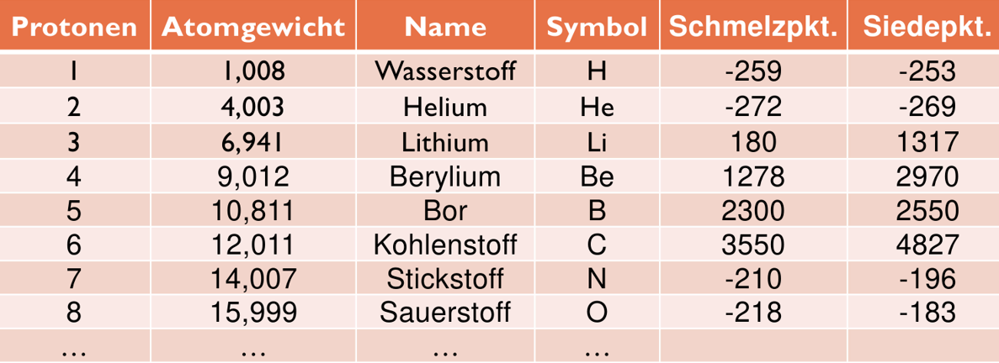

# Aufgaben zum Relationenmodell

## Aufgabe 1
Erklären Sie folgende Begriffe: *Tupel*, *Attribut*, *Relation*, *Domain* (Gebiet), *Grad*, *Kardinalität*.

## Aufgabe 2
Warum ist die Wahl problematisch, den Schlüsselkandidaten *Symbol* in der Relation *chemischeElemente* als Primärschlüssel zu wählen?

<figure markdown="span">
  { width="700" }
  <figcaption>Relation chemischeElemente</figcaption>
</figure>

## Aufgabe 3
Geben Sie den Primärschlüssel der nachfolgenden Relation an.

RELATION *VerkaeuferProdukt*:

| VerkNr  |VerkName   |PLZ   |VerkAdresse   |Produktname   |Umsatz|
|---      |---        |---   |---           |---           |---   |
|V1 |Meier            |8075  |Zürich        |Waschmaschine |11000 |
|V1 |Meier            |8075  |Zürich        |Herd          |5000  |
|V1 |Meier            |8075  |Zürich        |Kühlschrank   |1000  |
|V2 |Schneider        |1580  |Broye         |Herd          |4000  |
|V2 |Schneider        |1580  |Broye         |Kühlschrank   |33000 |
|V3 |Müller           |3000  |Bern          |Staubsauger   |1000  |

## Aufgabe 4
Welche Attribute müssen beim Eintrag eines neuen Records (=Tupel) immer *mindestens* angegeben werden, wenn die Integritätsregeln beachtet werden sollen?

## Aufgabe 5
Finden Sie die Primär- und Fremdschlüssel aller Relationen der Beispieldatenbank *Strassenverzeichnis Schweiz und Li*.

Stellen Sie sich vor, wir hätten in der Datenbank alle PK und FK der Tabellen definiert.

Stellen sie sich vor, wir möchten dann eine Tabelle löschen.

Frage:

* Unter welcher Voraussetzung geht das?
* Wann geht das nicht?

Beantworten Sie die Frage unter Berücksichtigung der *Integritätsregeln*. Ein RDBMS wie MySQL beachtet diese Regeln strikt und gibt Fehlermeldungen aus, wenn diese verletzt werden.