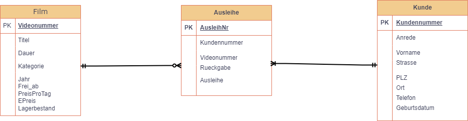
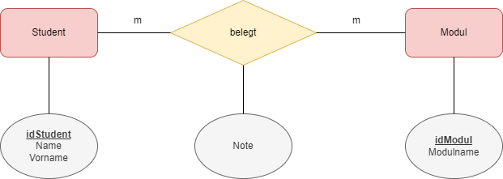

# UE06-02

## Aufgabe 1: Datenbeziehungen / Kardinalität

!!! example "Aufgabe 1"

    Bestimmen Sie das richtige Beziehungstypenpaar für die Entitätsmenge 1 und die Entitätsmenge 2.
    Achten Sie auf die Beziehung in der letzten Spalte.
    
    Beispiel
    
    | Entität 1 | Entität 2 | Beziehung | Kardinalität |
    |-----------|-----------|-----------|--------------|
    | Mensch    | Brille    | tragen    | 1:1          |
    
    
    **Aufgabe 1**
    
    | Nr | Entität 1     | Entität 2 | Beziehung      | Kardinalität |
    |----|---------------|-----------|----------------|--------------|
    | 1  | Auto          | Rad       | dazugehören    | ?            |
    | 2  | Taste         | Tastatur  | dazugehören    | ?            |
    | 3  | Studenten     | Modul     | besuchen       | ?            |
    | 4  | Attribut      | Tabelle   | dazugehören    | ?            |
    | 5  | Tier          | Zoo       | dazugehören    | ?            |
    | 6  | Fussballmatch | Besucher  | besuchen       | ?            |
    | 7  | Kunstwerke    | Museum    | ausgestellt    | ?            |
    | 8  | Studenten     | Studenten | Freundschaften | ?            |
    | 9  | Tierart       | Zoo       | findet sich    | ?            |
   
??? success "Antworten"

    === "1-Auto-Rad"
        1:m    
    === "2-Taste-Tastatur"
        m:1
    === "3-Studenten-Modul"
        m:m    
    === "4-Attribut-Tabelle"
        m:1    
    === "5-Tier-Zoo"
        m:1   
    === "6-Fussballmatch-Besucher"
        1:m
    === "7-Kunstwerk-Museum"
        m:1    
    === "8-Student-Student"
        m:m    
    === "9-Tierart-Zoo"
        m:m   
   

## Aufgabe 2: ERM interpretieren

!!! example "Aufgabe 2"

    Betrachten Sie das folgende ERM und beurteilen Sie die Richtigkeit der nachstehenden Aussagen.
    
    <figure markdown="span">
      { width="900" }
      <figcaption>ERM zur Filmausleihe</figcaption>
    </figure>
    
    1. Jeder Film gehört zu einem Kunden  [ ] wahr  [ ] falsch
    2. Ein Kunde kann mehrere Filme ausleihen?  [ ] wahr  [ ] falsch
    3. Ein Kunde kann mehrere Filme pro Ausleihereignis ausleihen?  [ ] wahr  [ ] falsch
    4. Es gibt Filme, die nicht ausgeliehen werden können?  [ ] wahr  [ ] falsch
    5. Es gibt Kunden, die keine Filme ausgeliehen haben?  [ ] wahr  [ ] falsch
    6. Kann ein Kunde mehrere Filme während zwei Wochen ausleihen?  [ ] wahr  [ ] falsch
    7. Die Beziehung Film – Ausleihe hat den Beziehungstyp 1-mc.  [ ] wahr  [ ] falsch
    8. Die Beziehung Ausleihe – Kunde hat den Beziehungstyp m-1.  [ ] wahr  [ ] falsch

??? success "Antworten"

    === "1."
        falsch. Ein Film kann sich in keiner Ausleihe befinden. Film - Ausleihe 1:mc. mc heist: kein, ein oder mehrere.      
    === "2."
        wahr. Dann wenn der Kunde mehrere Ausleihen hat. Ein Kunde kann mehrere Ausleihen haben.
    === "3."
        falsch. Film Ausleihe ist 1-mc. Das heisst: 1 Film kann sich in 0,1 oder mehreren Ausleihen befinden. 1 Ausleihe hat 1 Film.
        Ob das sinnvoll ist, ist eine andere Frage. Intuitiv würde man wohl annehmen, dass eine Ausleihe auch mehrere Filme beinhalten kann. Die Darstellung im ERM besagt jedoch, dass eine Ausleihe genau ein Film beinhaltet.     
    === "4."
        wahr. Ja, wenn diese in keiner Ausleihe vorhanden sind. Beziehung Film - Ausleihe ist 1-mc. c besagt, dass ein Film auch in 0 Ausleihen vorhanden sein kann.    
    === "5."
        falsch. Beziehung Ausleihe-Kunde ist m-1. Das heisst 1 Ausleihe gehört zu einem Kunden und 1 Kunde hat m Ausleihen. Wenn ein Kunde keine Ausleihen haben darf, dann müsste die Beziehung mc-1 sein. Diese Beziehung heisst also, dass nur ein Kunde ein Kunde ist, wenn er eine Ausleihe hat.   
    === "6."
        wahr. Die Zeitperiode ist hier irrelevant, da im ERM gar nicht berücksichtigt. Relevant ist nur die Tatsache, dass ein Kunde mehrere Ausleihen haben kann.
    === "7."
        wahr. Der Kreis bei Ausleihe sagt, dass auch 0 eingeschlossen ist. Also: 0, 1 oder mehrere Ausleihen können einen Film beinhalten. Oder: 1 Film ist in keiner, einer oder mehreren Ausleihen vorzufinden.    
    === "8."
        wahr. Das Symbol bei Ausleihe besagt 1 oder mehrere. Für "mehrere" wird 1 auch immer eingeschlossen.

    

## Aufgabe 3: Normalformen - Aufgabe als Repetition

!!! example "Aufgabe 3"
    
    Welche Normalformen sind hier verletzt? Erstellen Sie daaraus Tabellen in 3NF!
    
    | idStudent | Student       | idModul | Modulname     | Note |
    |-----------|---------------|---------|---------------|------|
    | 98712     | John Scofield | 2200    | Programmieren | A    |
    | 98712     | John Scofield | 2201    | Datenbanken   | C    |
    | 123456    | Heidi Scholl  | 2201    | Datenbanken   | E    |
    | 123456    | Heidi Scholl  | 2257    | Networking    | B    |
    | 123456    | Heidi Scholl  | 2210    | Security      | D    |
    | 52478     | Adrian Sieber | 2201    | Datenbanken   | A    |

!!! success "Antworten"
    Erste Überlegung:

    Was sind die Schlüsselmerkmale? 

    id_Student und idFachModul definieren einen Record eindeutig.

    Also:

    | <u>idStudent</u> | Student       | <u>idModul</u> | Modulname     | Note |
    |------------------|---------------|--------------------|---------------|------|

    Prüfung der NF:

    1NF ist verletzt, da die Wertebereiche des Merkmals Student nicht atomar sind. Hier besteht das Risiko von Anomalien, wenn ein Name unterschiedlich geschrieben wird. 
    
    2NF ist verletzt, weil 1NF verletzt ist.
    
    Wenn wir nun 1NF korrigieren wollen, ist es naheliegend die Merkmale *Student_Name* und *Student_Vorname* zu verwenden. Damit haben wir 1NF erfüllt.
    
    Ist dann 2NF erfüllt?

    Die 2NF ist nicht erfüllt, da nicht alle Nichtschlüsselmerkmale voll funktional abhängig sind vom zusammengesetzten Schlüssel der Tabelle: Student ist nur funktional abhängig von id_Student, Modulname ist funktional abhängig nur von idFachModul. 

    Das Merkmal "Note" ist ein Beziehungsmerkmal zwischen Student und Modul. 
    
    Grafisch kann man die Beziehung so darstellen:

    <figure markdown="span">
    { width="800" }
    <figcaption>ER-Modell Student-Modul-Note (erstellt mit draw.io)</figcaption>
    </figure>

    Es handelt sich hier um eine m-m-Beziehung zwischen Modul und Student: 1 Student belegt mehrere Module und 1 Modul kann von mehreren Studenten belegt werden.

    Wie wir wissen, bedingt eine m-m Beziehung eine Beziehungstabelle.

    Nach den ÜBERFÜHRUNGSREGELN  entstehen aus der Ursprungstabelle somit 3 Tabellen:

    * Student (<u>idStudent</u>, Name, Vorname)
    * Modul (<u>idModul</u>, Modulname)
    * Student_Modul (<u>id_Student</u>, <u>idModul</u>, Note)

    Wir haben hier **KEINE** *transitive Abhängigkeiten*, daher befinden sich diese Tabellen in 3NF.

    BEACHTEN SIE HIER DIE SCHREIBWEISE VON TABELLEN: 
    
    ***tabellenname(<u>merkmal1</u>,merkmal2,...)***

    Unterstrichene Merkmale (Attribute) bezeichnen Schlüsselmerkmale.

## Aufgabe 4: Erstellung physisches Datenmodell

!!! example "Aufgabe 4"

     Erstellen Sie das physische Datenmodell in 3NF.

!!! success "Antwort"
    Die Lösung dazu ist analog Übung UE06-01, Aufgabe 5. Üben Sie sich im Handling mit MySQL und führen Sie die SQL-Befehle zum Erstellen und Befüllen von Tabellen, inkl. dem Definieren von PK und FK.

    Als Basis dazu verwenden Sie das logische ER-Modell, welches sich auch so beschreiben lässt, wie in vorhergehender Aufgabe dargestellt:

    * Student (<u>idStudent</u>, Name, Vorname)
    * Modul (<u>idModul</u>, Modulname)
    * Student_Modul (<u>id_Student</u>, <u>idModul</u>, Note)