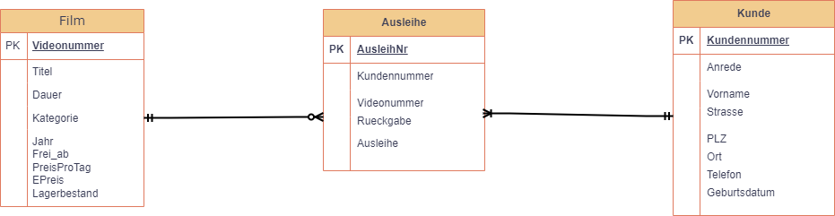

# Datenbeziehungen

!!! example "Aufgabe 1"

    Bestimmen Sie das richtige Beziehungstypenpaar für die Entitätsmenge 1 und die Entitätsmenge 2.
    Achten Sie auf die Beziehung in der letzten Spalte.
    
    Beispiel
    
    | Entität 1 | Entität 2 | Beziehung | Kardinalität |
    |-----------|-----------|-----------|--------------|
    | Mensch    | Brille    | tragen    | 1:1          |
    
    
    **Aufgabe 1**
    
    | Nr | Entität 1     | Entität 2 | Beziehung      | Kardinalität |
    |----|---------------|-----------|----------------|--------------|
    | 1  | Auto          | Rad       | dazugehören    | ?            |
    | 2  | Taste         | Tastatur  | dazugehören    | ?            |
    | 3  | Studenten     | Modul     | besuchen       | ?            |
    | 4  | Attribut      | Tabelle   | dazugehören    | ?            |
    | 5  | Tier          | Zoo       | dazugehören    | ?            |
    | 6  | Fussballmatch | Besucher  | besuchen       | ?            |
    | 7  | Kunstwerke    | Museum    | ausgestellt    | ?            |
    | 8  | Studenten     | Studenten | Freundschaften | ?            |
   
   
   

!!! example "Aufgabe 2"

    Betrachten Sie das folgende ERM und beurteilen Sie die Richtigkeit der nachstehenden Aussagen.
    
    <figure markdown="span">
      { width="900" }
      <figcaption>ERM zur Filmausleihe</figcaption>
    </figure>
    
    1. Jeder Film gehört zu einem Kunden  [ ] wahr  [ ] falsch
    2. Ein Kunde kann mehrere Filme ausleihen?  [ ] wahr  [ ] falsch
    3. Ein Kunde kann mehrere Filme pro Ausleihereignis ausleihen?  [ ] wahr  [ ] falsch
    4. Es gibt Filme, die nicht ausgeliehen werden können?  [ ] wahr  [ ] falsch
    5. Es gibt Kunden, die keine Filme ausgeliehen haben?  [ ] wahr  [ ] falsch
    6. Kann ein Kunde mehrere Filme während zwei Wochen ausleihen?  [ ] wahr  [ ] falsch
    7. Die Beziehung Film – Ausleihe hat den Beziehungstyp 1-mc.  [ ] wahr  [ ] falsch
    8. Die Beziehung Ausleihe – Kunde hat den Beziehungstyp m-1.  [ ] wahr  [ ] falsch
    

!!! example "Aufgabe 3"
    
    Welche Normalformen sind hier verletzt?
    
    | idStudent | Student       | Fach/Modul | Modulname     | Note |
    |-----------|---------------|------------|---------------|------|
    | 98712     | John Scofield | 2200       | Programmieren | A    |
    | 98712     | John Scofield | 2201       | Datenbanken   | C    |
    | 123456    | Heidi Scholl  | 2201       | Datenbanken   | E    |
    | 123456    | Heidi Scholl  | 2257       | Networking    | B    |
    | 123456    | Heidi Scholl  | 2210       | Security      | D    |
    | 52478     | Adrian Sieber | 2201       | Datenbanken   | A    |

!!! example "Aufgabe 4"

     Erstellen Sie aus der Tabelle in Aufgabe 3 ein Datenmodell in 3NF.