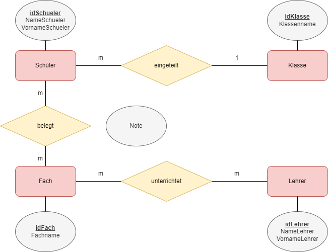
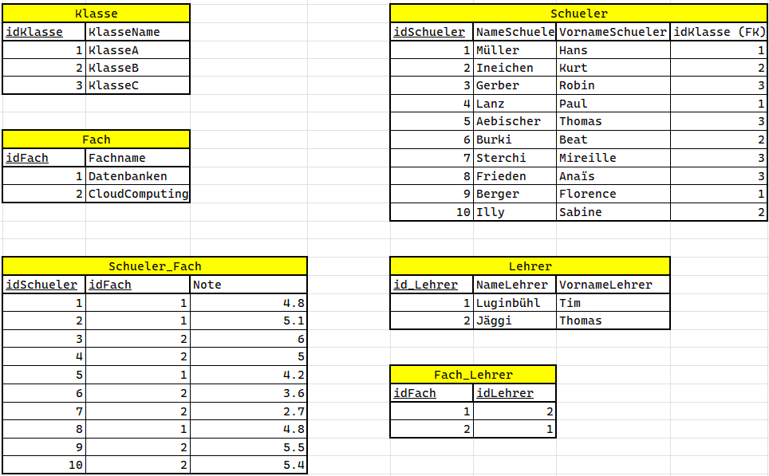

# UE06-03-Schuldatenbank

## 3NF herstellen

!!! example "Aufgabe 1"
    
    An einer Schule soll es in Zukunft eine zentralisierte Datenablage geben. Folgende Anforderungen gelten für die zu erstellende Datenbank:
    
    * Ein Schüler hat jeweils einen Vor- und Nachnamen
    * Die Lehrperson hat einen Vor- und Nachnamen und unterrichtet mindestens ein Fach, oder mehrere Fächer
    * Eine Klasse hat einen Namen und beliebig viele Schüler
    * Pro Fach kann ein Schüler jeweils eine numerische Note von 1-6 erzielen (eine Kommanstelle Präzision reicht) 
    
    Versuche die nötigen Tabellen in der **3ten Normalform** (3NF) zu entwickeln. Gehe dabei methodisch vor: siehe Folien auf Moodle.

## Konzeptionelles und logisches ERM erstellen

!!! example "Aufgabe 2"

    Erstelle aus den Angaben von Aufgabe 1 ein *konzeptionelles und ein logisches ERM*. 
    Diese Aufgabe kannst du auch lösen, wenn die vorhergehende Aufgabe noch nicht gelöst wurde.
    Gehe auch hier methodisch vor und nimm die PPT-Folien als Hilfe.

## Physische Datenbank aus logischem ERM erstellen

!!! example "Aufgabe 3"
    
    In einem weiteren Schritt sollst Du die Datenbank mittels SQL umsetzen. Fülle die Datenbank mit einer genügend grossen Anzahl Testdaten und versuche mehrere Tabellen gleichzeitig abzufragen. Diesen Schritt nennt man auch physisches Datenbankmodell. Hierbei soll dir das logische ERM als Basis dienen.

    Erstelle Queries für folgende Fragestellungen:

    * Was sind die Namen der Lehrer die eine bestimmte Klasse unterrichten?
    * Welchen Notendurchschnitt hat ein bestimmter Schüler?
    * Welches Fach hat am meisten Schüler?

!!! success "Lösungsvorschlag"

    Vorgehen konzeptionelle ERM:

    1. Das konzeptionelle ERM erstellen wir, indem wir die Entitäten (Entitätsmengen) als erses bestimmen. Entitäten besitzen immer mehrere gleichartige Elemente, wie z. Beispiel Lehrer, Schüler, Klassen, etc. Meist sind es Nomen in einer textuellen Beschreibung einer fachlichen Anforderung!
    2. Bestimmung der Beziehungen zwischen den Entitäten. Beschreiben Sie die Beziehung.
    3. Attribute (Merkmale) der Entitäten können wir auch gleich notieren und im ERM darstellen
    4. Bestimmung der Kardinalitäten (Anzahlangaben) zwischen den Entitäten. Gehen Sie dabei so vor, wie im PPT beschrieben: 1:m, m:m, etc

    
    Dies führt uns zu folgendem ERM:

    <figure markdown="span">
    { width="800" }
    <figcaption>konzeptionelles ERM zur Aufgabenstellung</figcaption>
    </figure>

    Beachte die Kardinalitäten: 
    
    Die Umsetzung von m-m-Beziehungen bedingt eine Zusatztabelle, die sog. Verbindungstabelle.

    Wir haben hier zwei m-m-Beziehungen:
    * Schueler-Fach: 1 Schüler belegt mehrere Fächer und ein Fach wird von mehreren Schülern belegt
    * Fach-Lehrer: 1 Fach kann von mehreren Lehrern unterrichtet werden und 1 Lehrer kann mehrere Fächer unterrichten.

    Das heisst, wir müssen zusätzlich 2 Verbinduchstabellen erstellen:
    * Schueler_Fach
    * Fach_Lehrer

    
    Die Beziehung Schueler-Fach hat zudem ein Merkmal "Note". Dieses Merkmal müssen wir in der Verbindungstabelle *Schueler_Fach* berücksichtigen.

    Vorgehen logisches ERM:

    Das logische ERM ist die Basis für das physische ERM. Es sollte daher komplett sein und auch die Verbindungstabellen berücksichtigen. Komplett heisst: alle Merkmale, Verbindiungstabellen, Schlüssel (PK und FK) inkl. Tabellen- und Attributnamen sind geklärt.

    **Logisches ERM als textualer Beschreibung:**

    * Schueler(<u>idSchueler</u>, NameSchueler, VornameSchueler, idKlasse (FK))
        * $\rightarrow$ der ForeignKey ist immer in der Tabelle, welche mit m bezeichnet ist! Siehe konzeptionelles ERM oben.
    * Klasse(<u>idKlasse</u>, KlasseName)
    * Fach(<u>idFach</u>, Fachname)
    * Schueler_Fach(<u>idSchueler</u>,<u>idFach</u>,Note)
        * $\rightarrow$ Verbindungstabelle mit Merkmal Note 
    * Lehrer(<u>idLehrer</u>, NameLehrer, VornameLehrer)
    * Fach_Lehrer(<u>idFach</u>, <u>idLehrer</u>)
    
    **Logisches ERM in Tabellenform mit Beispieldaten**
    
    <figure markdown="span">
    { width="700" }
    <figcaption></figcaption>
    </figure>

<figure markdown="span">
  { width="500" }
  <figcaption></figcaption>
</figure>