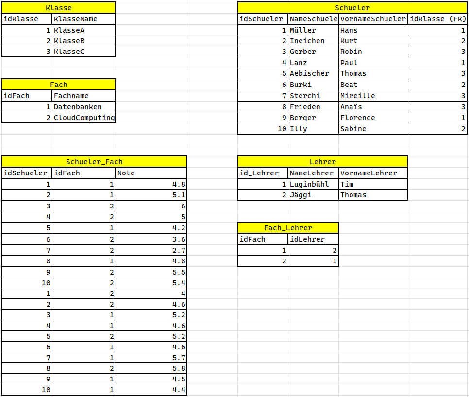

# UE06-03-Schuldatenbank

## 3NF herstellen

!!! example "Aufgabe 1"
    
    An einer Schule soll es in Zukunft eine zentralisierte Datenablage geben. Folgende Anforderungen gelten für die zu erstellende Datenbank:
    
    * Ein Schüler hat jeweils einen Vor- und Nachnamen
    * Die Lehrperson hat einen Vor- und Nachnamen und unterrichtet mindestens ein Fach, oder mehrere Fächer
    * Eine Klasse hat einen Namen und beliebig viele Schüler
    * Pro Fach kann ein Schüler jeweils eine numerische Note von 1-6 erzielen (eine Kommanstelle Präzision reicht) 
    
    Versuche die nötigen Tabellen in der **3ten Normalform** (3NF) zu entwickeln. Gehe dabei methodisch vor: siehe Folien auf Moodle.

## Konzeptionelles und logisches ERM erstellen

!!! example "Aufgabe 2"

    Erstelle aus den Angaben von Aufgabe 1 ein *konzeptionelles und ein logisches ERM*. 
    Diese Aufgabe kannst du auch lösen, wenn die vorhergehende Aufgabe noch nicht gelöst wurde.
    Gehe auch hier methodisch vor und nimm die PPT-Folien als Hilfe.


## Physische Datenbank aus logischem ERM erstellen

!!! example "Aufgabe 3"
    
    In einem weiteren Schritt sollst Du die Datenbank mittels SQL umsetzen. Fülle die Datenbank mit einer genügend grossen Anzahl Testdaten und versuche mehrere Tabellen gleichzeitig abzufragen. Diesen Schritt nennt man auch physisches Datenbankmodell. Hierbei soll dir das logische ERM als Basis dienen.

    Erstelle Queries für folgende Fragestellungen:

    * Was sind die Namen der Lehrer die eine bestimmte Klasse unterrichten?
    * Welchen Notendurchschnitt hat ein bestimmter Schüler?
    * Welches Fach hat am meisten Schüler?


??? success "Lösungsvorschlag"

    Vorgehen konzeptionelle ERM:

    1. Das konzeptionelle ERM erstellen wir, indem wir die Entitäten (Entitätsmengen) als erses bestimmen. Entitäten besitzen immer mehrere gleichartige Elemente, wie z. Beispiel Lehrer, Schüler, Klassen, etc. Meist sind es Nomen in einer textuellen Beschreibung einer fachlichen Anforderung!
    2. Bestimmung der Beziehungen zwischen den Entitäten. Beschreiben Sie die Beziehung.
    3. Attribute (Merkmale) der Entitäten können wir auch gleich notieren und im ERM darstellen
    4. Bestimmung der Kardinalitäten (Anzahlangaben) zwischen den Entitäten. Gehen Sie dabei so vor, wie im PPT beschrieben: 1:m, m:m, etc

    
    Dies führt uns zu folgendem ERM:


    <figure markdown="span">
    { width="800" }
    <figcaption>konzeptionelles ERM zur Aufgabenstellung</figcaption>
    </figure>

    Beachte die Kardinalitäten: 
    
    Die Umsetzung von m-m-Beziehungen bedingt eine Zusatztabelle, die sog. Verbindungstabelle.

    Wir haben hier zwei m-m-Beziehungen:
    * Schueler-Fach: 1 Schüler belegt mehrere Fächer und ein Fach wird von mehreren Schülern belegt
    * Fach-Lehrer: 1 Fach kann von mehreren Lehrern unterrichtet werden und 1 Lehrer kann mehrere Fächer unterrichten.

    Das heisst, wir müssen zusätzlich 2 Verbinduchstabellen erstellen:
    * Schueler_Fach
    * Fach_Lehrer

    
    Die Beziehung Schueler-Fach hat zudem ein Merkmal "Note". Dieses Merkmal müssen wir in der Verbindungstabelle *Schueler_Fach* berücksichtigen.

    Vorgehen logisches ERM:

    Das logische ERM ist die Basis für das physische ERM. Es sollte daher komplett sein und auch die Verbindungstabellen berücksichtigen. Komplett heisst: alle Merkmale, Verbindiungstabellen, Schlüssel (PK und FK) inkl. Tabellen- und Attributnamen sind geklärt.

    **Logisches ERM als textualer Beschreibung:**

    * Schueler(<u>idSchueler</u>, NameSchueler, VornameSchueler, idKlasse (FK))
        * $\rightarrow$ der ForeignKey ist immer in der Tabelle, welche mit m bezeichnet ist! Siehe konzeptionelles ERM oben.
    * Klasse(<u>idKlasse</u>, KlasseName)
    * Fach(<u>idFach</u>, Fachname)
    * Schueler_Fach(<u>idSchueler</u>,<u>idFach</u>,Note)
        * $\rightarrow$ Verbindungstabelle mit Merkmal Note 
    * Lehrer(<u>idLehrer</u>, NameLehrer, VornameLehrer)
    * Fach_Lehrer(<u>idFach</u>, <u>idLehrer</u>)
    
    **Logisches ERM in Tabellenform mit Beispieldaten**

    <figure markdown="span">
    { width="700" }
    <figcaption></figcaption>
    </figure>

    ``` sql title="Datenbank mit Tabellen erstellen"

    CREATE DATABASE SchulDB;

    USE SchulDB;
    
    CREATE TABLE Klasse (
      idKlasse int NOT NULL,
      KlasseName varchar(45) DEFAULT NULL,
      PRIMARY KEY (idKlasse)
    );
    
    
    CREATE TABLE Schueler (
      idSchueler int NOT NULL,
      NameSchueler varchar(45) DEFAULT NULL,
      VornameSchueler varchar(45) DEFAULT NULL,
      idKlasse int  NULL,
      PRIMARY KEY (idSchueler),
      FOREIGN KEY (idKlasse) REFERENCES Klasse (idKlasse)
    );
        
    CREATE TABLE  Fach  (
       idFach int NOT NULL,
       Fachname  varchar(45) DEFAULT NULL,
      PRIMARY KEY ( idFach )
    );
    
    CREATE TABLE Schueler_Fach (
      idSchueler int NOT NULL,
      idFach int NOT NULL,
      Note DECIMAL(10,1) NULL,
      PRIMARY KEY (idSchueler,idFach),
      FOREIGN KEY (idSchueler) REFERENCES Schueler (idSchueler),
      FOREIGN KEY (idFach) REFERENCES Fach (idFach)
    );
    
    

    
    CREATE TABLE Lehrer (
      idLehrer int NOT NULL,
      NameLehrer varchar(45) DEFAULT NULL,
      VornameLehrer varchar(45) DEFAULT NULL,
      PRIMARY KEY (idLehrer)
    );
    
    CREATE TABLE Fach_Lehrer (
      idFach INT NOT NULL,
      idLehrer INT NOT NULL,
      PRIMARY KEY (idFach, idLehrer),
      FOREIGN KEY (idFach) REFERENCES Fach (idFach),
      FOREIGN KEY (idLehrer) REFERENCES Lehrer (idLehrer)
    );
    
    
    
    
    ```

    ``` sql title="Tabellen mit Beispieldaten füllen"
    
    -- Tabelle Fach
    INSERT INTO `SchulDB`.`Fach` (`idFach`, `Fachname`) VALUES ('1', 'Datenbanken');
    INSERT INTO `SchulDB`.`Fach` (`idFach`, `Fachname`) VALUES ('2', 'CloudComputing');

    -- Tabelle Klasse
    INSERT INTO `SchulDB`.`Klasse` (`idKlasse`, `KlasseName`) VALUES ('1', 'KlasseA');
    INSERT INTO `SchulDB`.`Klasse` (`idKlasse`, `KlasseName`) VALUES ('2', 'KlasseB');
    INSERT INTO `SchulDB`.`Klasse` (`idKlasse`, `KlasseName`) VALUES ('3', 'KlasseC');
    
    -- Tabelle Schueler
    INSERT INTO `SchulDB`.`Schueler` (`idSchueler`, `NameSchueler`, `VornameSchueler`, `idKlasse`) VALUES ('1', 'Müller', 'Hans', '1');
    INSERT INTO `SchulDB`.`Schueler` (`idSchueler`, `NameSchueler`, `VornameSchueler`, `idKlasse`) VALUES ('2', 'Ineichen', 'Kurt', '2');
    INSERT INTO `SchulDB`.`Schueler` (`idSchueler`, `NameSchueler`, `VornameSchueler`, `idKlasse`) VALUES ('3', 'Gerber', 'Robin', '3');
    INSERT INTO `SchulDB`.`Schueler` (`idSchueler`, `NameSchueler`, `VornameSchueler`, `idKlasse`) VALUES ('4', 'Lanz', 'Paul', '1');
    INSERT INTO `SchulDB`.`Schueler` (`idSchueler`, `NameSchueler`, `VornameSchueler`, `idKlasse`) VALUES ('5', 'Aebischer', 'Thomas', '3');
    INSERT INTO `SchulDB`.`Schueler` (`idSchueler`, `NameSchueler`, `VornameSchueler`, `idKlasse`) VALUES ('6', 'Burki', 'Beat', '2');
    INSERT INTO `SchulDB`.`Schueler` (`idSchueler`, `NameSchueler`, `VornameSchueler`, `idKlasse`) VALUES ('7', 'Sterchi', 'Mireille', '3');
    INSERT INTO `SchulDB`.`Schueler` (`idSchueler`, `NameSchueler`, `VornameSchueler`, `idKlasse`) VALUES ('8', 'Frieden', 'Anaïs', '3');
    INSERT INTO `SchulDB`.`Schueler` (`idSchueler`, `NameSchueler`, `VornameSchueler`, `idKlasse`) VALUES ('9', 'Berger', 'Florence', '1');
    INSERT INTO `SchulDB`.`Schueler` (`idSchueler`, `NameSchueler`, `VornameSchueler`, `idKlasse`) VALUES ('10', 'Illy', 'Sabine', '2');

    -- Tabelle Lehrer
    INSERT INTO `SchulDB`.`Lehrer` (`idLehrer`, `NameLehrer`, `VornameLehrer`) VALUES ('1', 'Luginbühl', 'Tim');
    INSERT INTO `SchulDB`.`Lehrer` (`idLehrer`, `NameLehrer`, `VornameLehrer`) VALUES ('2', 'Jäggi', 'Thomas');

    -- Tabelle Schueler_Fach

    INSERT INTO `SchulDB`.`Schueler_Fach` (`idSchueler`, `idFach`, `Note`) VALUES ('1', '1', '4.8');
    INSERT INTO `SchulDB`.`Schueler_Fach` (`idSchueler`, `idFach`, `Note`) VALUES ('2', '1', '5.1');
    INSERT INTO `SchulDB`.`Schueler_Fach` (`idSchueler`, `idFach`, `Note`) VALUES ('3', '2', '6');
    INSERT INTO `SchulDB`.`Schueler_Fach` (`idSchueler`, `idFach`, `Note`) VALUES ('4', '2', '5.0');
    INSERT INTO `SchulDB`.`Schueler_Fach` (`idSchueler`, `idFach`, `Note`) VALUES ('5', '1', '4.2');
    INSERT INTO `SchulDB`.`Schueler_Fach` (`idSchueler`, `idFach`, `Note`) VALUES ('6', '2', '3.6');
    INSERT INTO `SchulDB`.`Schueler_Fach` (`idSchueler`, `idFach`, `Note`) VALUES ('7', '2', '2.7');
    INSERT INTO `SchulDB`.`Schueler_Fach` (`idSchueler`, `idFach`, `Note`) VALUES ('8', '1', '4.8');
    INSERT INTO `SchulDB`.`Schueler_Fach` (`idSchueler`, `idFach`, `Note`) VALUES ('9', '2', '5.5');
    INSERT INTO `SchulDB`.`Schueler_Fach` (`idSchueler`, `idFach`, `Note`) VALUES ('10', '2', '5.4');
    INSERT INTO `SchulDB`.`Schueler_Fach` (`idSchueler`, `idFach`, `Note`) VALUES ('1', '2', '4.3');
    INSERT INTO `SchulDB`.`Schueler_Fach` (`idSchueler`, `idFach`, `Note`) VALUES ('2', '2', '4.1');
    INSERT INTO `SchulDB`.`Schueler_Fach` (`idSchueler`, `idFach`, `Note`) VALUES ('3', '1', '4.0');
    INSERT INTO `SchulDB`.`Schueler_Fach` (`idSchueler`, `idFach`, `Note`) VALUES ('4', '1', '4.6');
    INSERT INTO `SchulDB`.`Schueler_Fach` (`idSchueler`, `idFach`, `Note`) VALUES ('5', '2', '5.2');
    INSERT INTO `SchulDB`.`Schueler_Fach` (`idSchueler`, `idFach`, `Note`) VALUES ('6', '1', '4.6');
    INSERT INTO `SchulDB`.`Schueler_Fach` (`idSchueler`, `idFach`, `Note`) VALUES ('7', '1', '5.7');
    INSERT INTO `SchulDB`.`Schueler_Fach` (`idSchueler`, `idFach`, `Note`) VALUES ('8', '2', '5.8');
    INSERT INTO `SchulDB`.`Schueler_Fach` (`idSchueler`, `idFach`, `Note`) VALUES ('9', '1', '4.5');
    

    -- Tabelle Fach_Lehrer
    INSERT INTO `SchulDB`.`Fach_Lehrer` (`idFach`, `idLehrer`) VALUES ('1', '2');
    INSERT INTO `SchulDB`.`Fach_Lehrer` (`idFach`, `idLehrer`) VALUES ('2', '1');


    ```

    ``` sql title="Query: Was sind die Namen der Lehrer die eine bestimmte Klasse unterrichten?"
    -- Was sind die Namen der Lehrer die eine bestimmte Klasse unterrichten?
    -- alle Daten abfragen
    SELECT * FROM Schueler, Klasse, Schueler_Fach,Fach,Fach_Lehrer,Lehrer
     WHERE Schueler.idKlasse = Klasse.idKlasse
     AND Schueler_Fach.idSchueler = Schueler.idSchueler
     AND Fach.idFach =  Schueler_Fach.idFach
     AND Fach_Lehrer.idFach = Schueler_Fach.idFach
     AND Fach_Lehrer.idLehrer = Lehrer.idLehrer
     
     -- alle Schüler, welche in KlasseA unterrichtet werden
     SELECT * FROM Schueler, Klasse, Schueler_Fach,Fach,Fach_Lehrer,Lehrer
     WHERE Schueler.idKlasse = Klasse.idKlasse
     AND Schueler_Fach.idSchueler = Schueler.idSchueler
     AND Fach.idFach =  Schueler_Fach.idFach
     AND Fach_Lehrer.idFach = Schueler_Fach.idFach
     AND Fach_Lehrer.idLehrer = Lehrer.idLehrer
     AND Klasse.KlasseName = "KlasseA"
     
     -- alle Lehrer, welche in KlasseA unterrichten. FINALES ERGEBNIS
     SELECT DISTINCT Lehrer.NameLehrer, Lehrer.VornameLehrer FROM Schueler, Klasse, Schueler_Fach,Fach,Fach_Lehrer,Lehrer
     WHERE Schueler.idKlasse = Klasse.idKlasse
     AND Schueler_Fach.idSchueler = Schueler.idSchueler
     AND Fach.idFach =  Schueler_Fach.idFach
     AND Fach_Lehrer.idFach = Schueler_Fach.idFach
     AND Fach_Lehrer.idLehrer = Lehrer.idLehrer
     AND Klasse.KlasseName = "KlasseA"

    ```


    ``` sql title="Query: Welchen Notendurchschnitt hat ein bestimmter Schüler?"
    SELECT * FROM Schueler, Klasse, Schueler_Fach,Fach,Fach_Lehrer,Lehrer
    WHERE Schueler.idKlasse = Klasse.idKlasse
    AND Schueler_Fach.idSchueler = Schueler.idSchueler
    AND Fach.idFach =  Schueler_Fach.idFach
    AND Fach_Lehrer.idFach = Schueler_Fach.idFach
    AND Fach_Lehrer.idLehrer = Lehrer.idLehrer
    AND Schueler.NameSchueler = "Sterchi"
    
    -- Resultat für Sterchi: Noten 2.7 und 5.7. --> Durchschnitt ist 4.2
    
    -- Welchen Notendurchschnitt hat Sterchi? FINALES ERGEBNIS:
    SELECT Schueler.NameSchueler, AVG(Note) AS AVG_Modules FROM Schueler, Klasse, Schueler_Fach,Fach,Fach_Lehrer,Lehrer
    WHERE Schueler.idKlasse = Klasse.idKlasse
    AND Schueler_Fach.idSchueler = Schueler.idSchueler
    AND Fach.idFach =  Schueler_Fach.idFach
    AND Fach_Lehrer.idFach = Schueler_Fach.idFach
    AND Fach_Lehrer.idLehrer = Lehrer.idLehrer
    AND Schueler.NameSchueler = "Sterchi"
    -- Resultat für Sterch: 4.2  Stimmt!
 
    ```
 
    ``` sql title="Query: Welches Fach hat am meisten Schüler?"

    SELECT * FROM Schueler, Klasse, Schueler_Fach,Fach,Fach_Lehrer,Lehrer
     WHERE Schueler.idKlasse = Klasse.idKlasse
     AND Schueler_Fach.idSchueler = Schueler.idSchueler
     AND Fach.idFach =  Schueler_Fach.idFach
     AND Fach_Lehrer.idFach = Schueler_Fach.idFach
     AND Fach_Lehrer.idLehrer = Lehrer.idLehrer
     ORDER BY Fach.idFach
     
     -- GROUP BY Fach mit COUNT() mit Sortierung DESC und Anzeige des höchsten Wertes mit LIMIT 1
     SELECT Fach.Fachname, COUNT(Fach.idFach) AS Anzahl_Schueler FROM Schueler, Klasse, Schueler_Fach,Fach,Fach_Lehrer,Lehrer
     WHERE Schueler.idKlasse = Klasse.idKlasse
     AND Schueler_Fach.idSchueler = Schueler.idSchueler
     AND Fach.idFach =  Schueler_Fach.idFach
     AND Fach_Lehrer.idFach = Schueler_Fach.idFach
     AND Fach_Lehrer.idLehrer = Lehrer.idLehrer
     GROUP BY Fach.idFach
     ORDER BY Anzahl_Schueler DESC
     -- LIMIT 1


    ```


<figure markdown="span">
  { width="500" }
  <figcaption></figcaption>
</figure>