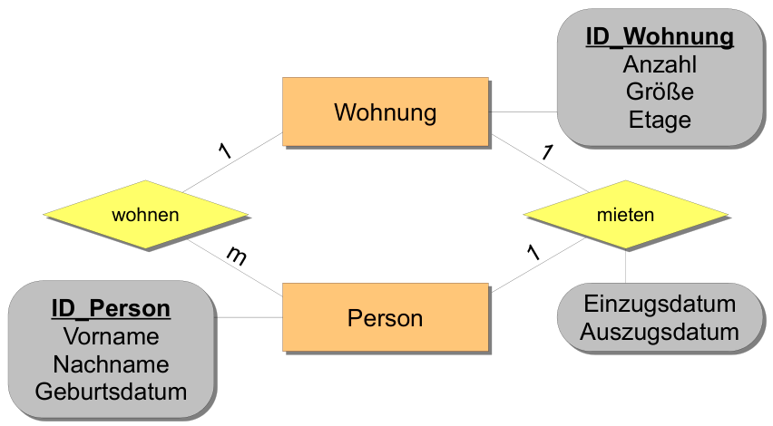
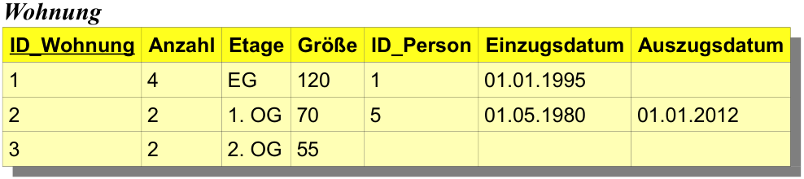
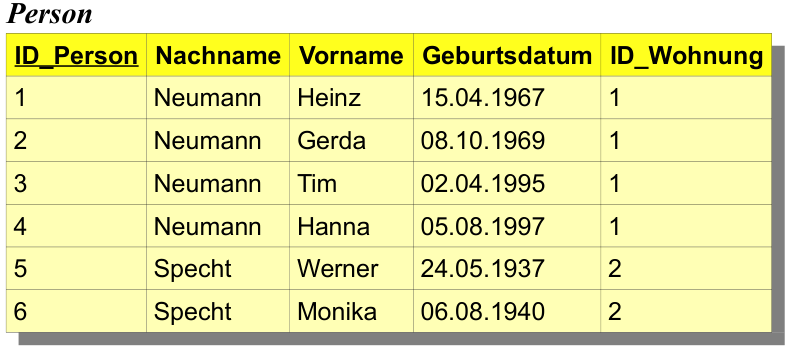
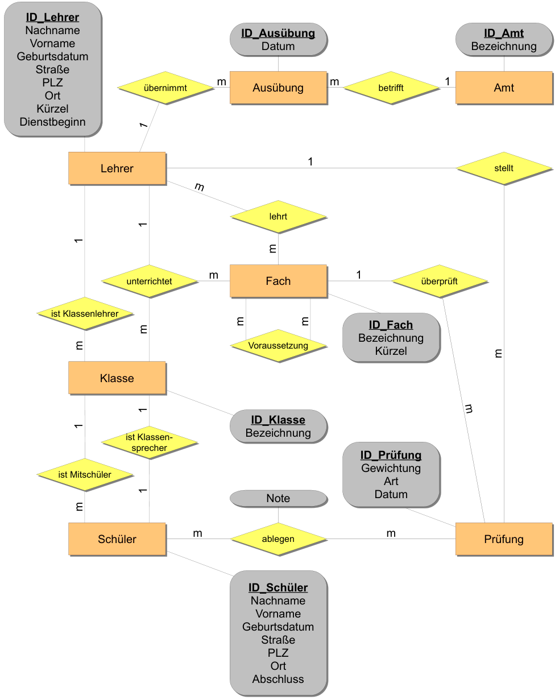

# UE07-01 Übungen

## 1. Fehlerhafte Tabellen

In einem Unternehmen sollen der Name, die Adresse, das Alter und der direkte Vorgesetzte des
jeweiligen Mitarbeiters in einer Tabelle gespeichert werden.

| Name           | Adresse                     | Alter | Vorgesetzter   |
|----------------|-----------------------------|-------|----------------|
| Scofield, John | Kirchweg 4, 2500 Biel       | 44    |                |
| Hankok, Herbie | Hof 7, 8000 Zürich          | 21    | Scofiled, John |
| Starr, Ringo   | Rosenstrasse 1, 4566 Halten | 24    | Scofield, John |
| John,Elton     | am Platz 3, 7000 Luzern     | 31    |                |

Aus dieser Tabelle ist beispielsweise erkennbar, dass 'Scofield John' der direkte Vorgesetze der beiden
Mitarbeiter 'Hankok Herbie' und 'Starr Ringo' ist.

1. Warum ist diese Tabelle für die Umsetzung auf einem relationalen Datenbanksystem
ungeeignet?

2. Zu welchen Komplikationen kann es bei der Verwendung dieser Tabelle kommen?

??? success "Antworten"

    === "1."
        * Weil die Tabelle kein eindeutiges Schlüsselmerkmal (und keinen Schlüssel) besitzt.
        * Weil einige Tabellenspalten mehrere unterschiedliche Informationen enthalten. (z. B. Name anstelle von Vorname und Nachname oder Adresse für Strasse, PLZ, Ort)
        * Die Tabelle enthält Informationen, die ständigen Änderungen unterworfen sind. (z. B. Alter anstelle von Geburtsdatum)

    === "2."
        * Ein Datensatz kann nicht (oder nur unzureichend) eindeutig identifiziert werden. 
        * Es ist nicht immer möglich zwischen Vorname und Nachname eindeutig zu unterscheiden, da in der Spalte 'Name' eine saubere und eindeutige Trennung zwischen Vor- und Nachname nicht enthalten ist.
        * Nach jedem Geburtstag eines Mitarbeiters muss das entsprechende Alter angepasst werden.

## 2. Schlüssel  und Fremdschlüssel

1. Welche beiden Eigenschaften muss ein Schlüsselmerkmal erfüllen?
2. Welcher Zusammenhang besteht zwischen einem Fremdschlüssel und einem zugehörigen Schlüsselmerkmal?
3. Begründen Sie, ob die Werte eines Fremdschlüssels eindeutig sein müssen oder nicht?
4. Beschreiben Sie die Bedeutung der Merkmale einer Beziehungstabelle.   
       a. Welche Merkmale sind Fremdschlüssel?

       b. Welche Merkmale gehören zum Schlüssel?

??? success "Antworten"

    === "1."
        Ein Schlüssel muss folgende beiden Bedingungen erfüllen:

        * Eindeutigkeit: Ein Schlüssel identifiziert eindeutig die Datensätze der Tabelle.
        * Minimal: Wird ein Schlüssel aus mehreren Merkmalen kombiniert, dürfen nicht mehr Merkmale als unbedingt notwendig an der Kombination beteiligt werden.
  
    === "2."
        Als Fremdschlüssel einer Tabelle wird ein Merkmal oder eine Kombination von Merkmalen bezeichnet, die in einer anderen Tabelle als Schlüssel vorkommen. Mithilfe von Fremdschlüsseln werden die Beziehungen zwischen Tabellen realisiert.
    
    === "3."
        * Die Werte müssen nicht eindeutig sein!
        * Beispiel: Betrachten Sie die Tabellen 'Klasse' und 'Schüler'. Um die Beziehung 'ist Mitschüler' umzusetzen, muss das Merkmal 'ID_Klasse' der Tabelle 'Schüler' als Fremdschlüssel hinzugefügt werden. Da aber mehrere Schüler in dieselbe Klasse gehen, wird auch derselbe ID-Wert im Fremdschlüsselmerkmal 'ID_Klasse' mehrfach auftauchen.

    === "4."
        Zusammengesetzter Schlüssel:

        Der Schlüssel der Beziehungstabelle wird aus der Kombination der Fremdschlüssel gebildet. Die einzelnen Merkmale, aus denen sich der Schlüssel zusammensetzt, werden auch als Teilschlüssel bezeichnet.

## 3. ER-Modell Miethaus
Erstellen Sie das ER-Modell zu der folgenden Datenbankbeschreibung mit Anforderungsliste.
Der Vermieter eines Mietshauses möchte eine Datenbank erstellen lassen, in der er Informationen
zu seinem Mietshaus ablegen kann.

Anforderungsliste:

1. Welche Wohnungen gibt es in dem Mietshaus?
2. Zu der Wohnung sollen die Grösse in m², die Anzahl der Personen, für die die Wohnung ausgelegt ist und die Angabe der Etage (EG, 1. OG, 2. OG) gespeichert werden.
3. Welche Personen leben in dem Mietshaus?
4. Welche Personen wohnen in den jeweiligen Wohnungen?
5. Es können mehrere Personen in einer Wohnung wohnen.
6. Eine Person kann nicht gleichzeitig in mehreren Wohnungen wohnen.
7. Wohnungen werden von Personen gemietet.
8. In jeder Wohnung gibt es eine Person, die als Ansprechpartner bzw. als „offizieller“ Mieter auftritt.
9. Eine Person kann nicht gleichzeitig Mieter von mehreren Wohnungen sein.
10. Zu den Personen sollen der Vorname, der Nachname und das Geburtsdatum erfasst werden.

Augaben:

1. Welche *Entitäten* entnehmen Sie der Anforderungsliste?
2. Welche *Beziehungen* entnehmen Sie der Anforderungsliste?
3. Erstellen Sie ein *konzeptionelles ER-Modell* mit Kardinalitäten und Merkmalenin Form einer Skizze!
4. Erstellen Sie mithilfe der Überführungsregeln die zugehörigen Tabellen mit folgenden Datensätzen:
   
       **Erdgeschoss**:

       Die Wohnung im Erdgeschoss hat 120 m² und ist für maximal 4 Personen ausgelegt. Sie wurde von Heinz Neumann (geb. 15.04.1967) für sich und seine Familie, Gerda Neumann (geb. 08.10.69) und die Kinder Tim (geb. 02.04.1995) und Hanna (geb. 05.08.1997) ab dem 01.01.95 gemietet.

       **Erstes Obergeschoss:**

       Das erste Obergeschoss (1. OG) hat 70 m² und kann maximal von 3 Personen genutzt werden. Es wird von dem Ehepaar Werner (geb. 24.5.1937) und Monika Specht (geb. 06.08.1940) seit dem 01.05.80 bewohnt. Weil den Spechts die Familie Neumann im EG zu laut ist, hat Werner Specht (Mieter) die Wohnung zum 01.01.2012 gekündigt.

       **Zweites Obergeschoss:**

       Die Wohnung im zweiten Obergeschoss (2. OG) hat 55 m² und bietet Platz für maximal 2 Personen. Sie steht zur Zeit leer.

??? success "Antworten"

    === "1."
        Entitäten: Wohnung, Person

    === "2."
        Beziehungen: wohnen, mieten
    
    === "3."
        <figure markdown="span">
        { width="600" }
        <figcaption>konzeptionelles ER-Modell</figcaption>
        </figure>

    === "4."
        Es werden nur 2 Tabellen benötigt (2 Entitäten; keine m:m-Beziehung, daher keine Verbindungstabelle.).

        <figure markdown="span">
        { width="600" }
        <figcaption>Der Fremdschlüssel 'ID_Person' realisiert die Beziehung 'mietet'</figcaption>
        </figure>

        <figure markdown="span">
        { width="600" }
        <figcaption>Der Fremdschlüssel 'ID_Wohnung' realisiert die Beziehung 'wohnen'</figcaption>
        </figure>

## 4. ER-Modell grössere Schuldatenbank

Für eine Berufsschule soll eine Datenbank erstellt werden. Mit der Schulleitung und dem Fachpersonal, das später mit der Datenbank arbeiten soll, sind erste Gespräche geführt worden, aus denen die folgende Anforderungsliste entstanden ist. In dieser Aufgabe wird eine Anforderungsliste vorgegeben, die in Bezug auf die Anzahlangaben absichtlich nicht vollständig ist.

Beim Lösen der Aufgabe gehen Sie bitte wie folgt vor:

1. Erstellen Sie das ER-Modell zur gegebenen Anforderungsliste.
2. Ergänzen Sie die Anzahlangaben sinnvoll.
3. Erzeugen Sie die Tabellen mithilfe des ER-Modells.

**Anforderungsliste:**

1. Welche Schüler gibt es an der Schule?
2. Der Name, der Vorname, die Adresse sowie das Geburtsdatum und der bisher erreichte schulische Abschluss müssen als Informationen für einen Schüler gespeichert werden.
3. Welche Klassen gibt es an der Schule?
4. Welche Ämter werden an der Schule ausgeübt?
5. Unter einem Amt versteht man zusätzliche Aufgaben wie Klassenlehrer, Mentor, etc.
6. Für Ämter und auch für Klassen genügt die Angabe einer Bezeichnung als Information.
7. Welche Schüler sind Mitschüler welcher Klasse?
8. Eine Klasse kann in mehrere feste Laborgruppen aufgeteilt werden. 
9. Die Information welcher Laborgruppe ein Schüler zugeteilt worden ist, soll ebenfalls in der Datenbank hinterlegt werden. Die Laborgruppe kann somt als einfaches Merkmal eines Schülers einer Klasse definiert werden.
10. Welcher Schüler ist Klassensprecher einer Klasse?
11. Welche Fächer werden an der Schule unterrichtet?
12. Für das Fach muss eine Fachbezeichnung und das Fachkürzel in der Datenbank gespeichert werden.
13. Welche Lehrer gibt es an der Schule?
14. Als Angaben zu einem Lehrer sind der Vor- und Nachname, seine Privatadresse, das Lehrerkürzel, sein Alter und das Dienstalter notwendig.
15. Welcher Lehrer ist Klassenlehrer einer Klasse?
16. Seit wann ist ein Lehrer Klassenlehrer einer Klasse?
17. Ein Lehrer kann Klassenlehrer von mehreren Klassen sein. Aber eine Klasse hat immer nur einen Klassenlehrer.
18. Welcher Lehrer lehrt welche Fächer?
19. Welcher Lehrer unterrichtet in welcher Klasse welches Fach?
20. Ein Fach wird in einer Klasse nur von einem Lehrer unterrichtet.
21. Welcher Lehrer prüft welchen Schüler in welchem Fach?
22. Ein Lehrer kann einen Schüler evtl. in mehreren Fächern prüfen.
23. Ein Schüler wird in einem Fach nur von einem Lehrer geprüft.
24. Ein Lehrer prüft in einem Fach mehrere Schüler.
25. Mit welchen Noten prüft der Lehrer einen Schüler in einem Fach und an welchem Datum? Mit welcher Gewichtung (z. B. 3 = Arbeit, 1 = Test, …) geht das Prüfergebnis in die Endnote ein? Wie hat der Lehrer den Schüler in dem Fach geprüft (Art der Prüfung: Arbeit, Test, ...)?

**Anmerkung:**
Mit Ausnahme der Ämter, bei denen explizit gefordert wurde, dass nachvollziehbar bleibt, wann welcher Lehrer welches Amt übernommen hat, sind keine Historiendaten in der Datenbank erforderlich. Beispielsweise ist nicht wichtig, wer in der Vergangenheit schon mal Klassenlehrer einer bestimmten Klasse war. Die Datenbank repräsentiert abgesehen von den Besetzungen der Ämter lediglich den aktuellen Zustand im laufenden Schuljahr.

Eine Ortstabelle muss nicht erstellt werden. Die Adresse wird bei den Entitäten gespeichert.

??? success "Antworten"

    === "ER-Modell mit Kardinalitäten"
        
        <figure markdown="span">
        { width="800" }
        <figcaption>konzeptionelles ER-Modell</figcaption>
        </figure>

    === "Tabellen"
        Es werden 11 Tabellen benötigt (7 Entitäten; 3 m:m-Beziehungen, eine Mehrfachbeziehung).
        <figure markdown="span">
        { width="800" }
        <figcaption>logisches ERM - Tabellen</figcaption>
        </figure>
