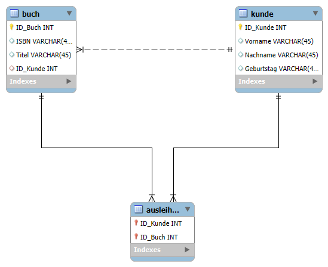
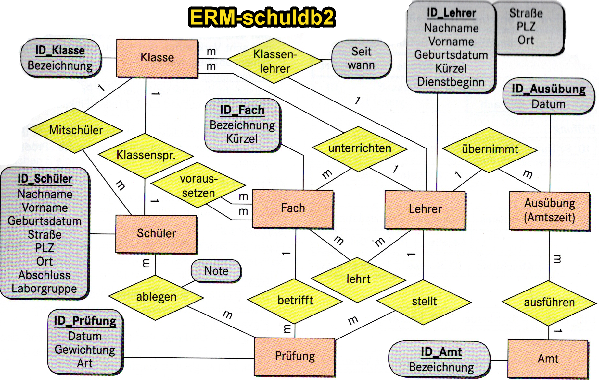

# LE08-Table-JOINs and Transactions

## Demodatenbank books (PPT)

Auf die beiliegende Demodatenbank wird in den PPT's auf Moodle referenziert. Für die Übungen werden wir eine andere Datenbank verwenden.

Zum Erstellen der DB öffnen Sie in der  {==MySQL Workbench==} ein neues SQL-Tab und führen Sie bibliothek.sql aus. Anschliessend `Refresh All` ausführen, damit die DB sichtbar wird.

[Download bibliothek.sql](../static/bibliothek.sql){:download="bibliothek.sql"}

<figure markdown="span">
  { width="800" }
  <figcaption>ERM der Bibliothek-Datenbank</figcaption>
</figure>

## Demodatenbank schuldb2 für Übungsaufgaben UE08-xx

[Download schuldb2.sql](../static/schuldb2.sql){:download="schuldb2.sql"}

[Download ERM-schuldb2](../static/ERM-schuldb2.png){:download="ERM-schuldb2.png"}

<figure markdown="span">
  { width="800" }
  <figcaption>ERM der schuldb2-Datenbank</figcaption>
</figure>

## Literatur

### JOIN-Beispiele

[Download JOINs.pdf](../static/JOINs.pdf){:download="JOINs.pdf"}

### Subqueries - Unterabfragen
[Download Unterabfragen-SubQueries.pdf](../static/Unterabfragen-SubQueries.pdf){:download="Unterabfragen-SubQueries.pdf"}

### Transaktionen
[Download Transaktionen.pdf](../static/Transaktionen.pdf){:download="Transaktionen.pdf"}

## Übungsdatenbank zu den Literaturhinweisen

[Download books.sql](../static/books.sql){:download="books.sql"}
