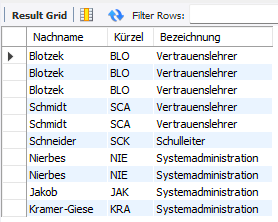
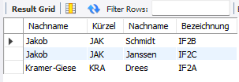
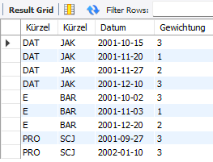
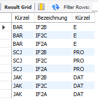
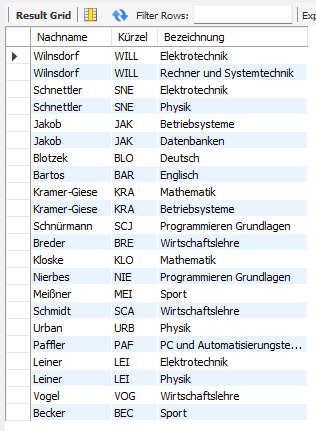
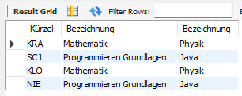

# UE08-01 Übungen zum INNER JOIN (EQUI-JOIN)

verwendete Datenbank: schuldb2

## Frage 1

!!! question

     Welche Aufgaben/Ämter bekleiden die Lehrer? Lassen Sie sich den Nachnamen und das Kürzel des Lehrers und die Bezeichnung des Amtes ausgeben.

=== "Antwort"

    <figure markdown="span">
    
    <figcaption></figcaption>
    </figure>
    
=== "SQL"

    ```sql
    SELECT L.Nachname, L.Kürzel, A.Bezeichnung
    FROM Lehrer AS L, Amt AS A, Ausübung AS Au
    WHERE L.ID_Lehrer = Au.ID_Lehrer
    AND Au.ID_Amt = A.ID_Amt;
    ```
## Frage 2
!!! question

     Lassen Sie sich den Klassenlehrer und den Klassensprecher der Klassen ausgeben.
     Dabei sind der Nachname des Klassenlehrers sowie dessen Kürzel, der Nachname des Klassensprechers und die Bezeichnung der Klasse wichtig.

=== "Antwort"

    <figure markdown="span">
    
    <figcaption></figcaption>
    </figure>
    
=== "SQL"

    ```sql
    SELECT L.Nachname, L.Kürzel, S.Nachname, K.Bezeichnung
    FROM Lehrer AS L, Schüler AS S, Klasse AS K
    WHERE L.ID_Lehrer = K.ID_Lehrer
    AND S.ID_Schüler = K.ID_Schüler;
    ```
## Frage 3
!!! question

     Ermitteln Sie, welcher Mitarbeiter eine Prüfung in welchem Fach gestellt hat. Lassen Sie sich dazu das Kürzel des Faches und des Mitarbeiters sowie das Datum und die Gewichtung der Prüfung anzeigen.

=== "Antwort"

    <figure markdown="span">
    
    <figcaption></figcaption>
    </figure>
    
=== "SQL"

    ```sql
    SELECT F.Kürzel, L.Kürzel, P.Datum, P.Gewichtung
    FROM Fach AS F, Lehrer AS L, Prüfung AS P
    WHERE L.ID_Lehrer = P.ID_Lehrer
    AND F.ID_Fach = P.ID_Fach;
    ```

## Frage 4
!!! question

     Bestimmen Sie, welcher Lehrer in welcher Klasse welches Fach unterrichtet. Lassen Sie sich das Lehrer- und Fachkürzel und die Klassenbezeichnung anzeigen.

=== "Antwort"

    <figure markdown="span">
    
    <figcaption></figcaption>
    </figure>
    
=== "SQL"

    ```sql
    SELECT L.Kürzel, K.Bezeichnung, F.Kürzel
    FROM Lehrer AS L, Klasse AS K, Fach AS F, unterrichten AS U
    WHERE F.ID_Fach = U.ID_Fach
    AND K.ID_Klasse = U.ID_Klasse
    AND L.ID_Lehrer = U.ID_Lehrer;
    ```

## Frage 5
!!! question

     Welcher Lehrer lehrt (nicht unterrichtet!) welches Fach? Lassen Sie sich den Nachnamen und das Kürzel des Lehrers sowie die Bezeichnung des Faches anzeigen.

=== "Antwort"

    <figure markdown="span">
    
    <figcaption></figcaption>
    </figure>
    
=== "SQL"

    ```sql
    SELECT L.Nachname, L.Kürzel, F.Bezeichnung 
    FROM Lehrer AS L, lehrt AS Le, Fach AS F 
    WHERE L.ID_Lehrer = Le.ID_Lehrer
    AND F.ID_Fach = Le.ID_Fach;
    ```

## Frage 6 - Self Join
!!! question

     Ermitteln Sie die Kürzel aller Lehrer, die ein Fach lehren, das Voraussetzung für ein anderes Fach ist. Lassen Sie sich das Lehrerkürzel, aber auch die beiden Fachbezeichnungen ausgeben. (Zwei Referenzen auf die Tabelle 'Fach' sind notwendig!)

=== "Antwort"

    <figure markdown="span">
    
    <figcaption></figcaption>
    </figure>
    
=== "SQL"

    ```sql
    SELECT L.Kürzel AS Kürzel, vor.Bezeichnung, nach.Bezeichnung 
    FROM Lehrer AS L, lehrt AS le, Fach AS vor, Fach AS nach, vorraussetzen AS v 
    WHERE L.ID_Lehrer = le.ID_Lehrer
    AND vor.ID_Fach = le.ID_Fach 
    AND vor.ID_Fach = v.ID_Fach_ist_Vorraussetzung
    AND nach.ID_Fach = v.ID_Fach_hat_Vorraussetzung;
    ```
