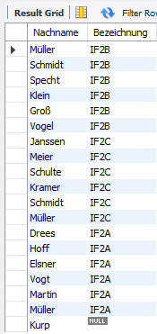

# UE08-02 Übungen zum LEFT- und RIGHT- JOIN

verwendete Datenbank: schuldb2

## Frage 1

!!! question

     Erstellen Sie eine vollständige Schülerliste mit Klassenzuteilung. Dabei sollen ALLE Schüler in der Liste enthalten sein, auch diejenigen, die zurzeit noch keiner Klasse zugeordnet sind. 
=== "Antwort"

    <figure markdown="span">
    
    <figcaption></figcaption>
    </figure>

    Es werden 19 Datensätze angezeigt, inklusive des Schülers 'Kurp, Udo'.
    
=== "SQL"

    ```sql
    SELECT S.Nachname, K.Bezeichnung 
    FROM Schüler AS S LEFT JOIN Klasse AS K 
    ON S.ID_Klasse = K.ID_Klasse;
    ```

## Frage 2
!!! question

     Ermitteln Sie, welcher Lehrer welches Fach lehrt. Bei dieser Abfrage sollen ALLE Fächer angezeigt werden, auch solche, für die zurzeit kein Lehrer eine Lehrbefähigung besitzt. Lassen Sie sich die Lehrer- und die entsprechenden Fachkürzel ausgeben. 
=== "Antwort"

    

    Es werden 25 Datensätze angezeigt, inklusive der Fächer 'L' (Latein), 'GR' (Griechisch), und 'JAVA'.
    
=== "SQL"

    ```sql
    SELECT L.Kürzel, F.Kürzel 
    FROM Fach AS F
    LEFT JOIN lehrt AS Le ON F.ID_Fach = Le.ID_Fach
    LEFT JOIN Lehrer AS L ON L.ID_Lehrer = Le.ID_Lehrer;
    ```

## Frage 3
!!! question

     Ermitteln Sie, welcher Lehrer welches Fach lehrt. Dabei sollen ALLE Lehrer angezeigt werden, auch solche, für die zurzeit noch keine Lehrbefähigung in der Datenbank eingetragen worden ist. 
=== "Antwort"

    
     Es werden 23 Datensätze angezeigt, inklusive des Lehrers 'SCK' (Schneider, Klaus)
    
    
=== "SQL"

    ```sql
    SELECT L.Kürzel, F.Kürzel
    FROM Fach AS F
    RIGHT JOIN lehrt AS Le ON F.ID_Fach = Le.ID_Fach
    RIGHT JOIN Lehrer AS L ON L.ID_Lehrer = Le.ID_Lehrer;

    ```

