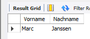
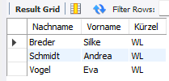
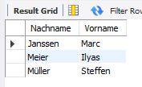
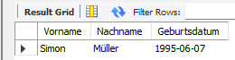
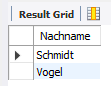
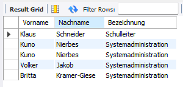

# UE08-03 Übungen zu Unterabfragen

verwendete Datenbank: schuldb2


## Frage 1
!!! question

     Bestimmen Sie den Nachnamen und den Vornamen des ältesten Schülers.
=== "Antwort"

    <figure markdown="span">
    
    <figcaption></figcaption>
    </figure>
    
=== "SQL ohne Variable"

    ```sql
    SELECT Nachname, Vorname 
    FROM Schüler
    WHERE Geburtsdatum = 
          ( SELECT MIN(Geburtsdatum)
            FROM Schüler
            WHERE Geburtsdatum != 0000-00-00 );
    ```

=== "SQL mit Variable"

    ```sql
    SELECT @geburtsdatum := MIN(Geburtsdatum)
    FROM Schüler 
    WHERE Geburtsdatum != 0000-00-00;
    SELECT Vorname, Nachname
    FROM Schüler 
    WHERE Geburtsdatum = @geburtsdatum;
    ```


## Frage 2
!!! question

     Bestimmen Sie die Nachnamen aller Lehrer, die das Fach lehren (nicht unbedingt unterrichten!), das nach Fachkürzel alphabetisch sortiert an letzter Stelle steht. Lassen Sie sich zusätzlich das Fachkürzel anzeigen.
=== "Antwort"

    <figure markdown="span">
    
    <figcaption></figcaption>
    </figure>
    
=== "SQL ohne Variable"

    ```sql
    SELECT L.Nachname, L.Vorname, F.Kürzel
    FROM Lehrer AS L, lehrt AS Le, Fach AS F
    WHERE L.ID_Lehrer = Le.ID_Lehrer
    AND Le.ID_Fach = F.ID_Fach
    AND F.Kürzel =
    ( SELECT MAX( Kürzel )
      FROM Fach );
    ```

=== "SQL mit Variable"

    ```sql
    SELECT @kürzel := MAX( Kürzel )
    FROM Fach;
    SELECT L.Nachname, L.Vorname, F.Kürzel
    FROM Lehrer AS L, lehrt AS Le, Fach AS F
    WHERE L.ID_Lehrer = Le.ID_Lehrer
      AND Le.ID_Fach = F.ID_Fach
      AND F.Kürzel = @kürzel;
    ```


## Frage 3
!!! question

     Ermitteln Sie die Nachnamen und Vornamen der Schüler, die älter sind als das Durchschnittsalter aller
     Schüler der Klasse 'IF2C'.
=== "Antwort"

    <figure markdown="span">
    
    <figcaption></figcaption>
    </figure>
    
=== "SQL ohne Variable"

    ```sql
    SELECT Nachname, Vorname
    FROM Schüler
    WHERE Geburtsdatum != '0000-00-00'
      AND Geburtsdatum <
          ( SELECT AVG( S.Geburtsdatum )
            FROM Schüler S, Klasse K
            WHERE S.ID_Klasse = K.ID_Klasse
              AND K.Bezeichnung = "IF2C"
              AND Geburtsdatum != '0000-00-00' );
    ```

=== "SQL mit Variable"

    ```sql
    SELECT @geburtsdatum := AVG( S.Geburtsdatum )
    FROM Schüler S, Klasse K
    WHERE S.ID_Klasse = K.ID_Klasse
      AND K.Bezeichnung = "IF2C"
      AND Geburtsdatum != '0000-00-00';
      SELECT Nachname, Vorname
      FROM Schüler
      WHERE Geburtsdatum != '0000-00-00'
        AND Geburtsdatum < @geburtsdatum;
    ```


## Frage 4
!!! question

     Bestimmen Sie die Vor- und Nachnamen und die Geburtsdaten aller Schüler, die jünger sind als alle Schüler der Klasse 'IF2A'.

     * Verwenden Sie einen 'Join', um auf die Klassenbezeichnung 'IF2A' abzuprüfen.
     * Formulieren Sie die Abfrage mit der ALL- oder ANY- Anweisung.
     * Wie kann diese SQL-Anfrage ohne ALL- oder ANY-Anweisung realisiert werden?

=== "Antwort"

    <figure markdown="span">
    
    <figcaption></figcaption>
    </figure>
    
=== "SQL"

    ```sql
    SELECT Vorname, Nachname, Geburtsdatum 
    FROM Schüler
    WHERE Geburtsdatum > All
          (SELECT S.Geburtsdatum
           FROM Schüler S, Klasse K 
           WHERE K.ID_Klasse = S.ID_Klasse 
             AND K.Bezeichnung = "IF2A");
    ```

=== "SQL Alternative ohne All- oder ANY-Anweisung"

    ```sql
    SELECT Vorname, Nachname, Geburtsdatum 
    FROM Schüler
    WHERE Geburtsdatum > 
          (SELECT MAX(S.Geburtsdatum)
           FROM Schüler S, Klasse K 
           WHERE K.ID_Klasse = S.ID_Klasse 
             AND K.Bezeichnung = "IF2A");
    ```
## Frage 5
!!! question

     Welcher Lehrernachname kommt auch als Nachname bei den Schülern vor?

     * Formulieren Sie die Abfrage mit der IN-Anweisung.
     * Kann die Abfrage auch ohne die IN-Anweisung umgesetzt werden?

=== "Antwort"

    <figure markdown="span">
    
    <figcaption></figcaption>
    </figure>
    
=== "SQL"

    ```sql
    SELECT Nachname 
    FROM Lehrer 
    WHERE Nachname IN
    ( SELECT Nachname FROM Schüler );
    ```
    Alternative Umsetzung mit `= ANY` möglich

## Frage 6
!!! question

     Ermitteln Sie die Vor- und Nachnamen aller Lehrer, die ein Amt ausüben oder schon mal ausgeübt haben, das mit dem Buchstaben 'S' beginnt.

     * Formulieren Sie die Abfrage mit der IN-Anweisung
     * Formulieren Sie die Abfrage mit der ALL- oder der ANY- Anweisung.
     * Wie kann die Abfrage ohne geschachtelte SQL-Abfrage umgesetzt werden?

=== "Antwort"

    <figure markdown="span">
    
    <figcaption></figcaption>
    </figure>
    
=== "SQL mit IN-Statement"

    ```sql
    SELECT L.Vorname, L.Nachname, A.Bezeichnung
    FROM Lehrer L, Amt A, Ausübung Au
    WHERE L.ID_Lehrer = Au.ID_Lehrer
      AND Au.ID_Amt = A.ID_Amt
      AND A.ID_Amt IN
          ( SELECT ID_Amt
            FROM Amt
            WHERE Bezeichnung LIKE "S%" );
    ```

=== "SQL-Alternative mit ANY"

    ```sql
    SELECT L.Vorname, L.Nachname, A.Bezeichnung
    FROM Lehrer L, Amt A, Ausübung Au
    WHERE L.ID_Lehrer = Au.ID_Lehrer
      AND Au.ID_Amt = A.ID_Amt
      AND A.ID_Amt = ANY
          ( SELECT ID_Amt
            FROM Amt
            WHERE Bezeichnung LIKE "S%" );
    ```

=== "SQL-Alternative ohne Unterabfrage"

    ```sql
    SELECT L.Vorname, L.Nachname, A.Bezeichnung
    FROM Lehrer L, Amt A, Ausübung Au
    WHERE L.ID_Lehrer = Au.ID_Lehrer
      AND Au.ID_Amt = A.ID_Amt
      AND A.Bezeichnung LIKE "S%";
    ```

