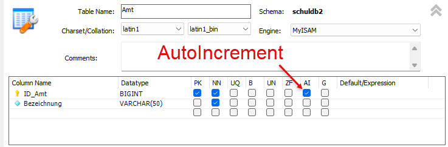
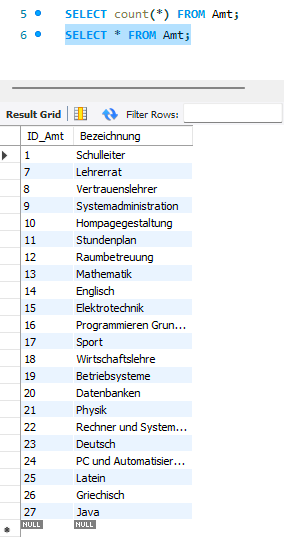

# UE08-04 Übungen zu INSERT-SELECT-Abfragen (nice to know...)


verwendete Datenbank: schuldb2

SQL-Abfragen können als Teil oder als Basis für weitere SQL-Anweisungen verwendet werden.

* Abfragen in Form von Unterabfragen können zu neuen Abfragen zusammengeführt werden.
* Sie können auch als Basis für INSERT-SELECT-Abfragen oder
* für VIEW-Definitionen verwendet werden.

Oft werden Unterabfragen im WHERE-Teil von SQL-Abfragen verwendet. Beachten Sie folgende Beispiele.


## Frage 1
!!! question

     Als weiteres Amt soll für jedes Unterrichtsfach ein Lehrer als Hauptansprechpartner benannt werden. Beispielsweise muss ein Sprecher der Fachschaft `Mathematik` ernannt werden. Deshalb lassen Sie mithilfe der INSERT-SELECT-Abfrage alle Fachbezeichnungen der Tabelle `Fach` automatisiert in die Tabelle `Amt` als Wert des Merkmals `Bezeichnung` eintragen.

=== "Antwort"

    Nach dem Ausführen der Abfrage hat die Tabelle `Amt` 22 Datensätze.

    ACHTUNG: funktioniert nur, wenn der Primary Key der Tabelle `Amt` automatisch generiert wird:

    <figure markdown="span">
    
    <figcaption>Änderung mit `Alter Table`</figcaption>
    </figure>
    
=== "SQL"

    ```sql
    INSERT INTO Amt( Bezeichnung )
    SELECT Bezeichnung FROM Fach;
    
    SELECT count(*) FROM Amt;
    ```
    

    <figure markdown="span">
    
    <figcaption></figcaption>
    </figure>


