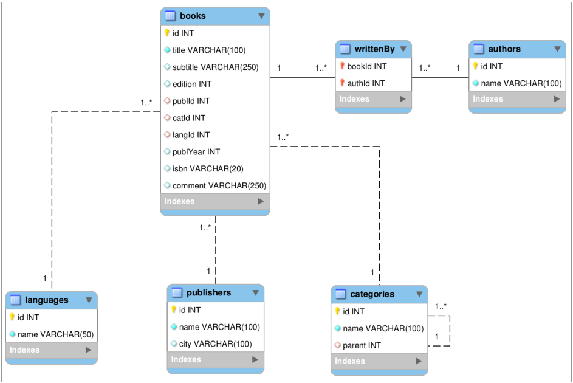
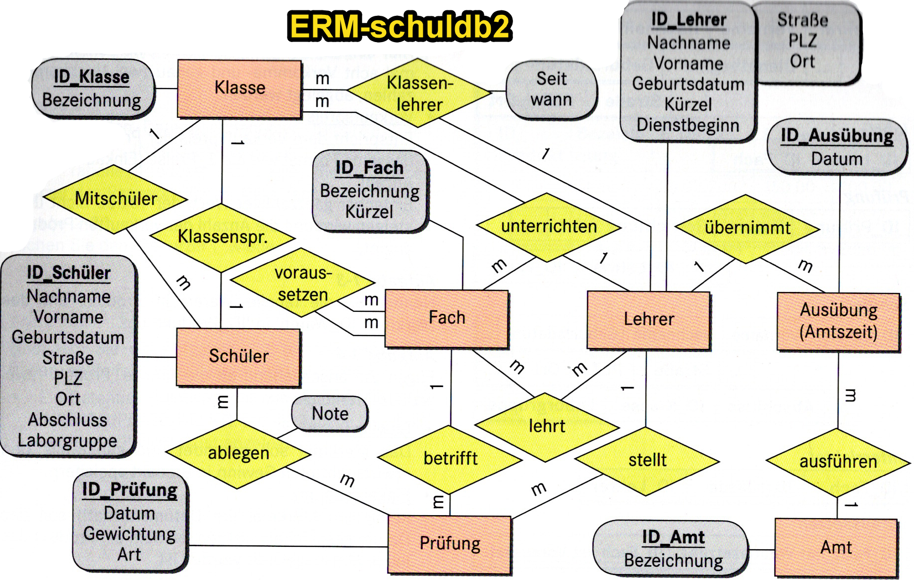

# LE09-Table-JOINs and Transactions

## Demodatenbank books (PPT)

Auf die beiliegende Demodatenbank wird in den PPT's auf Moodle referenziert. Für die Übungen werden wir eine andere Datenbank verwenden.

Zum Erstellen der DB öffnen Sie in der  {==MySQL Workbench==} ein neues SQL-Tab und führen Sie books.sql aus. Anschliessend `Refresh All` ausführen, damit die DB sichtbar wird.

[Download books.sql](../static/books.sql){:download="books.sql"}

[Download ERM-books-DB](../static/ERM-books-db.png){:download="ERM-books-db.png"}

<figure markdown="span">
  { width="800" }
  <figcaption>ERM der books-Datenbank</figcaption>
</figure>

## Demodatenbank schuldb2 für Übungsaufgaben UE09-xx

[Download schuldb2.sql](../static/schuldb2.sql){:download="schuldb2.sql"}

[Download ERM-schuldb2](../static/ERM-schuldb2.png){:download="ERM-schuldb2.png"}

<figure markdown="span">
  { width="800" }
  <figcaption>ERM der schuldb2-Datenbank</figcaption>
</figure>