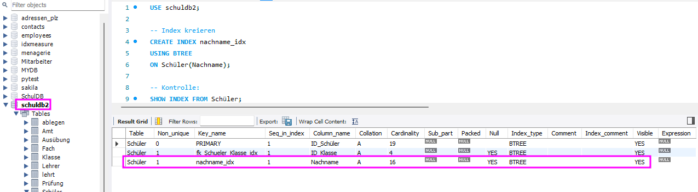

# UE09-01 INDIZES

<figure markdown="span">
  { width="500" }
  <figcaption>B*-Baum</figcaption>
</figure>


[grossartige Sammlung von Insiderwissen zum Verhalten von Indizes bei gängigen DBMS.](https://use-the-index-luke.com/){:target="_blank"}


## Aufgabe

verwendete Datenbank für Aufgabe: [schuldb2](https://tjaeggi.github.io/btw2201_databases/le08/#demodatenbank-schuldb2-fur-ubungsaufgaben-ue08-xx){:target="_blank"}


!!! Aufgabe

     Bei der Datenanalyse (schuldb2) hat sich herausgestellt, dass viele SQL-Abfragen suchend auf das Merkmal 'Nachname' der Tabelle 'Schüler' zugreifen.

     * Erstelle deshalb einen Sekundärindex auf dieses Merkmal. Verwende als Datenstruktur für diesen Index den B*-Baum.
     * Kontrolliere den Index mit einem SQL-Befehl. Was fällt Dir auf?

=== "Antwort"

    
    
=== "SQL INDEX kreieren"

    ```sql
    USE schuldb2;

    CREATE INDEX nachname_idx 
    USING BTREE
    ON Schüler(Nachname);
    ```

=== "SQL INDEX kontrollieren"

    ```sql
    USE schuldb2;

    SHOW INDEX FROM Schüler;
    ```
    **Beachte**: für Schlüssel (PK und FK) wurde bereits ein Index erstellt. Dies wird vom RDBMS automatisch gemacht.


    <figure markdown="span">
    { width="800" }
    <figcaption>Kontrolle Index</figcaption>
    </figure>