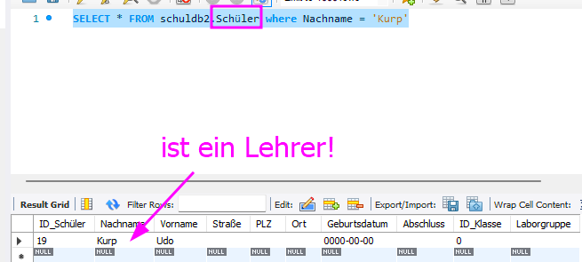
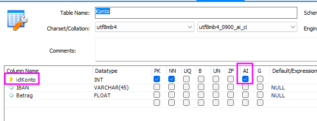
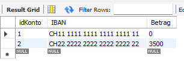

# UE09-02 TRANSAKTIONEN

<figure markdown="span">
  { width="500" }
  <figcaption>START TRANSACTION..</figcaption>
</figure>

## Aufgabe 1

verwendete Datenbank für Aufgabe: schuldb2

!!! Aufgabe

     Der Mathematiklehrer 'Udo Kurp' wurde versehentlich in die Schülertabelle eingetragen. 
     
     <figure markdown="span">
     { width="500" }
     <figcaption>Fehler..</figcaption>
     </figure>
     
     Um diesen Fehler zu korrigieren, muss der Datensatz zum einen aus der Schülertabelle gelöscht und zum anderen in die Lehrertabelle aufgenommen werden. Um ganz sicher zu gehen, dass diese beiden Aktionen entweder komplett oder gar nicht ausgeführt werden, gehen 
     Sie wie folgt vor:

     1. **Transaktion starten**: Starten Sie zunächst eine Transaktion.
  
     2. **SQL-Abfragen**: Löschen Sie nun den Datensatz aus der Tabelle 'Schüler'. Kontrollieren Sie mit einem SQL, ob der Lehrer auch gelöscht ist. Fügen Sie anschliessend den Datensatz in die Tabelle 'Lehrer' ein. Kontrollieren Sie mit einem SQL, ob er in der Tabelle sichtbar ist.
  
     3. **Transaktion beenden**: Nehmen Sie nun die Transaktion ZURÜCK! Kontrollieren Sie, ob der Ausgangszustand wieder hergestellt worden ist. Ist also der Datensatz 'Udo Kurp' wieder in der Tabelle 'Schüler' und aus der Lehrertabelle entfernt.
   
     **WICHTIG zu beachten**: 
     
     Die Tabellen müssen von der Engine `InnoDB` verwaltet werden, damit die Transaktion korrekt abläuft. Kontrolliere, ob dies der Fall ist mit dem Befehl: `SHOW TABLE STATUS;`

     Falls die Tabellen nicht von der Engine `InnoDB` verwaltet werden, muss folgende Änderung gemacht werden: 

     `ALTER TABLE Lehrer ENGINE=InnoDB;`

     `ALTER TABLE Schüler ENGINE=InnoDB;`

     Danke C.. !  :folded_hands: 


     

=== "Antwort"
    nicht gleich spicken! :face_with_diagonal_mouth:
    
    
=== "1. Transaktion starten"

    ```sql
    USE schuldb2;

    START TRANSACTION;
    ```

=== "2. Datensatz löschen und kontrollieren"

    ```sql
    DELETE FROM Schüler WHERE Nachname = 'Kurp' AND Vorname = 'Udo';
    SELECT * FROM schuldb2.Schüler where Nachname = 'Kurp'
    ```
    
=== "2. Datensatz in Lehrertabelle einfügen und kontrollieren"

    ```sql
    INSERT INTO Lehrer( Vorname, Nachname ) VALUES ('Udo', 'Kurp');
    SELECT * FROM schuldb2.Lehrer where Nachname = 'Kurp'
    ```

=== "3. TRANSAKTION zurücknehmen"

    ```sql
    ROLLBACK;
    ```

=== "3. Kontrolle Ausgangszustand"

    ```sql
    SELECT * FROM schuldb2.Schüler where Nachname = 'Kurp'
    SELECT * FROM schuldb2.Lehrer where Nachname = 'Kurp'
    ```


## Aufgabe 2

verwendete Datenbank für Aufgabe: schuldb2

!!! Aufgabe

     Wie vorhergehende Aufgabe, mit dem Unterschied, dass Sie nun die Transaktion nicht zurücknehmen.
     
     1. **Transaktion beenden**: Beenden Sie nun die Transaktion, indem Sie sie definitv schreiben und somit die Änderung dauerhaft übernehmen.


=== "Antwort"

    nicht gleich spicken! :face_with_peeking_eye: 

    
    
=== "Transaktion starten und beenden"

    ```sql
    USE schuldb2;

    START TRANSACTION;
    DELETE FROM Schüler WHERE Nachname = 'Kurp' AND Vorname = 'Udo';
    INSERT INTO Lehrer( Vorname, Nachname ) VALUES ('Udo', 'Kurp');
    COMMIT;
    ```

=== "Kontrolle"

    ```sql
    SELECT * FROM Lehrer WHERE Nachname = 'Kurp';
    ```

## Variablen in SQL

Bevor wir zur nächsten Aufgabe schreiten, lernen Sie bitte folgendes SQL-Feature:


!!! warning "Variablen"

    In SQL können auch Variablen definiert werden. Mit SQL-Variablen lassen sich komplexe Abfragen entzerren und vereinfachen. Eine Variable beginnt mit dem Zeichen `@`, gefolgt vom eigentlichen Variablennamen. Der Variable kann mit dem Zuweisungsoperator `:=` oder über das Schlüsselwort `SET` ein Wert zugewiesen werden. 

    Im folgenden Beispiel wird der Variable `@gehalt` der Wert des Durchschnittsgehalt in der Tabelle "Mitarbeiter" zugewiesen. Auf die Variable kann innerhalb einer Folge von SQL-Statements stets wieder zugegriffen werden.

    ```sql
    SET @gehalt = (SELECT AVG(Gehalt) FROM Mitarbeiter);
    ```

    und

    ```sql
    SELECT @gehalt := AVG(Gehalt) FROM Mitarbeiter;
    ```

    Beide Statements sind gleichwertig!

    Wenn nun also folgende Frage beantwortet werden soll:

    *Welcher Mitarbeiter verdient weniger als das Durchschnittsgehalt aller Mitarbeiter?*

    könnte dies auch so beantwortet werden:

    ```sql
    SELECT @gehalt := AVG(Gehalt) FROM Mitarbeiter;

    SELECT Nachname, Vorname FROM Mitarbeiter
      WHERE Gehalt < @gehalt;
    ```

    oder 


    ```sql
    SET @gehalt = (SELECT AVG(Gehalt) FROM Mitarbeiter);

    SELECT Nachname, Vorname FROM Mitarbeiter
      WHERE Gehalt < @gehalt;
    ```


## Aufgabe 3

erstellen Sie in einer dummy-Datenbank folgende Konto-Tabelle:

```sql
CREATE TABLE Konto (
  idKonto INT NOT NULL AUTO_INCREMENT,
  IBAN VARCHAR(45) NULL,
  Betrag FLOAT NULL,
  PRIMARY KEY (idKonto));
```

!!! warning "Beachte: AUTO_INCREMENT"
    `AUTO_INCREMENT` weist die Datenbank an, einen automatischen Zähler für das Attribut `idKonto` einzurichten. Der erste Record erhält damit die Nr 1, der zweite Record die Nummer 2 u.s.w. Damit muss sich der DB-Entwickler nicht mehr um den Wert des Primary Keys kümmern; dieser wird automatisch generiert, wenn ein Record eingefügt wird.

    In der MySQL-Workbench kann ein `AUTO_INCREMENT` auch grafisch definiert werden, indem `AI` angeklickt wird.

    <figure markdown="span">
    { width="500" }
    <figcaption>MySQL-Workbench: AI = AUTO_INCREMENT</figcaption>
    </figure>
    


Fügen Sie zwei Records hinzu:

```sql
INSERT INTO Konto (IBAN, Betrag) VALUES ('CH11 1111 1111 1111 1111 11', '2500');
INSERT INTO Konto (IBAN, Betrag) VALUES ('CH22 2222 2222 2222 2222 22', '1000');
```
Sie können nun beobachten, dass die Werte für den Primary Key `idKonto` automatisch generiert wurden.


Nun zur

!!! Aufgabe

     Überweise das Geld von Konto `CH11 1111 1111 1111 1111 11` auf das Konto `CH22 2222 2222 2222 2222 22`. Verwende dazu die Variablen `@geld1` für den Betrag aus `CH11 1111 1111 1111 1111 11` und `@geld2` für den Betrag aus `CH22 2222 2222 2222 2222 22`.

     Die Überweisung soll **als SICHERE Transaktion** erfolgen!

     Danach soll die Transaktion überprüft werden. Wurde das Geld transferiert und sind die Kontostände korrekt?


=== "Antwort"
    nicht gleich spicken! 🙎‍♂️ :pouting_face:


    
    
=== "Transaktion starten und beenden"

    ```sql
    USE xxx;

    START TRANSACTION;
    ```
    
    ```sql
    SELECT @geld1 := Betrag FROM Konto
      WHERE IBAN = 'CH11 1111 1111 1111 1111 11';
    ```

    ```sql
    SELECT @geld2 := Betrag FROM Konto
      WHERE IBAN = 'CH22 2222 2222 2222 2222 22';
    ```

    ```sql
    UPDATE Konto 
      SET Betrag = Betrag - @geld1
      WHERE IBAN = 'CH11 1111 1111 1111 1111 11';
    ```

    ```sql
    UPDATE Konto 
    SET Betrag = @geld1 + @geld2
    WHERE IBAN = 'CH22 2222 2222 2222 2222 22';
    ```

    ```sql
    COMMIT;
    ```

=== "Kontrolle"

    ```sql
    SELECT * FROM Konto;
    ```
    
    <figure markdown="span">
    { width="500" }
    <figcaption>das war eine sichere Transaktion!</figcaption>
    </figure>