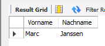

# UE09-03 Übungen zu Unterabfragen

verwendete Datenbank: schuldb2


!!! question "Frage 1"

     Bestimmen Sie den Nachnamen und den Vornamen des ältesten Schülers.
=== "Antwort"

    <figure markdown="span">
    
    <figcaption></figcaption>
    </figure>
    
=== "SQL ohne Variable"

    ```sql
    SELECT Nachname, Vorname 
    FROM Schüler
    WHERE Geburtsdatum = 
          ( SELECT MIN(Geburtsdatum)
            FROM Schüler
            WHERE Geburtsdatum != 0000-00-00 );
    ```

=== "SQL mit Variable"

    ```sql
    SELECT @geburtsdatum := MIN(Geburtsdatum)
    FROM Schüler 
    WHERE Geburtsdatum != 0000-00-00;
    SELECT Vorname, Nachname
    FROM Schüler 
    WHERE Geburtsdatum = @geburtsdatum;
    ```
