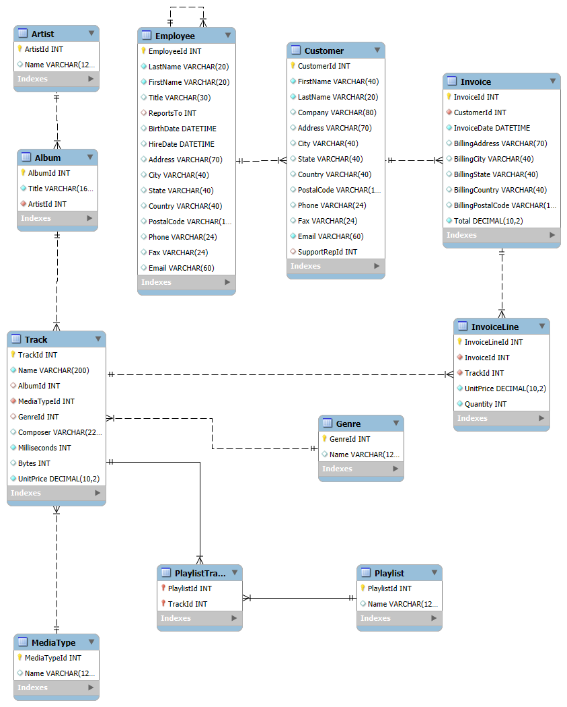

# UE09-04 MySQL und Python

## Chinook-Datenbank in MySQL erstellen


Nachfolgend hast Du eine Ansammlung von SQL-Queries welche die Chinook-Datenbank ausmachen. Wie Du Dich sicher erinnern magst, hast Du mit dieser Datenbank Deine ersten Erfahrungen gesammelt in SQLite.

Versuche nun, die Datenbank chinook in MySQL zu erstellen.

Dazu verwendest Du ein Python Skript, welches ein beigelegtes SQL-Skript gegen deine lokale MYSQL-Datenbank ausführt.

Versuche diese Chinook-DB in MySQL zu erstellen und lass dir anschliessend das ERM von der MySQL-Workbench generieren.


[Download Chinook_MySql_AutoIncrementPKs.sql](../static/Chinook_MySql_AutoIncrementPKs.sql){:download="Chinook_MySql_AutoIncrementPKs.sql"}


```py title="Python-Skript"

import os
import io
import pymysql

def run_query(connection, query):
    with connection.cursor() as cursor:
        cursor.execute(query)
    connection.commit()


connection = pymysql.connect(
    host="localhost",
    user="ihr_username",
    password="ihr_passwort",
    port=3306,
    charset='utf8'
)

lines = []
with open(os.path.join('.', 'Chinook_MySql_AutoIncrementPKs.sql'), encoding='utf-8-sig') as fp:
    lines = fp.read().split('\n')

current_query = ''
for i in range(len(lines)):
    current_query += lines[i]
    if len(current_query) > 0 and current_query[-1] == ';':
        run_query(connection, current_query)
        current_query = ""
    if i%round(len(lines)/100) == 0:
        print('progress: ' + str(round(i/len(lines)*100)) + '%')


```

## ERM der chinook-Datenbank

Lass dieses ERM in deiner Installation mit MySQL-Workbench erstellen! Verwende dazu die Funktion "Reverse Engineer".

<figure markdown="span">
{ width="800" }
<figcaption>ERM generiert aus MYSQL-Workbench für chinook-DB</figcaption>
</figure>