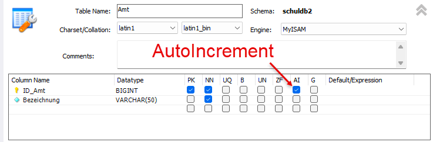
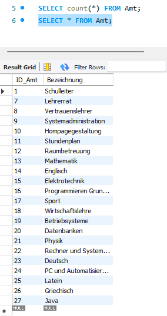

# UE09-04 Übungen zu INSERT-SELECT-Abfragen

verwendete Datenbank: schuldb2
## Frage 1
!!! question "Frage 1"

     Als weiteres Amt soll für jedes Unterrichtsfach ein Lehrer als Hauptansprechpartner benannt werden. Beispielsweise muss ein Sprecher der Fachschaft 'Mathematik' ernannt werden. Deshalb lassen Sie mithilfe der INSERT-SELECT-Abfrage alle Fachbezeichnungen der Tabelle 'Fach' automatisiert in die Tabelle 'Amt' als Wert des Merkmals 'Bezeichnung' eintragen. (Nach dem Ausführen der Abfrage hat die Tabelle 'Amt' 22 Datensätze.)

=== "Antwort"

    Nach dem Ausführen der Abfrage hat die Tabelle `Amt` 22 Datensätze.

    ACHTUNG: funktioniert nur, wenn der Primary Key der Tabelle `Amt` automatisch generiert wird:

    <figure markdown="span">
    
    <figcaption>Änderung mit `Alter Table`</figcaption>
    </figure>
    
=== "SQL"

    ```sql
    INSERT INTO Amt( Bezeichnung )
    SELECT Bezeichnung FROM Fach;
    
    SELECT count(*) FROM Amt;
    ```
    

    <figure markdown="span">
    
    <figcaption></figcaption>
    </figure>


