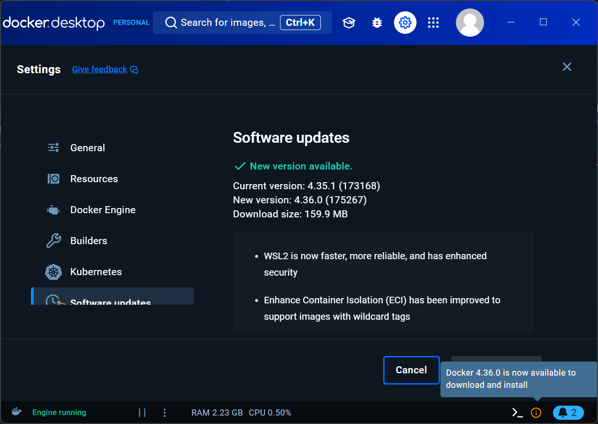
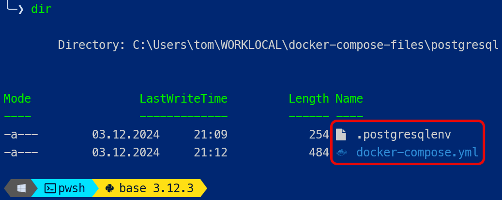
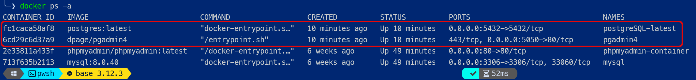
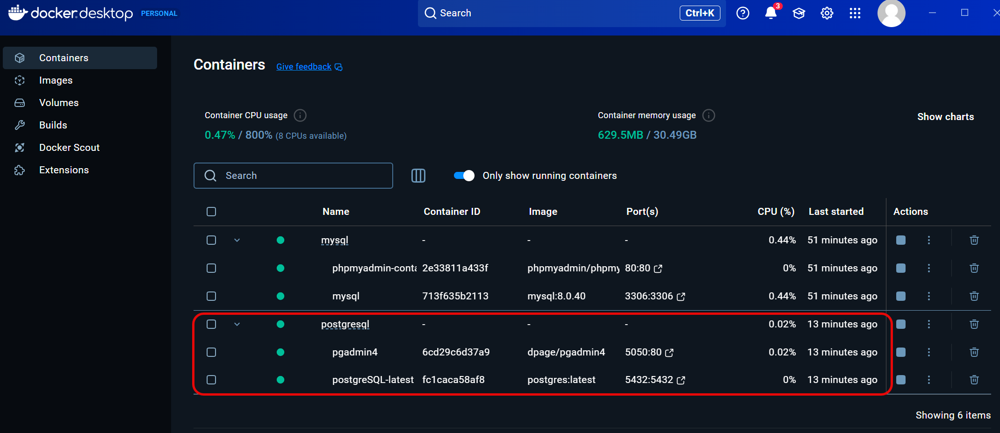
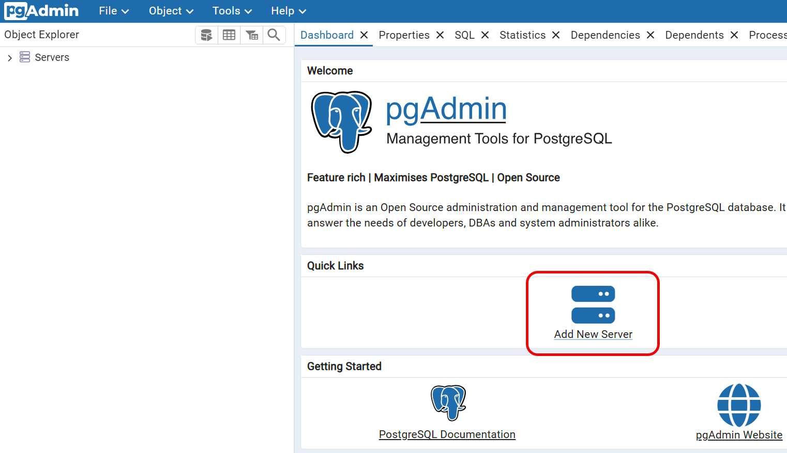
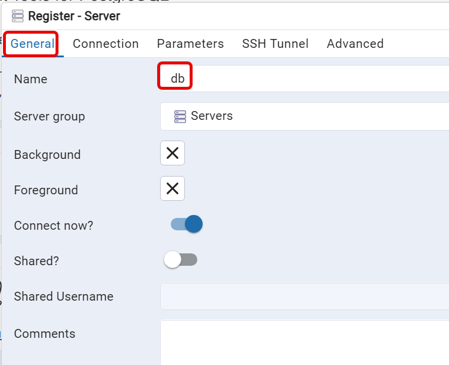
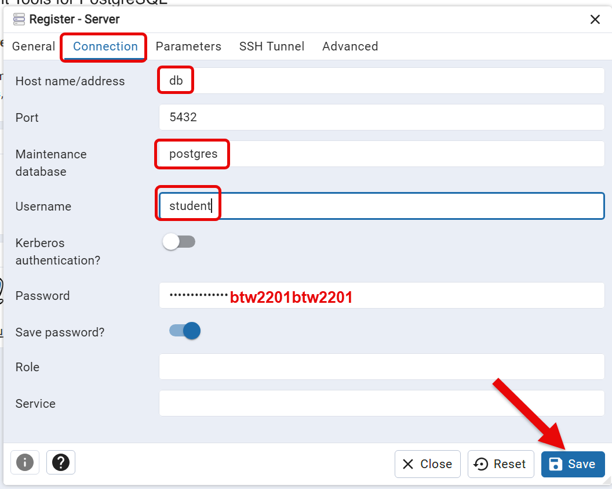
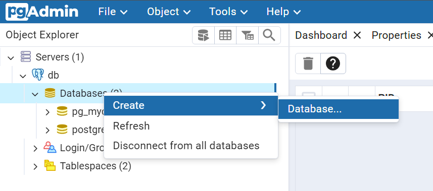

# DOCKER-Installationsanleitung PostgreSQL mit pgadmin4

Die aktuelle Version von PostgreSQL ist im Moment (Dez. 2024) `17.2`.

Führen Sie folgende Schritte aus:

## Start Docker-Desktop auf Ihrem Notebook

Stellen Sie sicher, dass Sie eingeloggt sind. 

<figure markdown="span">
  { width="600" }
  <figcaption>Docker-Desktop gestartet und angemeldet</figcaption>
</figure>

Führen Sie ein update des Docker-Desktops aus, falls das notwendig ist. Die aktuelle Version zum Zeitpunkt dieses Dokumentes ist 4.36.0 (Windows)

## Verzeichniss erstellen für Ihre Docker-Files

``` bash
mkdir docker-compose-files
cd .\docker-compose-files\
mkdir postgresql
cd postgresql
```

## Erstellung der docker-compose-Files

Erstellen Sie 2 Dateien. 


Die Environment-Variablen mit sicherheitskritischen Informationen schreiben wir in ein eigenes File mit Namen `.postgresqlenv`, welches wir mit dem `docker-compose.yml` referenzieren. Stellen Sie sicher, dass das `.postgresqlenv` keine Extension (z. Bsp. .txt) hat.

Dies ist eine gängige Methode um sicherheitsrelevante Informationen in eigenen Dateien abzuspeichern. Diese Dateien können dann mit eingeschränkten Rechten verwaltet werden, damit nicht jedermann die Passwörter einsehen kann.

Die Dateien sehen so aus:

<figure markdown="span">
  { width="600" }
  <figcaption>2 Dateien erstellen</figcaption>
</figure>

Inhalte der Dateien:

```yaml title=".\.postgresqlenv"
# PostgreSQL database
PGDATA=/var/lib/postgresql/data/pgdata
POSTGRES_USER=student
POSTGRES_PASSWORD=btw2201btw2201
POSTGRES_DB=pg_mydb
POSTGRES_HOST=localhost
# pgAdmin
PGADMIN_DEFAULT_EMAIL=student@bfh.ch
PGADMIN_DEFAULT_PASSWORD=btw2201btw2201
```


```yaml title="docker-compose.yml"
services:
  db:
    image: postgres:latest
    container_name: postgreSQL-latest
    restart: always
    env_file:
      - .postgresqlenv
    ports:
      - 5432:5432
    volumes:
      - db_data:/var/lib/postgresql/data
  pgadmin:
    image: dpage/pgadmin4
    container_name: pgadmin4
    restart: always
    ports:
      - "5050:80"
    env_file:
      - .postgresqlenv
    volumes:
      - pgadmin-data:/var/lib/pgadmin

volumes:
  db_data:
  pgadmin-data:
```


## Docker-Container starten

Im Verzeichnis, wo das `docker-compose.yml` liegt, starten Sie die Container mit

`docker compose up -d`

Kontrolle, ob Container laufen mit

`docker ps -a`


<figure markdown="span">
  { width="800" }
  <figcaption>Container running?</figcaption>
</figure>


Auch im Docker-Desktop sind die laufenden Container sichtbar:


<figure markdown="span">
  { width="800" }
  <figcaption>Container running?</figcaption>
</figure>


## Verbindung mit pgAdmin4

!!! info "pgAdmin4"

    pgAdmin4 ist ein Web-Interface um PostgreSQL zu administrieren. pgAdmin4 ist dasselbe, wie die MySQL-Workbench für die MySQL-Datenbank.


pgAdmin4 erreichen wir auf `http://localhost:5050`

Login mit user `student@bfh.ch`, Passwort: `btw2201btw2201`. Diese Credentials haben wir im `.postgresqlenv` definiert.

Nun müssen wir pgAdmin mit der PostgreSQL-Datenbank verbinden. Klicke auf "Add New Server"

<figure markdown="span">
  { width="500" }
  <figcaption>pgAdmin mit Datenbank verbinden</figcaption>
</figure>

Machen Sie folgende Angaben:

<figure markdown="span">
  { width="500" }
  <figcaption>General Tab</figcaption>
</figure>


<figure markdown="span">
  { width="500" }
  <figcaption>Connection Tab</figcaption>
</figure>


Nun erscheint der DatenbankServer in der linken Sidebar. Erstellen Sie eine neue Datenbank mit Rechtsklick

<figure markdown="span">
  { width="500" }
  <figcaption>Ansicht `Datenbank erstellen</figcaption>
</figure>

Machen Sie sich vertraut mit pgAdmin4, indem Sie das Video unten anschauen. Springe auf Minute 5. Danach lernen Sie neue Dinge..


[Video zu pgAdmin](https://www.youtube.com/watch?v=WFT5MaZN6g4){:target="_blank"}


