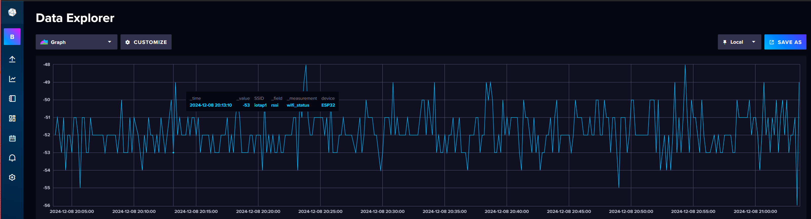

# LE11 - Timeseries Datenbank InfluxDB

<figure markdown="span">
  { width="600" }
  <figcaption>Timeserie s Databases</figcaption>
</figure>

<figure markdown="span">
  { width="600" }
  <figcaption>Zeitreihendaten in InfluxDB</figcaption>
</figure>