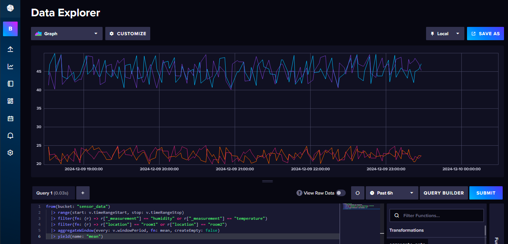

# Einführungsbeispiel mit InfluxDB und Python

Hier ist ein vollständiges Python-Skript, das zeigt, wie man Sensordaten in ein InfluxDB-Bucket lädt und anschliessend einige Basisabfragen durchführt.

Erstellen Sie vorher einen weiteren Testbucket, z. Bsp. mit Namen `sensor_data`.

``` py linenums="1" title="sensor_data.py"
import influxdb_client
from influxdb_client.client.write_api import SYNCHRONOUS
from datetime import datetime, timedelta
import random

# Verbindung zu InfluxDB herstellen
bucket = "sensor_data"
org = "BFH"
token = "IHR TOKEN"
url = "http://localhost:8086"

client = influxdb_client.InfluxDBClient(
    url=url,
    token=token,
    org=org
)

# Beispiel-Sensordaten mit Timestamps schreiben
write_api = client.write_api(write_options=SYNCHRONOUS)

# Funktion zur Generierung von zufälligen Sensordaten mit Timestamps
def generate_sensor_data(num_points):
    data = []
    current_time = datetime.utcnow()
    for i in range(num_points):
        # Temperaturdaten
        temp_data = f"temperature,location=room1 value={round(random.uniform(20.0, 25.0), 1)} {int(current_time.timestamp() * 1e9)}"
        data.append(temp_data)
        temp_data = f"temperature,location=room2 value={round(random.uniform(20.0, 25.0), 1)} {int(current_time.timestamp() * 1e9)}"
        data.append(temp_data)

        # Feuchtigkeitsdaten
        humidity_data = f"humidity,location=room1 value={round(random.uniform(40.0, 50.0), 1)} {int(current_time.timestamp() * 1e9)}"
        data.append(humidity_data)
        humidity_data = f"humidity,location=room2 value={round(random.uniform(40.0, 50.0), 1)} {int(current_time.timestamp() * 1e9)}"
        data.append(humidity_data)

        current_time -= timedelta(minutes=5)
    return data

# Generiere 100 Datenpunkte
sensor_data = generate_sensor_data(100)

# Schreibe die generierten Datenpunkte in InfluxDB
write_api.write(bucket=bucket, record=sensor_data)
print("Daten erfolgreich geschrieben")

# Basisabfragen mit Flux durchführen
query_api = client.query_api()

# Abfrage: Alle Datenpunkte
query = f'from(bucket: "{bucket}") |> range(start: -30d)'
result = query_api.query(org=org, query=query)

print("\nAlle Datenpunkte:")
for table in result:
    for record in table.records:
        print(record)

# Abfrage: Filter nach Measurement 'temperature'
query = f'''
from(bucket: "{bucket}")
  |> range(start: -30d)
  |> filter(fn: (r) => r._measurement == "temperature")
'''
result = query_api.query(org=org, query=query)

print("\nDatenpunkte für 'temperature':")
for table in result:
    for record in table.records:
        print(record)

# Abfrage: Durchschnittswert der Temperatur
query = f'''
from(bucket: "{bucket}")
  |> range(start: -30d)
  |> filter(fn: (r) => r._measurement == "temperature")
  |> mean(column: "_value")
'''
result = query_api.query(org=org, query=query)

print("\nDurchschnittswert der Temperatur:")
for table in result:
    for record in table.records:
        print(record)

# Abfrage: Gruppieren nach Tag 'location' und Durchschnittswert berechnen
query = f'''
from(bucket: "{bucket}")
  |> range(start: -30d)
  |> filter(fn: (r) => r._measurement == "temperature")
  |> group(columns: ["location"])
  |> mean(column: "_value")
'''
result = query_api.query(org=org, query=query)

print("\nDurchschnittswert der Temperatur gruppiert nach 'location':")
for table in result:
    for record in table.records:
        print(record)

# Verbindung schliessen
client.close()
```

**Machen Sie sich mit dem Data Explorer von Influx vertraut und analysiere die generierten Daten**

<figure markdown="span">
  { width="800" }
  <figcaption>InfluxDB Data Explorer</figcaption>
</figure>


## Dokumentation Flux 

Flux ist eine Data scripting language designed for querying, analyzing, and acting on data


[Flux overview](https://docs.influxdata.com/flux/v0/get-started/){:target="_blank"}

[Flux query basics](https://docs.influxdata.com/flux/v0/get-started/query-basics/){:target="_blank"}

[Flux syntax basics](https://docs.influxdata.com/flux/v0/get-started/syntax-basics/){:target="_blank"}


