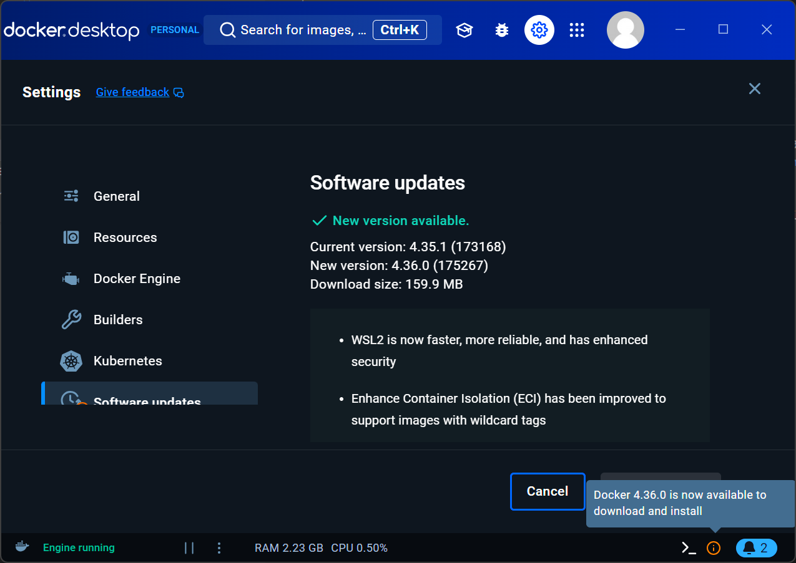

# Installation von InfluxDB mit docker 


Führen Sie folgende Schritte aus:

## Start Docker-Desktop auf Notebook

Stellen Sie sicher, dass Sie eingeloggt sind. 

<figure markdown="span">
  { width="600" }
  <figcaption>Docker-Desktop aktualisiert und angemeldet</figcaption>
</figure>

Führen Sie ein update des Docker-Desktops aus, falls das notwendig ist. 

## Verzeichniss erstellen für Ihre Docker-Files

``` bash
mkdir docker-compose-files
cd .\docker-compose-files\
mkdir influxdb
cd influxdb
```

## Erstellung des `docker-compose.yml`-Files


```yaml title="docker-compose.yml"
services:
  influxdb:
    image: influxdb:2
    container_name: influxdb
    restart: always
    ports:
      - '8086:8086'
    environment:
      DOCKER_INFLUXDB_INIT_MODE: setup
      DOCKER_INFLUXDB_INIT_USERNAME: admin
      DOCKER_INFLUXDB_INIT_PASSWORD: btw2201btw2201
      DOCKER_INFLUXDB_INIT_ORG: BFH
      DOCKER_INFLUXDB_INIT_BUCKET: OpenWeather
    volumes:
      - ./data:/var/lib/influxdb2
      - ./config:/etc/influxdb2
```


## Docker-Container starten

Im Verzeichnis, wo das `docker-compose.yml` liegt, starten Sie die Container mit

`docker compose up -d`

Kontrolle, ob Container läuft mit

`docker ps -a`


<figure markdown="span">
  { width="800" }
  <figcaption>Container running?</figcaption>
</figure>


Auch im Docker-Desktop sind die laufenden Container sichtbar:


<figure markdown="span">
  { width="800" }
  <figcaption>Container running?</figcaption>
</figure>


## Verbindung mit GUI von InfluxDB


Das Web-GUI von InfluxDB erreichen wir nun auf `http://localhost:8086`

Login mit user `admin`, Passwort: `btw2201btw2201`. Diese Credentials haben wir im `docker-compose.yml` definiert.


<figure markdown="span">
  { width="300" }
  <figcaption>Login WebGUI InfluxDB</figcaption>
</figure>

## API Token generieren

Generiere dir als Erstes ein API Token. Dieses werden wir für alles Weitere als Zugangskey verwenden. 


<figure markdown="span">
  { width="600" }
  <figcaption>All Access API Token generieren</figcaption>
</figure>

<figure markdown="span">
  { width="600" }
  <figcaption></figcaption>
</figure>

**Das bei Dir generierte Token muss notiert werden!**

<figure markdown="span">
  { width="600" }
  <figcaption></figcaption>
</figure>

Beispieltoken ⚠️ NICHT kopieren ist ein Beispiel! ⚠️
```
h9Bdxy-qm6djPdE5fP8PD8SnEwp46A88cFlgJU-VKlIraRbdQlHHJut44Lelf1Tqr1Ck4WyeYqYD5dZPSILCtw==
```


## Bucket zum Testen erstellen

Erstellen Sie auch einen Testbucket, z.Bsp mit Namen `MYBUCKET`

<figure markdown="span">
  { width="600" }
  <figcaption>Bucket erstellen</figcaption>
</figure>


## Introbeispiel

Führen Sie das Python Programmierbeispiel durch. Verwende jedoch immer Dein generiertes Token von oben.

<figure markdown="span">
  { width="600" }
  <figcaption>Write and query data using Python</figcaption>
</figure>

!!! note

    * Ihr **URL** lautet: `url="http://localhost:8086"`
    * **Token**: `token="IHR TOKEN"`
    * **Organisation**: `org="BFH"`
    * **Bucket**: `bucket="MYBUCKET"`
    * Initialisierungsstring client: `client = InfluxDBClient(url=url, token=token, org=org)`

Angelehnt an das Beispiel in *Get Started* würde ein Skript zum Schreiben der Testdaten so ausschauen

``` py
import influxdb_client, os, time
from influxdb_client import InfluxDBClient, Point, WritePrecision
from influxdb_client.client.write_api import SYNCHRONOUS

client = InfluxDBClient(url="http://localhost:8086", token="IHR TOKEN", org="BFH")

bucket="MYBUCKET"

write_api = client.write_api(write_options=SYNCHRONOUS)

for value in range(5):
  point = (
    Point("measurement1")
    .tag("tagname1", "tagvalue1")
    .field("field1", value)
  )
  write_api.write(bucket=bucket, org="BFH", record=point)
  time.sleep(1) # separate points by 1 second

```
