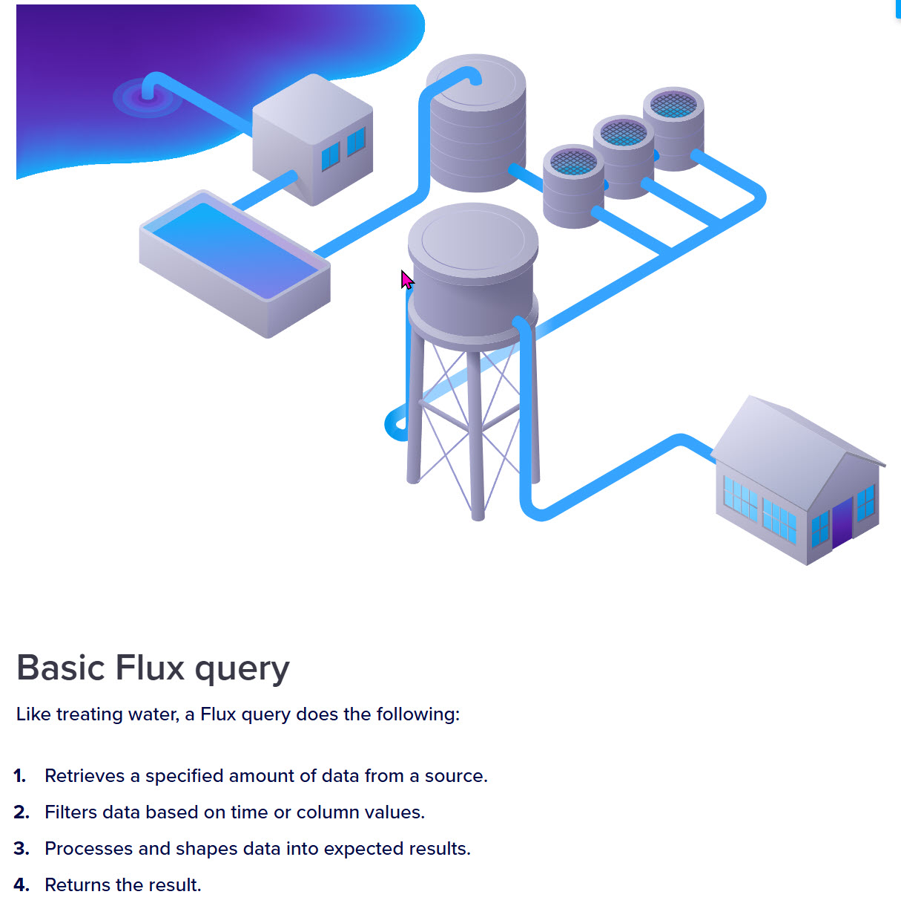

# Einführung InfluxDB als Vertreter einer TSDB

InfluxDB ist eine **NoSQL-Datenbank**. Sie ist speziell für das Speichern und Abfragen von Zeitreihendaten entwickelt worden, also Daten, die über die Zeit hinweg aufgezeichnet werden, wie Sensordaten, Metriken, Events und Logs.
Mehr Details zu NoSQL-Datenbanken folgen in LE12.

## Merkmale von InfluxDB

- **Zeitreihen-Datenbank**: Optimiert für das Speichern von Datenpunkten, die mit Zeitstempeln versehen sind.
- **SQL-ähnliche Abfragesprache**: Verwendet **InfluxQL**, eine SQL-ähnliche Abfragesprache, die speziell für Zeitreihendaten entwickelt wurde.
- **Hohe Schreibgeschwindigkeit**: InfluxDB ist auf hohe Schreibgeschwindigkeiten ausgelegt und kann grosse Mengen an Daten effizient verarbeiten.
- **Retention Policies**: Unterstützt Aufbewahrungsrichtlinien, um Daten nach einer bestimmten Zeit automatisch zu löschen oder zu archivieren.
- Einfach zu verwenden: Installation und Konfiguration sind relativ einfach, und es bietet eine Vielzahl von Visualisierungs- und Analysewerkzeugen.


## Spezifische Eigenschaften von InfluxDB

*InfluxDB* ist eine beliebte Open-Source-Zeitreihendatenbank, die für die Verwaltung und Analyse von Zeitreihendaten entwickelt wurde. *InfluxDB* wurde von Google in der Programmiersprache *Go* entwickelt.

Hier sind einige ihrer spezifischen **Eigenschaften**:

* **Skalierbarkeit**: InfluxDB kann grosse Datenmengen effizient verarbeiten
* **Datenkompression**: Grosse Datenmengen können komprimiert werden, um Speicherplatz zu sparen.
* **Datenrichtlinien**: Es ermöglicht die Festlegung von Richtlinien, um genau zu bestimmen, wo bestimmte Daten gespeichert werden
* **Echtzeit-Datenverarbeitung**: InfluxDB kann Echtzeit- und parallel eintreffende Daten effizient speichern und analysieren.
* Flexibilität: Sie kann sowohl lokal als auch in der Cloud betrieben werden und unterstützt verschiedene Programmiersprachen.
* **Zeitreihen-Daten**: InfluxDB speichert Datenpunkte, die mit Zeitstempeln versehen sind, wie z.B. Temperaturmessungen, Leistungsmetriken oder Finanzdaten
* **Abfragesprache Flux**: InfluxDB verwendet eine eigene Abfragesprache namens *InfluxQL* für die Datenabfrage und Analyse. Ab InfluxDB 2.0 wird die neue Abfragesprache *Flux* unterstützt, die für ETL-Prozesse optimiert ist.
* **Datenmodell**: Die Daten werden in drei Hauptkomponenten gespeichert: *Measurements*, *Fields* und *Tags*. *Measurements* sind ähnlich wie Tabellen, *Fields* sind die Werte und *Tags* sind zusätzliche Metadaten, die die Daten kategorisieren2
* InfluxDB ist besonders nützlich für Anwendungen wie **IoT** und **Überwachung und Analyse von Sensordaten**

## Anwendungsbereiche von InfluxDB
- **Überwachung und Metriken**: In der IT zur Überwachung von Servern, Netzwerken und Anwendungen.
- **IoT (Internet der Dinge)**: Zur Verarbeitung und Analyse von Sensordaten aus IoT-Geräten.
- **Finanzanalyse**: Zur Analyse und Überwachung von Finanzmarktdaten und Handelsaktivitäten.

## InfluxDB-Konzepte

### Bucket
In InfluxDB ist ein *Bucket* eine grundlegende Datenspeichereinheit, die sowohl Zeitreihendaten als auch Metadaten speichert. Hier sind einige wesentliche Punkte:

* **Zeitbasierte Retention**
    * Buckets haben eine vordefinierte Aufbewahrungsrichtlinie (RetentionPolicy), die bestimmt, wie lange die Daten aufbewahrt werden, bevor sie automatisch gelöscht werden. Dies hilft, den Speicherbedarf zu verwalten.
* **Namespace für Daten**
    * Ein Bucket fungiert als Namespace für Messungen, Tags und Felder. Es hilft, die Daten organisatorisch zu trennen und zu verwalten.
* **Zugriffskontrolle**
    * Buckets ermöglichen es, granulare Zugriffskontrollen durchzusetzen. Das bedeutet, dass Benutzer unterschiedliche Berechtigungen für verschiedene Buckets haben können.
* **Datenanreicherung und Abfragen**
    * Daten können in Buckets geschrieben, abgerufen und analysiert werden, wobei InfluxDB's Abfragesprachen wie InfluxQL oder *Flux* verwendet werden.

**Beispiel:**

Angenommen, du hast Sensordaten, die Temperatur- und Feuchtigkeitsmessungen enthalten. Du könntest einen Bucket namens `sensor_data` erstellen, um diese Daten zu speichern:

```
from(bucket: "sensor_data")
  |> range(start: -1h)
  |> filter(fn: (r) => r._measurement == "temperature")
  |> mean()

```
In diesem Beispiel filterst du Daten aus dem `sensor_data` Bucket und berechnest den Durchschnitt der Temperaturmessungen der letzten Stunde.

Ein *Bucket* in InfluxDB ist ein zentraler Punkt, um Daten mit klaren Aufbewahrungsrichtlinien, Zugriffssteuerungen und einer strukturierten Organisation zu verwalten. Es ist ein **grundlegender Baustein im Datenmanagement mit InfluxDB**.

### Measurement (Messung)

In InfluxDB ist ein *Measurement* (Messung) ein logisches Konzept, das einer Tabelle in relationalen Datenbanken ähnelt.

**Konzept eines *Measurements***

* **Sammlung von Datenpunkten**
    * Ein **Measurement** ist eine Sammlung von Datenpunkten, die bestimmte Werte über die Zeit speichern. Zum Beispiel könnten Temperaturmessungen, CPU-Nutzungsdaten oder Netzwerkbandbreite alle in separaten Measurements gespeichert werden.

* **Name des Measurements**
    * Jedes Measurement hat einen Namen, der es eindeutig identifiziert. Der Name sollte beschreibend sein und klar machen, welche Art von Daten darin gespeichert wird. Zum Beispiel: `temperature`, `cpu_usage`, `network_traffic`.

* **Felddaten und Tags**
    * **Fields** (Felder): Dies sind die tatsächlichen gemessenen Werte, z.B. die Temperatur in Grad Celsius oder die CPU-Auslastung in Prozent. Fields sind nicht indexiert und können numerisch, textuell oder boolish sein.
    * **Tags**: Tags sind indexierte Metadaten, die Datenpunkte kategorisieren. Sie ermöglichen schnelle Abfragen und Gruppierungen. Ein Beispiel für Tags könnte der Standort eines Sensors oder der Hostname eines Servers sein.

**Beispiel für ein Measurement**

Angenommen, du hast ein Measurement namens temperature:

* *Fields*: value (die tatsächliche Temperaturmessung)
* *Tags*: location (z.B. "living_room", "kitchen")

Datenpunkte könnten so aussehen:

```
time                | location     | value
--------------------|--------------|------
2023-01-01T00:00:00Z| living_room  | 21.5
2023-01-01T00:05:00Z| kitchen      | 22.3

```

**Abfrage eines Measurements**

Hier ist ein Beispiel, wie du mit Flux-Daten aus einem Measurement abfragen könntest:

```
from(bucket: "my_bucket")
  |> range(start: -1d)
  |> filter(fn: (r) => r._measurement == "temperature")
  |> filter(fn: (r) => r.location == "living_room")
  |> mean()


```

Ein ***Measurement*** in InfluxDB ist eine zentrale Komponente, die eine **Sammlung von Datenpunkten** darstellt, die über die Zeit hinweg erfasst wurden. Es enthält *Fields* für die tatsächlichen Messwerte und *Tags* für die Kategorisierung und schnelle Abfrage von Daten.

### Konzeptvergleich Fields und Tags gegenüber einem RDBMS

- **Fields** und **Tags** bei InfluxDB können wie folgt mit einem relationalen Datenbankmanagementsystem (RDBMS) verglichen werden:

    * **Fields**: In InfluxDB enthalten Fields die eigentlichen Messwerte (Datenpunkte), die Sie speichern. Sie entsprechen den Spaltenwerten in einer Tabelle eines RDBMS. Beispielsweise könnten Temperatur und Feuchtigkeit in einer Wetterdatenbank als Fields gespeichert werden. Fields sind nicht indexiert, was bedeutet, dass Abfragen, die auf Fields basieren, langsamer sein können, insbesondere bei grossen Datenmengen.
    * **Tags**: Tags sind Metadaten, die verwendet werden, um Daten in InfluxDB zu indexieren und zu organisieren. Tags entsprechen den Schlüsseln in einer Datenbank, die verwendet werden, um Abfragen zu optimieren. In einem RDBMS würden Tags den indexierten Spalten oder den Primär- und Fremdschlüsseln ähnlich sein. Zum Beispiel könnten der Standort (z.B. Stadtname) und der Sensortyp als Tags gespeichert werden.


Hier eine Vergleichstabelle zur Verdeutlichung:


|InfluxDB   |RDBMS   |
|---|---|
|Fields   |Spaltenwerte   |
|Tags   |Indexierte Spalten/Schlüssel   |


Tags werden verwendet, um Daten effizient zu finden und zu filtern, während Fields die spezifischen Messwerte enthalten.


### Abfragesprache *Flux*

Die Abfragesprache *Flux* ist eine auf Zeitreihendaten spezialisierte Sprache, die für die Verwaltung und Analyse von Daten in InfluxDB entwickelt wurde.


<figure markdown="span">
  { width="600" }
  <figcaption>Pipeline Architektur von FLUX</figcaption>
</figure>


[aus Flux documentation](https://docs.influxdata.com/flux/v0/get-started/){:target="_blank"}

**Eigenschaften:**

1. Flexibilität und Ausdruckskraft
      1. Flux ist darauf ausgelegt, komplexe Datenanalysen und Transformationen einfach zu machen. Sie unterstützt nicht nur einfache Abfragen, sondern auch fortgeschrittene Datenmanipulationen und Aggregationen.

2. Pipeline-Architektur
      1. Flux verwendet eine *Pipeline-Architektur*, bei der Daten durch eine Reihe von Funktionen und Transformationen fliessen können. Dies ermöglicht es, Daten schrittweise zu filtern, zu transformieren und zu analysieren:
      ```
      from(bucket: "example-bucket")
      |> range(start: -1h)
      |> filter(fn: (r) => r._measurement == "temperature")
      |> mean()
      ```
3. Integration von Zeitreihendaten und relationale Daten
      1. Flux kann nicht nur mit Zeitreihendaten umgehen, sondern auch mit  relationalen Datenquellen interagieren. Dies ermöglicht die Kombination von Daten aus verschiedenen Quellen. [Zum Beispiel MySQL.](https://docs.influxdata.com/flux/v0/query-data/sql/mysql/){:target="_blank"}
4. Eingebaute Funktionen und Operatoren
      1. Flux bietet eine Vielzahl von eingebauten Funktionen und Operatoren, die speziell für die Zeitreihenanalyse entwickelt wurden, wie Aggregationen (mean, max, min, sum), Filter, Join-Operationen und vieles mehr.
5. Benutzerdefinierte Funktionen
      1. Mit Flux können Benutzer ihre eigenen Funktionen erstellen, um spezifische Analysen und Transformationen durchzuführen. Dies erhöht die Flexibilität und Anpassungsfähigkeit der Abfragesprache:
      ```
      myFunc = (table=<-) => table |> range(start: -1h) |> mean()

      from(bucket: "example-bucket")
      |> myFunc()
      ```

      siehe dazu: [Define custom functions](https://docs.influxdata.com/flux/v0/define-functions/){:target="_blank"}

6. Support für Task Automation
      1. Flux kann für die Automatisierung von Aufgaben verwendet werden, z.B. für geplante Abfragen und Benachrichtigungen. Dies ist nützlich für kontinuierliche Datenverarbeitung und Überwachung.
7. Cross-Database Queries
      1. Flux ermöglicht Abfragen, die über mehrere InfluxDB-Instanzen und -Datenbanken hinweg gehen, was für verteilte und hybride Cloud-Umgebungen nützlich ist.
      

**Beispiel eines Flux-Queries**

Hier ist ein Beispiel für eine typische Flux-Abfrage, die die Durchschnittstemperatur der letzten Stunde berechnet:


``` sql
from(bucket: "sensor_data")
  |> range(start: -1h)
  |> filter(fn: (r) => r._measurement == "temperature")
  |> mean()
  |> yield(name: "mean_temperature")
```


**Beispiel eines Flux-*Cross*-Queries mit MySQL**

``` sql
import "sql"

// MySQL-Daten abrufen
mysql_data = sql.from(
    driverName: "mysql",
    dataSourceName: "user:password@tcp(localhost:3306)/db",
    query: "SELECT * FROM example_table"
)

// InfluxDB-Daten abrufen
influx_data = from(bucket: "weather")
  |> range(start: -24h)
  |> filter(fn: (r) => r._measurement == "temperature" or r._measurement == "humidity")

// Daten zusammenführen basierend auf einem gemeinsamen Schlüssel
combined_data = join(
    tables: {mysql: mysql_data, influx: influx_data},
    on: ["common_column"]
)

combined_data

```


*Flux ist eine Abfragesprache, die speziell für die Arbeit mit Zeitreihendaten optimiert ist. Ihre Eigenschaften ermöglichen Datenanalysen, die über einfache SQL-Abfragen hinausgehen.*


#### Hinweis zu Query-Sprachen in InfluxDB

!!! info "Query Sprachen in InfluxDB"
    Bei den Versionen 0.x und 1.x von **InfluxDB** wurde die Sprache *InfluxQL* verwendet. Wir arbeiten hier mit der Version 2.7. In Version 2.x wurde *InfluxQL* durch *Flux* abgelöst. Hinweise dazu finden sich [hier](https://docs.influxdata.com/influxdb/v2/get-started/query/?t=influx+CLI){:target="_blank"} unter *Query data with InfluxQL*.


## Links

[Get started with InfluxDB and Key Concepts](https://docs.influxdata.com/influxdb/v2/get-started/){:target="_blank"}


