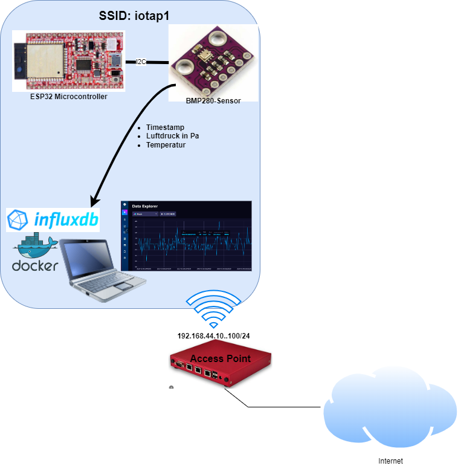

# InfluxDB Übung 3 **als Option**

Das Schreiben von Sensorwerten mit dem ESP32 und einem Sensor in eine InfluxDB ist fakultativ und greift thematisch vor.

<figure markdown="span">
  { width="600" }
  <figcaption>BMP280-Sensordaten in InfluxDB speichern</figcaption>
</figure>

Eine Einführung zu dieser Problemstellung findest du [hier](https://randomnerdtutorials.com/esp32-influxdb/){:target="_blank"} und [hier](https://micropython-iot-hackathon.readthedocs.io/en/latest/projects.html){:target="_blank"}.

