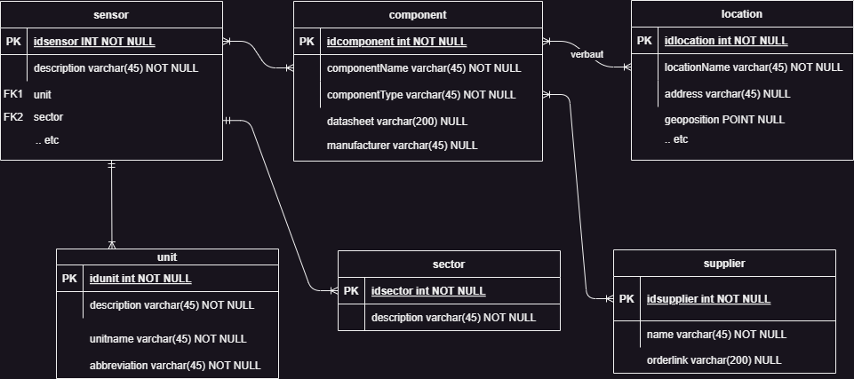
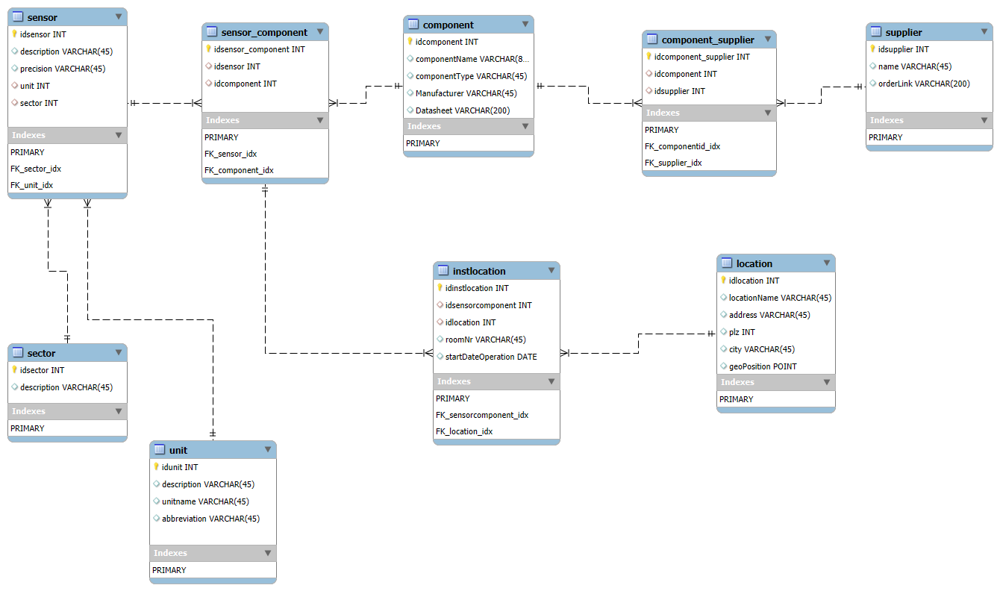
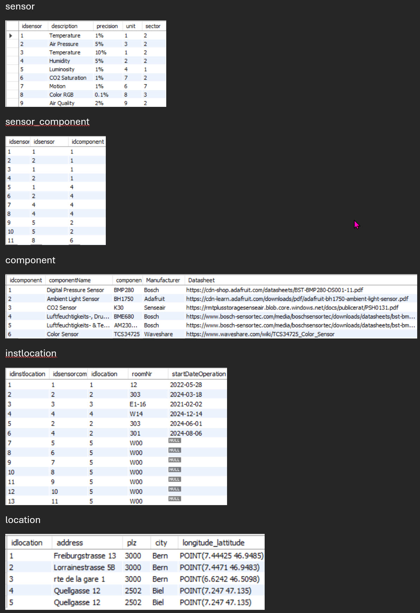
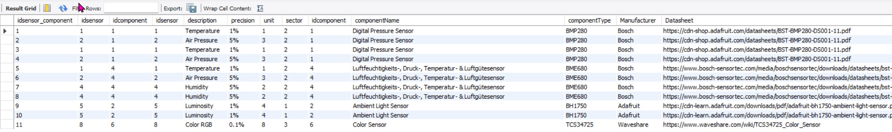
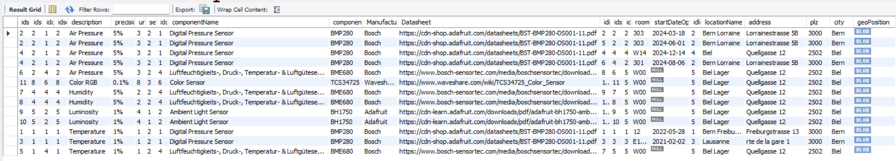
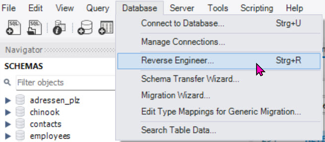
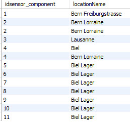
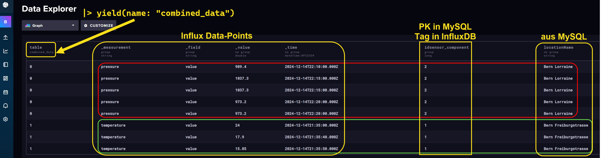
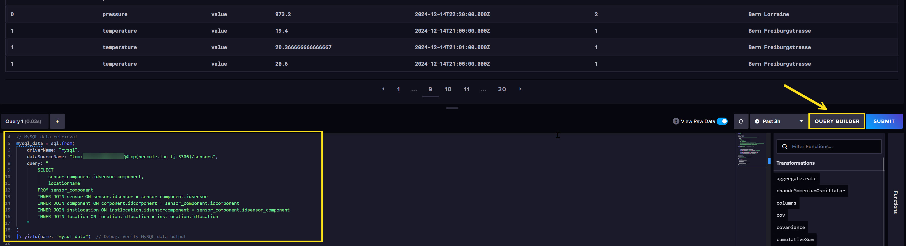

# UE11-04-Integrierte Aufgabe RDBMS (MySQL) - TSDB (InfluxDB)

## **Problemstellung**

Nehme an, Du arbeitest als Wirtschaftsingenieur in einem Industrieunternehmen mit mehreren Standorten.
Du bist unter anderem verantwortlich für die Gebäudeautomation.
Dazu werden viele Sensordaten verarbeitet um folgende Bereiche optimal zu betreiben:

1. intelligente Lichtsteuerung der Gebäude und Räumlichkeiten
2. Heizung, Ventilation, Klima
3. Zugangskontrollen
4. Unterhalt und Wartung von Anlagen
5. Lagermanagement
6. Energiemanagement
7. Remote Monitoring von Produktionsanlagen

Die Verwaltung der Sensorsysteme soll in einem RDBMS verwaltet werden. Die erzeugten Sensorwerte werden in einer TSDB (InfluxDB) gespeichert.

Für die Verwaltung der Sensorsysteme (statische Verwaltung)  gelten folgende Anforderungen:

- Ein Sensor kann einen oder auch mehrere Sensorwerte registrieren. Bsp: BME280 (Temperatur, Feuchtigkeit und Luftdruck) 
- Jeder Sensorwert kann mit einer physikalischen Einheit oder einem boolschen Wert beschrieben werden.
- Jeder Sensor hat Eigenschaften, welche in einem technischen Datenblatt (pdf oder http-Link) beschrieben sind.
- Für einen Sensor gibt es eine Typenbezeichnung, einen Hersteller und einen Lieferanten.
- Ein Sensorelement hat einen Preis und ein Inbetriebnahmedatum. Es kann aber auch inaktiv in einem Lager liegen. 
- Für jeden Sensorwert kann der Ort der Erfassung eindeutig identifiziert werden
- Ein Standort ist gekennzeichnet durch ein Gebäude mit Adresse und Raumnummer. Eine Standortbeschreibung 
  kann auch **keine** postalische Adresse sein.  
- Ein Sensorwert kann einem der 7 Bereiche zugeordnet werden.


## **Aufgaben**

Die Aufgaben können im Team bearbeitet werden und ist eine gute Übung für die Prüfung am Ende des Semesters.

a. Erstelle dazu ein **konzeptionelles ERM**.

b. Erstelle ein **logisches ERM** mit Beispieldatensätzen.

c. Die Daten der Sensorinfrastruktur werden in MySQL verwaltet und die Sensorwerte in InfluxDB.

d. Erstelle die **Tabellen mit SQL** mit **Beispiel-Datensätzen**

e. Wie gedenkst du die Zeitserien der einzelnen Sensorwerte in InfluxDB mit den Eigenschaften der Sensoren zu verknüfen?
   
   Bsp: Wenn Sensorwerte fehlerhaft sind oder gänzlich fehlen: wie identifizieren sie den Standort der Sensorkomponente? Wie identifizieren sie den Sensortyp, den Einbauort? Zu welcher Sensorkomponente gehört ein einzelner Sensorwert? Welche anderen Sensoren haben denselben Einbauort?

f. Erstelle zu den Fragen aus e. enstsprechende **SQL&FLUX-Abfragen**.

g. Präsentiert das ERM und eure Gedanken zu dieser Problemstellung der Klasse
   
   
### **Beispiele von Sensoren**

Hier einige Sensoren als Beispiele. Beachten Sie, dass viele Sensorkomponenten mehrere Sensorsignale liefern. Ihr BMP280 vom ESP32-Kit liefert beispielsweise zwei Signale: Temperatur in °C und Luftdruck in Pascal. 

In einer Datenbank, müssen wir die Signale als Einzelsignale identifizieren können. Das bedeutet, dass es möglich sein muss, ein einzelnes Sensorsignal einer Sensorkomponente zuzuweisen. Dies ist dann von Bedeutung, wenn wir mit einem Signal Probleme haben. Dann sollten wir wissen, welche Komponente betroffen ist.

#### PIR

Motion Detector

misst:

* Wert 1 bei Bewegung, Wert 0 keine Bewegung

[Datasheet](https://projecthub.arduino.cc/electronicsfan123/interfacing-arduino-uno-with-pir-motion-sensor-593b6b){:target="_blank"}

#### BMP280

misst:

* Air-Pressure in Pascal
* Temperature in °C

[Datasheet](https://cdn-shop.adafruit.com/datasheets/BST-BMP280-DS001-11.pdf){:target="_blank"}

#### BME680

misst:

* Air-Pressure in Pascal
* Temperature in °C
* Humidity in rel. %
* Gas

[Datasheet](https://www.bosch-sensortec.com/media/boschsensortec/downloads/datasheets/bst-bme680-ds001.pdf){:target="_blank"}

#### AM2302

misst:

* Temperature in °C
* Humidity in rel. %

[Datasheet](https://cdn-shop.adafruit.com/datasheets/Digital+humidity+and+temperature+sensor+AM2302.pdf){:target="_blank"}

#### BH1750

misst:

* Luminosity in LUX

[Datasheet](https://cdn-learn.adafruit.com/downloads/pdf/adafruit-bh1750-ambient-light-sensor.pdf){:target="_blank"}


#### TCS34725

misst:

* RGB color sensor. Output as RGB-Hex-Value, eg:  `#F5151B`

[Datasheet](https://www.waveshare.com/wiki/TCS34725_Color_Sensor){:target="_blank"}

#### MPU-9250
Gyroscope oder Inertial Motion Unit

misst:

* gibt Werte für yaw, pitch und roll

[Datasheet](https://invensense.tdk.com/wp-content/uploads/2015/02/PS-MPU-9250A-01-v1.1.pdf){:target="_blank"}

[Bild zu Yaw, Pitch und Roll](https://projecthub.arduino.cc/paulplusx/using-the-mpu9250-to-get-real-time-motion-data-7bdefc){:target="_blank"}


#### Senseair K30
CO2-Sensor

misst:

* CO2 Werte in ppm

[Datasheet](https://rmtplusstoragesenseair.blob.core.windows.net/docs/publicerat/PSH0131.pdf){:target="_blank"}


## **LÖSUNGSVORSCHLÄGE**

??? success "**Schritt 1**: Konzeptionelles ERM" 
    Das ist eine mögliche Darstellungsform mit einem Tool (hier draw.io). Das Diagramm kann aber auch von Hand erstellt werden. Dabei werden die Entitäten als Kasten und die Attribute als Bubbles dargestellt.
    Mit PK und FK werden die Keys *Primary Key* und *Foreign Key* bezeichnet.

    Beachte hier im Beispiel die Verbindung `Component` - `Location`. Diese Beziehung realisiert *verbaut in* mit dem Attribut *startDateOperation*. Dieses Merkmal ist ein **Beziehungsattribut**, welches wir in der Verbindungstabelle aufnehmen müssen! Die Verbindungstabellen, also die Auflösung von `m:m`-Beziehungen, nehmen wir im *logischen ERM* vor.

    <figure markdown="span">
    { width="600" }
    <figcaption>konzeptionelles ERM</figcaption>
    </figure>


 
??? success "**Schritt 2**: Logisches ERM" 
    Das logische ERM ist die Vorgabe für das physische ERM. Hier werden die `m:m`-Beziehungen mit Verbindungstabellen aufgelöst. Alle PK und FK werden ergänzt und die Attribute komplett aufgenommen.
    Eine gute Praxis ist in diesem Schritt auch die Darstellung von Demo-Datensätzen. Dies ermöglicht dem ERM-Designer seine ERM-Struktur zu überprüfen und hilft dem Betrachter das ERM schneller zu verstehen.  

    <figure markdown="span">
    { width="600" }
    <figcaption>logisches ERM</figcaption>
    </figure>
    

    

    <figure markdown="span">
    { width="600" }
    <figcaption>Demo-Records für einige Tabellen</figcaption>
    </figure>

??? success "**Schritt 3**: Physisches ERM (SQL-Create-Statements)" 

    Das physische ERM baut auf dem logischen ERM auf. Als DB-Entwickler und SQL-Expert bietet das logische ERM alle Informationen, um die DB-Struktur physisch zu realisieren.
    Mögliche Ausnahme: INDEXE ! Diese werden oft auch im Nachhinein definiert, um die Query-Performance zu optimieren.

    ```SQL linenums="1" title="SQLs: CREATE TABLES AND INSERT DEMO RECORDS"
    -- Schema sensors erstellen, mit
    CREATE DATABASE sensors;
    -- Fokus auf sensors-DB
    USE sensors;
    /* -------------CREATE TABLES and INSERT DEMO RECODRS-------------------------------------- */
    CREATE TABLE `sector` (
      `idsector` int NOT NULL,
      `description` varchar(45) DEFAULT NULL,
      PRIMARY KEY (`idsector`)
    ) ENGINE=InnoDB DEFAULT CHARSET=utf8mb4 COLLATE=utf8mb4_0900_ai_ci;
    
    
    select * from sector;
    INSERT INTO sector (idsector, description) VALUES (1, 'Smart Lighting Systems');
    INSERT INTO sector (idsector, description) VALUES (2, 'Automated HVAC Systems');
    INSERT INTO sector (idsector, description) VALUES (3, 'Security and Access Control');
    INSERT INTO sector (idsector, description) VALUES (4, 'Predictive Maintenance');
    INSERT INTO sector (idsector, description) VALUES (5, 'Inventory Management');
    INSERT INTO sector (idsector, description) VALUES (6, 'Energy Management');
    INSERT INTO sector (idsector, description) VALUES (7, 'Remote Monitoring and Control');
    INSERT INTO sector (idsector, description) VALUES (8, 'other');
    select * from sector;
    /* --------------------------------------------------------------------------------------- */
    CREATE TABLE `unit` (
      `idunit` int NOT NULL,
      `description` varchar(45) DEFAULT NULL,
      `unitname` varchar(45) DEFAULT NULL,
      `abbreviation` varchar(45) DEFAULT NULL,
      PRIMARY KEY (`idunit`)
    ) ENGINE=InnoDB DEFAULT CHARSET=utf8mb4 COLLATE=utf8mb4_0900_ai_ci;
    
    
    select * from unit;
    INSERT INTO unit (idunit, description, unitname, abbreviation) VALUES ('1', 'Temperature', 'Degree     Celsius', '°C');
    INSERT INTO unit (idunit, description, unitname, abbreviation) VALUES ('2', 'Humidity', 'relative     Humidity', '%');
    INSERT INTO unit (idunit, description, unitname, abbreviation) VALUES ('3', 'Air Pressure', 'Pascal', 'Pa');
    INSERT INTO unit (idunit, description, unitname, abbreviation) VALUES ('4', 'Luminosity', 'Lumen', 'Lux');
    INSERT INTO unit (idunit, description, unitname, abbreviation) VALUES ('5', 'Geo Position', 'Latitudue and     Longitude', 'Lat_Long');
    INSERT INTO unit (idunit, description, unitname, abbreviation) VALUES ('6', 'Yaw_Pitch_Roll', 'Angle',     'Deg');
    INSERT INTO unit (idunit, description, unitname, abbreviation) VALUES ('7', 'Saturation CO2', 'CO2 Parts     per Million', 'ppm');
    INSERT INTO unit (idunit, description, unitname, abbreviation) VALUES ('8', 'Color', 'RGB HEX Value', '#');
    INSERT INTO unit (idunit, description, unitname, abbreviation) VALUES ('9', 'Air Quality', 'Value 1..10',     'Dec');
    INSERT INTO unit (idunit, description, unitname, abbreviation) VALUES ('10', 'True or False', 'True_False',     'boolean');
    select * from unit;
    /* --------------------------------------------------------------------------------------- */
    CREATE TABLE `sensor` (
      `idsensor` int NOT NULL,
      `description` varchar(45) DEFAULT NULL,
      `precision` varchar(45) DEFAULT NULL,
      `unit` int DEFAULT NULL,
      `sector` int DEFAULT NULL,
      PRIMARY KEY (`idsensor`)
    ) ENGINE=InnoDB DEFAULT CHARSET=utf8mb4 COLLATE=utf8mb4_0900_ai_ci;
    
    
    select * from sensor;
    INSERT INTO sensor (idsensor, description, `precision`, unit, sector) VALUES ('1', 'Temperature', '1%',     '1', '2');
    INSERT INTO sensor (idsensor, description, `precision`, unit, sector) VALUES ('2', 'Air Pressure', '5%',     '3', '2');
    INSERT INTO sensor (idsensor, description, `precision`, unit, sector) VALUES ('3', 'Temperature', '10%',     '1', '2');
    INSERT INTO sensor (idsensor, description, `precision`, unit, sector) VALUES ('4', 'Humidity', '5%', '2',     '2');
    INSERT INTO sensor (idsensor, description, `precision`, unit, sector) VALUES ('5', 'Luminosity', '1%', '4',     '1');
    INSERT INTO sensor (idsensor, description, `precision`, unit, sector) VALUES ('6', 'CO2 Saturation', '1%',     '7', '2');
    INSERT INTO sensor (idsensor, description, `precision`, unit, sector) VALUES ('7', 'Motion', '1%', '6',     '7');
    INSERT INTO sensor (idsensor, description, `precision`, unit, sector) VALUES ('8', 'Color RGB', '0.1%',     '8', '3');
    INSERT INTO sensor (idsensor, description, `precision`, unit, sector) VALUES ('9', 'Air Quality', '2%',     '9', '2');
    select * from sensor;
    /* --------------------------------------------------------------------------------------- */
    CREATE TABLE `component` (
      `idcomponent` int NOT NULL,
      `componentName` varchar(80) DEFAULT NULL,
      `componentType` varchar(45) DEFAULT NULL,
      `Manufacturer` varchar(45) DEFAULT NULL,
      `Datasheet` varchar(200) DEFAULT NULL,
      PRIMARY KEY (`idcomponent`)
    ) ENGINE=InnoDB DEFAULT CHARSET=utf8mb4 COLLATE=utf8mb4_0900_ai_ci;
    
    
    select * from component;
    INSERT INTO component (idcomponent, componentName, componentType, Manufacturer, Datasheet) VALUES (1,     'Digital Pressure Sensor', 'BMP280', 'Bosch', 'https://cdn-shop.adafruit.com/datasheets/BST-BMP280-DS001-11.    pdf');
    INSERT INTO component (idcomponent, componentName, componentType, Manufacturer, Datasheet) VALUES (2,     'Ambient Light Sensor', 'BH1750', 'Adafruit', 'https://cdn-learn.adafruit.com/downloads/pdf/    adafruit-bh1750-ambient-light-sensor.pdf');
    INSERT INTO component (idcomponent, componentName, componentType, Manufacturer, Datasheet) VALUES (3, 'CO2     Sensor', 'K30', 'Senseair', 'https://rmtplusstoragesenseair.blob.core.windows.net/docs/publicerat/PSH0131.    pdf');
    INSERT INTO component (idcomponent, componentName, componentType, Manufacturer, Datasheet) VALUES (4,     'Luftfeuchtigkeits-, Druck-, Temperatur- & Luftgütesensor', 'BME680', 'Bosch', 'https://www.bosch-sensortec.    com/media/boschsensortec/downloads/datasheets/bst-bme680-ds001.pdf');
    INSERT INTO component (idcomponent, componentName, componentType, Manufacturer, Datasheet) VALUES (5,     'Luftfeuchtigkeits- & Temperatur-Sensor', 'AM2302/DHT22', 'Bosch', 'https://www.bosch-sensortec.com/media/    boschsensortec/downloads/datasheets/bst-bme680-ds001.pdf');
    INSERT INTO component (idcomponent, componentName, componentType, Manufacturer, Datasheet) VALUES (6,     'Color Sensor', 'TCS34725', 'Waveshare', 'https://www.waveshare.com/wiki/TCS34725_Color_Sensor');
    select * from component;
    /* --------------------------------------------------------------------------------------- */
    
    CREATE TABLE `sensor_component` (
      `idsensor_component` int NOT NULL,
      `idsensor` int DEFAULT NULL,
      `idcomponent` int DEFAULT NULL,
      PRIMARY KEY (`idsensor_component`)
    ) ENGINE=InnoDB DEFAULT CHARSET=utf8mb4 COLLATE=utf8mb4_0900_ai_ci;
    
    
    select * from sensor_component;
    INSERT INTO sensor_component (idsensor_component, idsensor, idcomponent) VALUES (1, 1, 1);
    INSERT INTO sensor_component (idsensor_component, idsensor, idcomponent) VALUES (2, 2, 1);
    INSERT INTO sensor_component (idsensor_component, idsensor, idcomponent) VALUES (3, 1, 1);
    INSERT INTO sensor_component (idsensor_component, idsensor, idcomponent) VALUES (4, 2, 1);
    INSERT INTO sensor_component (idsensor_component, idsensor, idcomponent) VALUES (5, 1, 4);
    INSERT INTO sensor_component (idsensor_component, idsensor, idcomponent) VALUES (6, 2, 4);
    INSERT INTO sensor_component (idsensor_component, idsensor, idcomponent) VALUES (7, 4, 4);
    INSERT INTO sensor_component (idsensor_component, idsensor, idcomponent) VALUES (8, 4, 4);
    INSERT INTO sensor_component (idsensor_component, idsensor, idcomponent) VALUES (9, 5, 2);
    INSERT INTO sensor_component (idsensor_component, idsensor, idcomponent) VALUES (10, 5, 2);
    INSERT INTO sensor_component (idsensor_component, idsensor, idcomponent) VALUES (11, 8, 6);
    select * from sensor_component;
    /* --------------------------------------------------------------------------------------- */
    
    CREATE TABLE `supplier` (
      `idsupplier` int NOT NULL,
      `name` varchar(45) DEFAULT NULL,
      `orderLink` varchar(200) DEFAULT NULL,
      PRIMARY KEY (`idsupplier`)
    ) ENGINE=InnoDB DEFAULT CHARSET=utf8mb4 COLLATE=utf8mb4_0900_ai_ci;
    
    
    SELECT * FROM supplier;
    INSERT INTO supplier (idsupplier, name, orderLink) VALUES (1, 'Mouser', 'https://www.mouser.ch/');
    INSERT INTO supplier (idsupplier, name, orderLink) VALUES (2, 'DigiKey', 'https://www.digikey.ch/en');
    INSERT INTO supplier (idsupplier, name, orderLink) VALUES (3, 'Conrad', 'https://www.conrad.ch/');
    INSERT INTO supplier (idsupplier, name, orderLink) VALUES (4, 'Reichelt', 'https://www.reichelt.de/');
    INSERT INTO supplier (idsupplier, name, orderLink) VALUES (5, 'Bastelgarage', 'https://www.bastelgarage.ch/    ');
    INSERT INTO supplier (idsupplier, name, orderLink) VALUES (6, 'Adafruit', 'https://www.adafruit.com/');
    SELECT * FROM supplier;
    /* --------------------------------------------------------------------------------------- */
    
    CREATE TABLE `component_supplier` (
      `idcomponent_supplier` int NOT NULL,
      `idcomponent` int DEFAULT NULL,
      `idsupplier` int DEFAULT NULL,
      PRIMARY KEY (`idcomponent_supplier`)
    ) ENGINE=InnoDB DEFAULT CHARSET=utf8mb4 COLLATE=utf8mb4_0900_ai_ci;
    
    
    SELECT * FROM component_supplier;
    INSERT INTO component_supplier (idcomponent_supplier, idcomponent, idsupplier) VALUES (1, 1, 6);
    INSERT INTO component_supplier (idcomponent_supplier, idcomponent, idsupplier) VALUES (2, 1, 5);
    INSERT INTO component_supplier (idcomponent_supplier, idcomponent, idsupplier) VALUES (3, 2, 6);
    INSERT INTO component_supplier (idcomponent_supplier, idcomponent, idsupplier) VALUES (4, 3, 2);
    INSERT INTO component_supplier (idcomponent_supplier, idcomponent, idsupplier) VALUES (5, 3, 1);
    INSERT INTO component_supplier (idcomponent_supplier, idcomponent, idsupplier) VALUES (6, 4, 4);
    INSERT INTO component_supplier (idcomponent_supplier, idcomponent, idsupplier) VALUES (7, 4, 5);
    INSERT INTO component_supplier (idcomponent_supplier, idcomponent, idsupplier) VALUES (8, 5, 5);
    INSERT INTO component_supplier (idcomponent_supplier, idcomponent, idsupplier) VALUES (9, 5, 4);
    INSERT INTO component_supplier (idcomponent_supplier, idcomponent, idsupplier) VALUES (10, 6, 4);
    INSERT INTO component_supplier (idcomponent_supplier, idcomponent, idsupplier) VALUES (11, 6, 5);
    INSERT INTO component_supplier (idcomponent_supplier, idcomponent, idsupplier) VALUES (12, 6, 6);
    SELECT * FROM component_supplier;
    /* --------------------------------------------------------------------------------------- */
    
    
    CREATE TABLE `location` (
      `idlocation` int NOT NULL,
      `locationName` varchar(45) DEFAULT NULL,
      `address` varchar(45) DEFAULT NULL,
      `plz` int DEFAULT NULL,
      `city` varchar(45) DEFAULT NULL,
      `geoPosition` point DEFAULT NULL,
      PRIMARY KEY (`idlocation`)
    ) ENGINE=InnoDB DEFAULT CHARSET=utf8mb4 COLLATE=utf8mb4_0900_ai_ci;
    
    
    SELECT idlocation, address, plz, city, ST_AsText(geoposition) AS longitude_lattitude FROM location;
    INSERT INTO location (idlocation, locationName, address, plz, city, geoPosition) VALUES (1, 'Bern     Freiburgstrasse', 'Freiburgstrasse 13', '3000', 'Bern', POINT(7.44425, 46.9485));
    INSERT INTO location (idlocation, locationName, address, plz, city, geoPosition) VALUES (2, 'Bern     Lorraine', 'Lorrainestrasse 5B', '3000', 'Bern', POINT(7.4471, 46.9483)); 
    INSERT INTO location (idlocation, locationName, address, plz, city, geoPosition) VALUES (3, 'Lausanne',     'rte de la gare 1', '3000', 'Bern', POINT(6.6242, 46.5098));
    INSERT INTO location (idlocation, locationName, address, plz, city, geoPosition) VALUES (4, 'Biel',     'Quellgasse 12', '2502', 'Biel', POINT(7.2470, 47.1350));
    INSERT INTO location (idlocation, locationName, address, plz, city, geoPosition) VALUES (5, 'Biel Lager',     'Quellgasse 12', '2502', 'Biel', POINT(7.2470, 47.1350));
    SELECT idlocation, address, plz, city, ST_AsText(geoposition) AS longitude_lattitude FROM location;
    /* --------------------------------------------------------------------------------------- */
    
    CREATE TABLE `instlocation` (
      `idinstlocation` int NOT NULL,
      `idsensorcomponent` int DEFAULT NULL,
      `idlocation` int DEFAULT NULL,
      `roomNr` varchar(45) DEFAULT NULL,
      `startDateOperation` date DEFAULT NULL,
      PRIMARY KEY (`idinstlocation`)
    ) ENGINE=InnoDB DEFAULT CHARSET=utf8mb4 COLLATE=utf8mb4_0900_ai_ci;
    
    
    SELECT * FROM instlocation;
    INSERT INTO instlocation (idinstlocation, idsensorcomponent, idlocation, roomNr, startDateOperation) VALUES     (1, 1, 1, 12, '2022-05-28');
    INSERT INTO instlocation (idinstlocation, idsensorcomponent, idlocation, roomNr, startDateOperation) VALUES     ('2', '2', '2', '303', '2024-03-18');
    INSERT INTO instlocation (idinstlocation, idsensorcomponent, idlocation, roomNr, startDateOperation) VALUES     ('3', '3', '3', 'E1-16', '2021-02-02');
    INSERT INTO instlocation (idinstlocation, idsensorcomponent, idlocation, roomNr, startDateOperation) VALUES     ('4', '4', '4', 'W14', '2024-12-14');
    INSERT INTO instlocation (idinstlocation, idsensorcomponent, idlocation, roomNr, startDateOperation) VALUES     ('5', '2', '2', '303', '2024-06-01');
    INSERT INTO instlocation (idinstlocation, idsensorcomponent, idlocation, roomNr, startDateOperation) VALUES     ('6', '4', '2', '301', '2024-08-06');
    INSERT INTO instlocation (idinstlocation, idsensorcomponent, idlocation, roomNr) VALUES ('7', '5', '5',     'W00');
    INSERT INTO instlocation (idinstlocation, idsensorcomponent, idlocation, roomNr) VALUES ('8', '6', '5',     'W00');
    INSERT INTO instlocation (idinstlocation, idsensorcomponent, idlocation, roomNr) VALUES ('9', '7', '5',     'W00');
    INSERT INTO instlocation (idinstlocation, idsensorcomponent, idlocation, roomNr) VALUES ('10', '8', '5',     'W00');
    INSERT INTO instlocation (idinstlocation, idsensorcomponent, idlocation, roomNr) VALUES ('11', '9', '5',     'W00');
    INSERT INTO instlocation (idinstlocation, idsensorcomponent, idlocation, roomNr) VALUES ('12', '10', '5',     'W00');
    INSERT INTO instlocation (idinstlocation, idsensorcomponent, idlocation, roomNr) VALUES ('13', '11', '5',     'W00');
    SELECT * FROM instlocation;
    /* --------------------------------------------------------------------------------------- */
    ```

    ```SQL linenums="1" title="Query-SQL: Query aller Sensoren mit den Komponenten"
    -- Alle Sensoren mit entsprechenden Komponenten
    SELECT * FROM sensor_component
    INNER JOIN sensor
     ON sensor.idsensor = sensor_component.idsensor
    INNER JOIN component
     ON component.idcomponent = sensor_component.idcomponent
    ```

    <figure markdown="span">
    { width="1200" }
    <figcaption>Alle Sensoren mit entsprechenden Komponenten</figcaption>
    </figure>

    ```SQL linenums="1" title="Query-SQL: Alle Sensoren mit entsprechenden Komponenten, Einbaudatum und Location"
    SELECT * FROM sensor_component
    INNER JOIN sensor
     ON sensor.idsensor = sensor_component.idsensor
    INNER JOIN component
     ON component.idcomponent = sensor_component.idcomponent
    INNER JOIN instlocation
     ON instlocation.idsensorcomponent = sensor_component.idsensor_component
    JOIN location 
     ON location.idlocation = instlocation.idlocation
    ORDER BY description
    ```

    <figure markdown="span">
    { width="1200" }
    <figcaption>Alle Sensoren mit entsprechenden Komponenten und Location mit Startdate of Operation</figcaption>
    </figure>

    **WICHTIG**: zum Schluss erstellen wir noch die **Referential Integrity** 

    ``` SQL

    /* ---------- ALTER TABLES-define FOREIGN KEYS and REFERENTIAL INTEGRITY ---------------- */

    -- sensor-table     

    ALTER TABLE `sensors`.`sensor` 
    ADD INDEX `FK_sector_idx` (`sector` ASC) VISIBLE;
    ;
    ALTER TABLE `sensors`.`sensor` 
    ADD CONSTRAINT `FK_sector`
      FOREIGN KEY (`sector`)
      REFERENCES `sensors`.`sector` (`idsector`)
      ON DELETE CASCADE
      ON UPDATE RESTRICT;
          

    -- unit
    ALTER TABLE `sensors`.`sensor` 
    ADD INDEX `FK_unit_idx` (`unit` ASC) VISIBLE;
    ;
    ALTER TABLE `sensors`.`sensor` 
    ADD CONSTRAINT `FK_unit`
      FOREIGN KEY (`unit`)
      REFERENCES `sensors`.`unit` (`idunit`)
      ON DELETE CASCADE
      ON UPDATE RESTRICT;    
    

    -- sensor_component
    ALTER TABLE `sensors`.`sensor_component` 
    ADD INDEX `FK_sensor_idx` (`idsensor` ASC) VISIBLE;
    ;
    ALTER TABLE `sensors`.`sensor_component` 
    ADD CONSTRAINT `FK_sensor`
      FOREIGN KEY (`idsensor`)
      REFERENCES `sensors`.`sensor` (`idsensor`)
      ON DELETE CASCADE
      ON UPDATE RESTRICT;
      
    ALTER TABLE `sensors`.`sensor_component` 
    ADD INDEX `FK_component_idx` (`idcomponent` ASC) VISIBLE;
    ;
    ALTER TABLE `sensors`.`sensor_component` 
    ADD CONSTRAINT `FK_component`
      FOREIGN KEY (`idcomponent`)
      REFERENCES `sensors`.`component` (`idcomponent`)
      ON DELETE CASCADE
      ON UPDATE RESTRICT;    

    -- component-supplier    

    ALTER TABLE `sensors`.`component_supplier` 
    ADD INDEX `FK_componentid_idx` (`idcomponent` ASC) VISIBLE,
    ADD INDEX `FK_supplier_idx` (`idsupplier` ASC) VISIBLE;
    ;
    ALTER TABLE `sensors`.`component_supplier` 
    ADD CONSTRAINT `FK_componentid`
      FOREIGN KEY (`idcomponent`)
      REFERENCES `sensors`.`component` (`idcomponent`)
      ON DELETE CASCADE
      ON UPDATE RESTRICT,
    ADD CONSTRAINT `FK_supplier`
      FOREIGN KEY (`idsupplier`)
      REFERENCES `sensors`.`supplier` (`idsupplier`)
      ON DELETE CASCADE
      ON UPDATE RESTRICT;
      
    -- instlocation    

    ALTER TABLE `sensors`.`instlocation` 
    ADD INDEX `FK_sensorcomponent_idx` (`idsensorcomponent` ASC) VISIBLE,
    ADD INDEX `FK_location_idx` (`idlocation` ASC) VISIBLE;
    ;
    ALTER TABLE `sensors`.`instlocation` 
    ADD CONSTRAINT `FK_sensorcomponent`
      FOREIGN KEY (`idsensorcomponent`)
      REFERENCES `sensors`.`sensor_component` (`idsensor_component`)
      ON DELETE CASCADE
      ON UPDATE RESTRICT,
    ADD CONSTRAINT `FK_location`
      FOREIGN KEY (`idlocation`)
      REFERENCES `sensors`.`location` (`idlocation`)
      ON DELETE CASCADE
      ON UPDATE RESTRICT;
      
    /* ------------------------------------------- */
    ```

    Erst jetzt liefert der *Reverse Engineer* ein komplettes ERM mit Beziehungen und Kardinalitäten.

    <figure markdown="span">
    { width="600" }
    <figcaption>Mit *Reverse Engineer* kann das ERM jetzt automatisch erstellt werden. Prüfe dieses!</figcaption>
    </figure>


??? success "**Daten aus Influx mit MySQL verknüpfen**" 

    Die Tabelle `sensor_component` mit dem PK `idsensor_component` identifiziert jedes Sensorsignal eindeutig. 
    
    Ziel: wir wollen Daten aus MySQL (statische Daten) mit den dynamischen Sensorsignalen kombinieren. Ziel soll sein: 
    
    **Sensorwerte (aus InfluxDB) mit dem Standort (in MySQL gespeichert) sichtbar machen.**
    
    

    Mit Hilfe des folgenden SQL's in MySQL kann der Standort eines Sensorsignals abgefragt werden:

    ```SQL linenums="1" title="Query-SQL: Standort des Sensorsignals"
    SELECT sensor_component.idsensor_component, locationName 
        FROM sensor_component
        INNER JOIN sensor ON sensor.idsensor = sensor_component.idsensor
        INNER JOIN component ON component.idcomponent = sensor_component.idcomponent
        INNER JOIN instlocation ON instlocation.idsensorcomponent = sensor_component.idsensor_component
        INNER JOIN location ON location.idlocation = instlocation.idlocation
    ```
    <figure markdown="span">
    { width="300" }
    <figcaption>Standorte der Sensorsignale</figcaption>
    </figure>


    Damit wir in InfluxDB ein verbindendes Element in die MySQL-Datenbank haben, definieren wir einen `Tag` mit dem Namen des Primary Key, `idsensor_component`, der Tabelle `sensor_component`. Diese Tabelle enthält jedes einzelne Sensorsignal und die dazugehörenden statischen Daten, neben anderem also auch der `locationName`.

    Hier das Python-Skript, welches zufällige Sensordaten mit dem Tag `idsensor_component` erzeugt.
    Wir nehmen hier als Beispiel die id's 1 und 2. 1 gehört zu *Bern Freiburgstrasse* und 2 gehört zur Location *Bern Lorraine*.

    Beachte die markierten Code-Zeilen!

    ``` python linenums="1" title="Erzeugung von Sensordaten mit tag *idsensor_component*" hl_lines="19 24"
    import influxdb_client
    from influxdb_client.client.write_api import SYNCHRONOUS
    from datetime import datetime, timedelta, timezone
    import random    
    

    client = influxdb_client.InfluxDBClient(url="http://localhost:8086", token="DEIN TOKEN", org="BFH")    

    bucket="DEMOBUCKET"    

    write_api = client.write_api(write_options=SYNCHRONOUS)    

      
    def generate_sensor_data(num_points):
        data = []
        current_time = datetime.now(timezone.utc)
        for i in range(num_points):
            # Temperaturdaten in Grad Celsius normalverteilt zwischen 15 und 25°
            temp_data = f"temperature,idsensor_component=1 value={round(random.uniform(15.0, 25.0), 1)} {int    (current_time.timestamp() * 1e9)}"
            data.append(temp_data)
                

            # Luftdruckdaten in normalverteilt zwischen 950 und 1050 hPa
            pressure_data = f"pressure,idsensor_component=2 value={round(random.uniform(950.0, 1050.0), 1)} {int    (current_time.timestamp() * 1e9)}"
            data.append(pressure_data)
                
            # die current time wird nach jedem loop um 5Min zurückgesetzt. So entsteht eine Time Serie
            current_time -= timedelta(minutes=5)
        return data    

    # Generiere 100 Datenpunkte
    sensor_data = generate_sensor_data(100)
    # Schreibe die generierten Datenpunkte in InfluxDB
    write_api.write(bucket=bucket, record=sensor_data)    

    print("Daten erfolgreich geschrieben")

    ```

    Nachdem wir einige 100 Sensor-Datensätze nach InfluxDB geschrieben haben, wollen wir diese Abfragen. Die Abfrage soll den Sensorwert (aus Influx) und auch die Location (aus MySQL) anzeigen:

    <figure markdown="span">
    { width="1200" }
    <figcaption>Influx-Timeseries mit MySQL-Daten kombiniert</figcaption>
    </figure>


    


    Das Flux-Query-Statement wird mit dem Query Builder im Data Explorer eingegeben. Schieben Sie den Switch auf *View Raw Data*.

    <figure markdown="span">
    { width="1200" }
    <figcaption>Query Builder im Data Explorer</figcaption>
    </figure>


    **Passen Sie ihre Credentials an!**


    ``` sql 
    import "sql"
    import "experimental"
    
    // MySQL data retrieval
    mysql_data = sql.from(
        driverName: "mysql",
        dataSourceName: "tom:password@tcp(hercule.lan.tj:3306)/sensors",
        query: "
            SELECT 
                sensor_component.idsensor_component,
                locationName 
            FROM sensor_component
            INNER JOIN sensor ON sensor.idsensor = sensor_component.idsensor
            INNER JOIN component ON component.idcomponent = sensor_component.idcomponent
            INNER JOIN instlocation ON instlocation.idsensorcomponent = sensor_component.idsensor_component
            INNER JOIN location ON location.idlocation = instlocation.idlocation
        "
    )
    |> yield(name: "mysql_data")  // Debug: Verify MySQL data output
    
    // InfluxDB data retrieval with conversion of idsensor_component to int
    influx_data = from(bucket: "DEMOBUCKET")
      |> range(start: v.timeRangeStart, stop: v.timeRangeStop)
      |> filter(fn: (r) => r._measurement == "pressure" or r._measurement == "temperature")
      |> filter(fn: (r) => r._field == "value")
      |> map(fn: (r) => ({ r with idsensor_component: int(v: r.idsensor_component) }))
      |> filter(fn: (r) => r.idsensor_component == 1 or r.idsensor_component == 2)
      |> aggregateWindow(every: v.windowPeriod, fn: mean, createEmpty: false)
      |> yield(name: "influx_data")  // Debug: Verify InfluxDB data output
    
    // Join operation
    combined_data = join(
        tables: {mysql: mysql_data, influx: influx_data},
        on: ["idsensor_component"]
    )
    |> map(fn: (r) => ({
        _time: r._time,
        _measurement: r._measurement,
        _field: r._field,
        _value: r._value,
        idsensor_component: r.idsensor_component,
        locationName: r.locationName
    }))
    |> yield(name: "combined_data")
    
    ```

    **Erklärungen zum Code:**

    ``` flux
    import "sql"
    import "experimental"
    ```
    Diese Anweisungen importieren die notwendigen Pakete für den SQL-Zugriff und experimentelle Funktionen in Flux.

    **Abrufen der MySQL-Daten**

    ``` sql
    mysql_data = sql.from(
    driverName: "mysql",
    dataSourceName: "tom:password@tcp(hercule.lan.tj:3306)/sensors",
    query: "
        SELECT 
            sensor_component.idsensor_component,
            locationName 
        FROM sensor_component
        INNER JOIN sensor ON sensor.idsensor = sensor_component.idsensor
        INNER JOIN component ON component.idcomponent = sensor_component.idcomponent
        INNER JOIN instlocation ON instlocation.idsensorcomponent = sensor_component.idsensor_component
        INNER JOIN location ON location.idlocation = instlocation.idlocation
    "
    )
    |> yield(name: "mysql_data")  // Debug: Überprüfung der MySQL-Daten
    ```
    Dies ruft Daten aus der MySQL-Datenbank ab, indem die SQL-Abfrage von oben verwendet wird, und speichert sie in der Variablen `mysql_data`. Die Abfrage holt `idsensor_component` und `locationName`, indem mehrere Tabellen verbunden werden. Die `yield`-Anweisung wird zum Debuggen verwendet, um sicherzustellen, dass die Daten korrekt abgerufen werden.


    **Abrufen der InfluxDB-Daten und Konvertierung**

    ``` sql
    influx_data = from(bucket: "DEMOBUCKET")
      |> range(start: v.timeRangeStart, stop: v.timeRangeStop)
      |> filter(fn: (r) => r._measurement == "pressure" or r._measurement == "temperature")
      |> filter(fn: (r) => r._field == "value")
      |> map(fn: (r) => ({ r with idsensor_component: int(v: r.idsensor_component) }))
      |> filter(fn: (r) => r.idsensor_component == 1 or r.idsensor_component == 2)
      |> aggregateWindow(every: v.windowPeriod, fn: mean, createEmpty: false)
      |> yield(name: "influx_data")  // Debug: Überprüfung der InfluxDB-Daten
    ```
    Dies ruft Zeitreihendaten aus InfluxDB ab:

    1. `from(bucket: "DEMOBUCKET")`: Gibt das Bucket an, aus dem abgefragt wird.
    2. `range(start: v.timeRangeStart, stop: v.timeRangeStop)`: Definiert den Zeitbereich für die Abfrage.
    3. `filter`: Filtert die Daten, um nur Messungen für `pressure` und `temperature` einzuschliessen.
    4. `map`: Konvertiert das `idsensor_component` Feld von String zu Integer. In InfluxDB ist der Datentyp per default String, in MySQL hingegen Integer. Damit das mapping klappt, müssen wir den Datentyp konvertieren auf Integer.
    5. `filter`: Filtert die Daten weiter, um die `idsensor_component` Werte 1 und 2 einzuschliessen.
    6. `aggregateWindow`: Aggregiert Daten über den angegebenen Zeitraum.
    7. `yield`: Wird zum Debuggen verwendet, um sicherzustellen, dass die Daten korrekt sind.


    **Zusammenführen der Daten**

    ``` sql
    combined_data = join(
        tables: {mysql: mysql_data, influx: influx_data},
        on: ["idsensor_component"]
    )
    |> map(fn: (r) => ({
        _time: r._time,
        _measurement: r._measurement,
        _field: r._field,
        _value: r._value,
        idsensor_component: r.idsensor_component,
        locationName: r.locationName
    }))
    |> yield(name: "combined_data")

    ```

    Dies verbindet die MySQL-Daten (`mysql_data`) mit den InfluxDB-Daten (`influx_data`) basierend auf dem Feld `idsensor_component`:

    1. `join`: Kombiniert die beiden Datensätze basierend auf `idsensor_component`.
    2. `map`: Stellt sicher, dass die resultierenden Datenfelder aus beiden Datensätzen enthalten, speziell `_time`, `_measurement`, `_field`, `_value`, `idsensor_component` und `locationName`.
    3. `yield`: Gibt die verbundenen Daten zur finalen Überprüfung aus.


    Durch diese Schritte stellen wir sicher, dass das Feld `locationName` aus MySQL korrekt mit den Zeitreihendaten aus InfluxDB zusammengeführt wird, sodass es im Data Explorer sichtbar wird.


