<figure markdown="span">
  { width="600" }
  <figcaption></figcaption>
</figure>

!!! note "Zielsetzung des Tutorials"

    Erfahren Sie, wie eine horizontal skalierbare Datenbank funktioniert. Das gibt Ihnen einen Eindruck, wie Millionen von Endusern mit derselben Anwendung arbeiten können. Beispiele von Anwendungen grosser Firmen, die du sicher kennst: Netflix, Spotify, X, LinkedIn, Apple, Facebook, Uber, Pinterest, JPMorgan Chase, Visa, NetApp,.. 
    
    All diese Firmen setzen für Ihre global verteilten Anwendungen (unter anderen) *Apache Cassandra* ein.

    Weiter ist es eine gute Erfahrung, während der Ausbildung einmal mit NoSQL gearbeitet zu haben. Diese Datenbanken sind bei Anwendungen im Bereich von BigData omnipräsent. 


## Eigenschaften von Cassandra

Cassandra ist ein verteiltes Datenbank Management System, welches für die Verarbeitung grosser Datenvolumen geeignet ist.
Die Architektur ist auf mehrere Nodes (Rechner) verteilt. Die Daten werden unter den Nodes repliziert. Das führt zu einer hohen Verfügbarkeit ohne single point of failure, wenn >= 3 Nodes eingesetzt werden.

Im unteren Bild entsprechen die Kreise einzelner Nodes. Die Verbindungen zwischen den Kreisen symbolisieren die verteilte Architektur. Der Client sendet seine Anfragen an einen Node in einem Cassandra-Cluster. Der Node, welcher die Anfrage annimmt, wird als Coodinator bezeichnet. Jeder Node innerhalb eines Cluster kann diese Rolle übernehmen.

<figure markdown="span">
  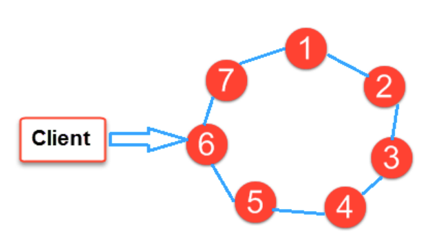{ width="600" }
  <figcaption></figcaption>
</figure>

### Cassandra als Teil der Applikationsentwicklung
Im Relationalen Modell wird zuerst die Datenstruktur analysiert und dann am Ende die Applikation darauf angewendet. Die Applikation ruft Queries auf, um die benötigten Informationen aus dem Datenmodell zu holen.


Bei Apache Cassandra ist der Prozess umgekehrt. Hier wird zuerst die Anwendung entwickelt. Es wird entschieden, welche Queries in der Anwendung ausgeführt werden müssen. Dies führt zur Überlegung, wie das logische Datenmodell aussehen muss.Nachdem die Queries und das Datenmodell definiert sind, werden die Daten in Cassandra geladen.

Dieses Vorgehen, hier vereinfacht beschrieben,  ist nicht nur für Cassandra typisch, sondern für alle NoSQL-Datenbanken.


<figure markdown="span">
  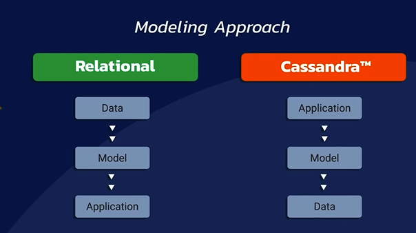{ width="600" }
  <figcaption></figcaption>
</figure>


### Cassandra und das CAP-Theorem
Im Zusammenhang mit dem CAP-Theorem präferiert Cassandra **A**vailability und **P**artition Tolearance und "opfert" die Konsistenz. Man spricht daher auch von einem *AP-System*. 
Die Consistency  kann jedoch mit der Anzahl eingesetzter Nodes in einem Cassandra-Setup "getuned" werden. Details dazu folgen. 


<figure markdown="span">
  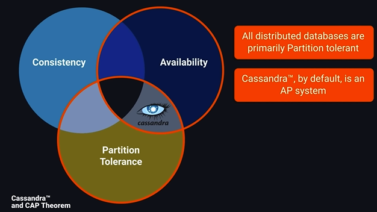{ width="800" }
  <figcaption></figcaption>
</figure>


### Verteilte, skalierbare NoSQL-Datenbank
Cassandra ist somit eine horizontal skalierbare, opensource NoSQL Datenbank.
Die Datenbank besteht aus mehreren Nodes, die logisch in einem Ring zusammengefasst sind. Die Nodes replizieren sich, so dass die DB stets konsistent ist. 

<figure markdown="span">
  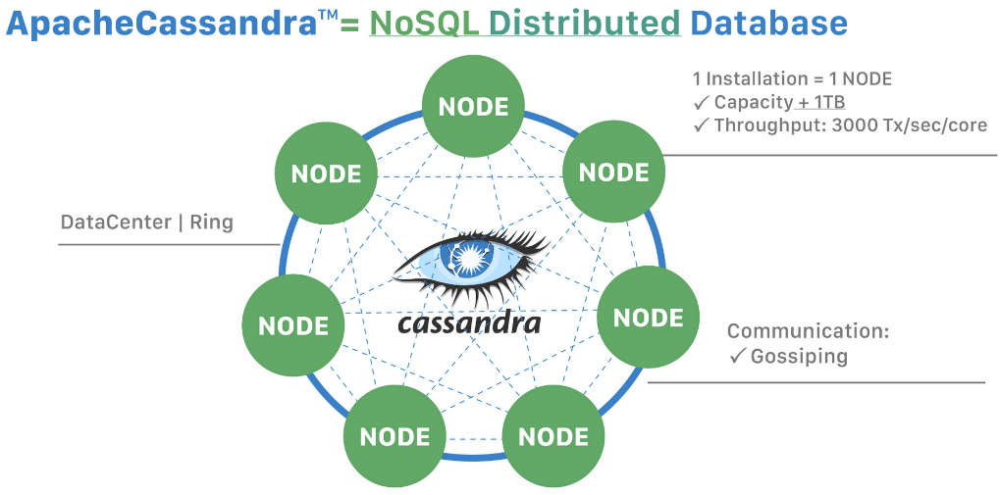{ width="800" }
  <figcaption></figcaption>
</figure>

Die Skalierbarkeit kann damit erreicht werden, indem die Anzahl Nodes angepasst werden kann.
In der Dokumentation wird folgendes gesagt:

***„To double your capacity or double your throughput, double the number of nodes.“***

<figure markdown="span">
  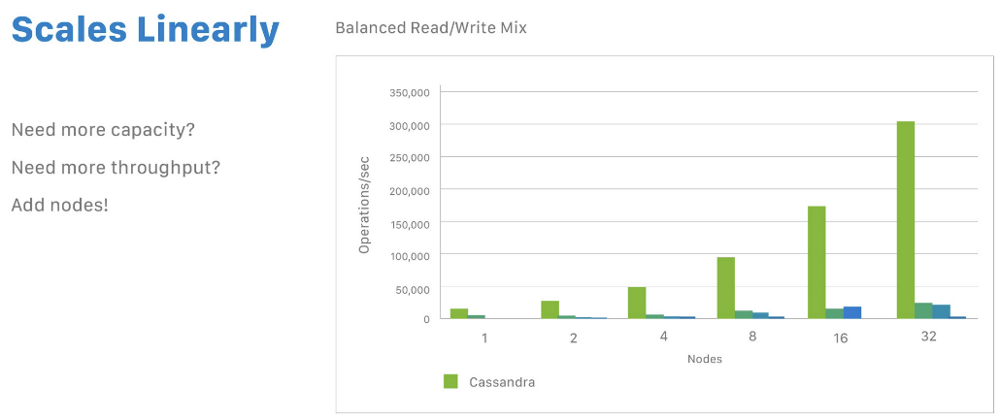{ width="800" }
  <figcaption></figcaption>
</figure>

Die Message ist somit einfach: **Je mehr Nodes, desto mehr Durchsatz.**

In diesem Zusammenhang bildet das Konzept der *Partitions* eine entscheidende Rolle.

### Partitions
Daten können auf mehrere Nodes repliziert werden. Dies erhöht die Verfügbarkeit und Fehlertoleranz. In Cassandra exisitert der Begriff des **Replication Factors RF**. Dieser besagt, auf wie vielen Nodes die Daten repliziert werden sollen. Wenn unser Cassandra System aus einem Node besteht, ist der RF=1. Mit RF=2 werden die Daten auf einem weiteren Node repliziert, usw.

Der Betrieb von Cassandra macht Sinn, wenn das System aus mehrere Nodes besteht. Alle Nodes zusammen bilden einen **Cluster** oder "Ring".
**Nodes sind untereinander gleichwertig** und jeder Node hat dieselben Funktionalitäten wie alle andern. Man spricht hier auch von einer *masterless architecture*. 

Jeder Node besitzt einen Satz von sogenannten **Tokens**. Diese Tokens spielen eine Rolle, wenn es darum geht, auf welchem Node innerhalb des Clusters die Daten abgespeichert werden sollen.  Dazu wird jeder verwaltbaren Datenzeile ein **Partition Key** zugeordnet. Dieser Key ist entscheidend für die Nodes, welche die Datenzeile abspeichern sollen. Wenn Daten in einem Cassandra Cluster eingefügt werden, wird als erster Schritt dieser Partition Key erstellt. Dieser Key **bestimmt dann den Node, welcher für die Daten "verantwortlich" ist**. Die Erstellung des Keys erfolgt durch das Generieren eines **Hash-Wertes**, welcher auf die Wertebereiche der Tokens abgestimmt ist, für welche die Nodes verantwortlich sind.
Für die Zuweisung des Nodes ist der *Database Coodinator* verantwortlich. Jeder Node in einem Cluster kann diese Rolle als Coodinator übernehmen. Alle Nodes kommunizieren mit dem sogenannten ***gossip*-Protokoll**. Dieses Protokoll legt den aktuellen Coodinator fest. Das gossip-Protokoll legt auch fest, welcher Node für welche Token-Ranges verantwortlich ist. 
Wenn nun Daten im Cluster eingefügt werden, beispielsweise eine neue Zeile in einer Tabelle, bestimmt der aktuelle Coodinator die Partition Nummer, beispielsweise Nr. 59.
Der Coordinator schaut nun, welcher Node für Token Nr 59 verantwortlich ist und leitet die Daten an diesen weiter. Dieser Node wird auch *Replica Node* genannt. Wenn RF > 1 ist, werden diese Daten an mehrere Nodes weitergeleitet. Bei RF=1 erhält nur ein Node die Daten.

**Beachte:** 
Der *Coodinator Node* ist nicht auf einen Node beschränkt. Damit hätten wir einen *single point of failure*. Jeder Node kann diese Rolle übernehmen! Wer die Rolle zu einem bestimmten Zeitpunkt inne hat, wird durch das *gossip-Protokoll* bestimmt.

**Die Replikation in einem Cassandra-Datenbank-System garantiert Reliability und Fehlertoleranz.**


<figure markdown="span">
  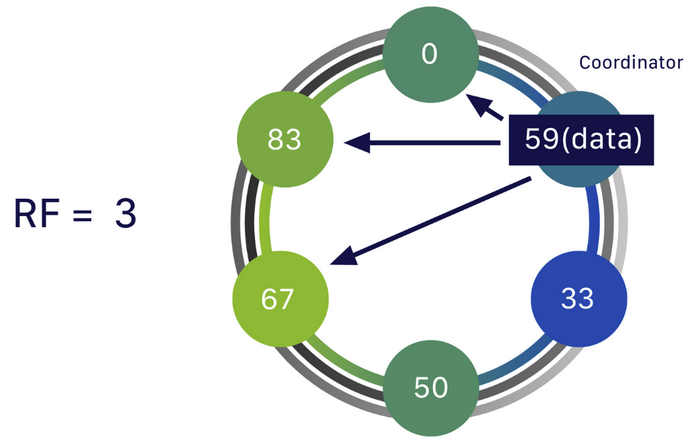{ width="600" }
  <figcaption></figcaption>
</figure>


Cassandra kennt weiter den Begriff des *Datacenter*. Cassandra repliziert die Daten zwischen den verschiedenen Datacenters. Dies hat vorallem Performance-Vorteile, wenn die Daten über mehrer Kontinente verteilt werden müssen.
Datacenter können bei der Konfiguration von Cassandra eingerichtet werden. Im Standard besteht das Cassandra-System aus einem Datacenter.
Es ist so auch nicht erstaunlich, dass die Erfinder von Cassandra ehemalige Facebook-Mitarbeiter waren. 


<figure markdown="span">
  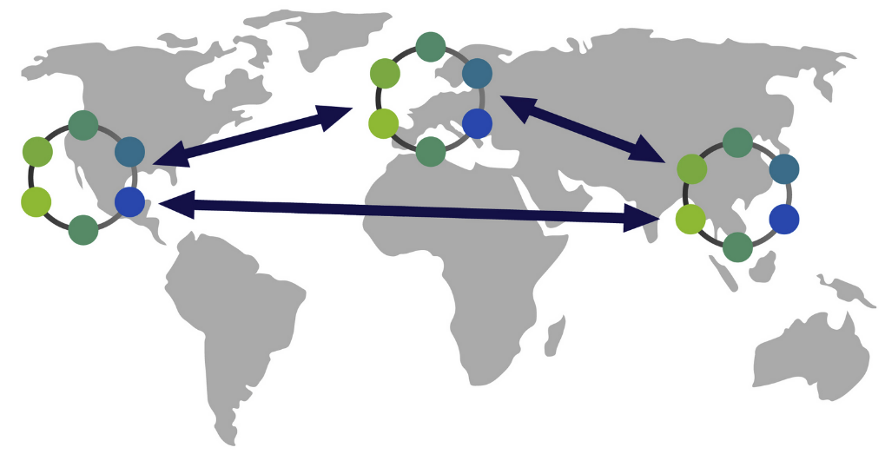{ width="600" }
  <figcaption></figcaption>
</figure>


Cassandra gilt als **AP-System** (Available Partition-tolerant) im Sinne des CAP-Theorems, welches Sie bereits kennen. Es "opfert" also das dritte Element in diesem Konzept, die Consistency. Diese Consistency kann jedoch parametriert werden, indem der *Consistency Level* *(CL)* in Cassandra eingestellt werden kann. Der CL besagt, wie viele Nodes im Cluster minimal ein Read/Write acknowledge dem Coordinator abgeben müssen, bevor die Operation als erfolgreich behandelt wird. Dieser *CL* basiert auf dem *Replication Factor RF*. Wenn RF=3 ist, müssen die Mehrheit der Nodes für eine Operation dem Coordinator ein *acknowledge* senden. In diesem Fall müssen das mindestens 2 Nodes machen. Wenn das nicht der Fall ist, wird die Operation vom Coodinator als nicht erfolgreich behandelt. Bei RF=6 ist der CL=(6/2+1)=4. Mindestens 4 Nodes müssen in diesem Fall ein acknowledge senden. Der *Consistency Level CL* wird auch als *Quorum* bezeichnet. 


<figure markdown="span">
  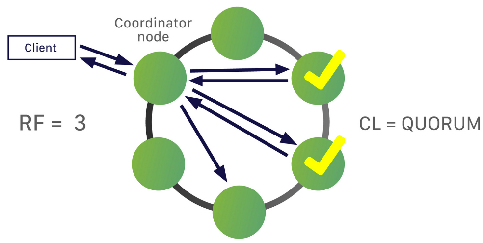{ width="600" }
  <figcaption></figcaption>
</figure>


Diese Eigenschaft macht Cassandra sehr flexibel. Es spielt keine Rolle, wo sich die Nodes eines Cassandra-Clusters befinden - ob in einer Cloud oder in einem eigenen Rechencenter. Beliebige Infrastruktur-Kombinationen bilden eine einzige Datenbank, die global verfügbar sein kann.


<figure markdown="span">
  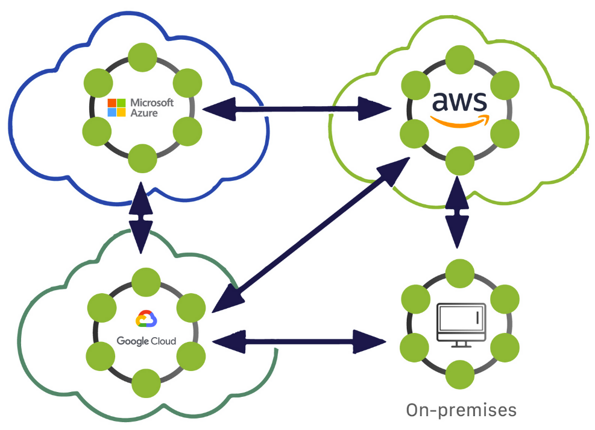{ width="600" }
  <figcaption></figcaption>
</figure>


## Praktische Vorbereitung

### Erstellen von Keyspaces und Cluster-Replication

Wir werden in diesem Tutorial queries an Cassandra senden. Dazu verwenden wir die **C**assandra S**QL** - **Sh**ell. Diese heisst `cqlsh`. `cqlsh` wird in Docker wie folgt gestartet:

`docker exec -it cassandra-1 cqlsh`

```
vmadmin@cassandravm:~/scripts$ docker exec -it cassandra-1 cqlsh
Connected to my-cluster at 127.0.0.1:9042
[cqlsh 6.2.0 | Cassandra 5.0.2 | CQL spec 3.4.7 | Native protocol v5]
Use HELP for help.
cqlsh>
``` 

Hier Ihr erstes Query:

```
cqlsh> DESCRIBE keyspaces;

system       system_distributed  system_traces  system_virtual_schema
system_auth  system_schema       system_views 

cqlsh>
```

Als Antwort erhalten Sie alle existierenden *keyspaces*. Ein *Keyspace* enthält Tabellen und ist analog zu einem Datenbankschema in einer relationalen Datenbank. 

Bevor wir Tabellen anlegen, müssen wir einen Keyspace erstellen. Wir erstellen diesen mit einem Replication Factor 3. Daten werden also auf allen 3 Nodes verwaltet:

`cqlsh> CREATE KEYSPACE M165 WITH REPLICATION = { 'class' : 'NetworkTopologyStrategy', 'datacenter1': 3};`

Damit wir ein Keyspace mit RF=3 erstellt. Die Strategie definiert, wie Daten in verschiedenen Datacenters repliziert werden soll. Vergleiche dazu das Kapitel zu den Partitions.

!!! info "Warum starten wir mit 3 Nodes?"

    * Es wird empfohlen, stets mit **mindestens 3 Nodes** ein Cassandra System zu betreiben.     

    * Wenn **Consistency** verlangt wird, benötigen wir ein **Acknowlegement von mindestens 2 Nodes**.    

    * Wenn ein Node ausfällt, ist der Cluster immer noch verfügbar, weil noch 2  Nodes vorhanden sind.    

    * Das Verständnis dazu wird im Verlaufe dieser Übungen entstehen.


    Unsere 3 Nodes sollten also hiermit *Up* *and Running* sein:
    ```
    vmadmin@cassandravm:~/scripts$ docker exec cassandra-3 nodetool status
    Datacenter: datacenter1
    =======================
    Status=Up/Down
    |/ State=Normal/Leaving/Joining/Moving
    --  Address     Load        Tokens  Owns (effective)  Host ID                               Rack 
    UN  172.17.0.4  192.62 KiB  16      64.7%             224bb3b4-3cec-45b6-89a7-0b231a237743  rack1
    UN  172.17.0.3  211.35 KiB  16      59.3%             87693efc-73ec-45c6-a8eb-094071bb8942  rack1
    UN  172.17.0.2  216.33 KiB  16      76.0%             c2e09e05-7ddb-4e90-a289-8cd0795e4d6e  rack1
    ```


Die Nodes hören auf den Ports 9042, 9043 und 9044 auf Client-Requests. Den jeweils verwendeten Port sehen Sie beim Starten der cqlsh-Shell:
`docker exec -it cassandra-1 cqlsh`

```
Connected to my-cluster at 127.0.0.1:9042
[cqlsh 6.2.0 | Cassandra 5.0.2 | CQL spec 3.4.7 | Native protocol v5]
Use HELP for help.
cqlsh>
```


Dieses Szenario hier ist realistisch für einen kleinen Cluster. **In einer produktiven Umgebung würden die Nodes auf eigenen Rechnern laufen**, um die Performance zu erhöhen.

Bevor wir beginnen Tabellen zu erstellen, ist es nützlich einige **Basics zum Tabellendesign** zu verstehen.

## Eintauchen und Hands-On in die Cassandra Architektur
Cassandra ist eine *dezentralisierte multi-node Datenbank*, welche **physisch über mehrere Standorte** verteilt ist. Sie verwendet *Replikation* und *Partitionen* und ist dadurch enorm **skalierbar für Lese- und Schreiboperationen**.

### Dezentralisation
Cassandra ist **dezentral organisiert**. Jeder Node ist gleichwertig; es sind Peers! Jeder Node agiert in verschiedenen Rollen und ohne zentralen Controller.

Die dezentrale Architektur von Cassandra erlaubt es, dass Nodes ausfallen können und auch nodes hinzugefügt werden, ohne dass das ganze System dadurch gestört wird.

### Jeder Node ist ein Coordinator

Daten werden auf verschiedene Nodes repliziert. Wenn ein Request anliegt, kann dieser von jedem Node verarbeitet werden.

Der **initiale Request-Empfänger wird zu einem Coodinator Node** für diesen Request. Wenn andere Nodes zwecks Konsistenzüberprüfung kontaktiert werden müssen, verlangt der Koordinator die benötigten Daten von den Replica Nodes.

Der Koordinator kann mit einem sogenannten  [Consistent Hashing Algorithmus](https://cassandra.apache.org/doc/latest/cassandra/architecture/dynamo.html?highlight=consistency#dataset-partitioning-consistent-hashing) den Node oder die Nodes ermitteln, welche die Daten bereitstellen können. 


<figure markdown="span">
  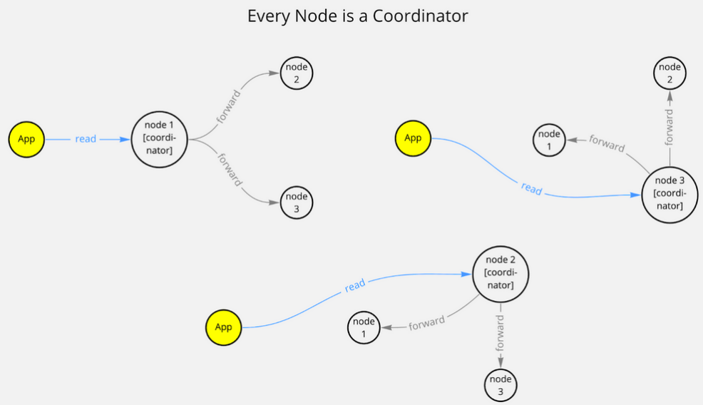{ width="600" }
  <figcaption></figcaption>
</figure>


Der Koordinator-Node ist für viele Dinge zuständig, z. Bsp. auch für das Reparieren von Daten oder für Read- und Write-Retries.


### Data Partitioning

!!! info "Partitioning "
    
    Partitioning is a method of splitting and storing a single logical dataset in multiple databases. By distributing the data among multiple machines, a cluster of database systems can store larger datasets and handle additional requests.


In Cassandra werden Daten in einem definierten Schema, dem sogenannten *Keyspace* verwaltet. Innerhalb dieses *Keyspace* werden die Tabellen angelegt.

Zusätzlich wird auch in Cassandra ein *Primary Key* für jede Tabelle definiert. Nur so ist eine eindeutige Identifizierung eines Datensatzes möglich.

Das Konzept der Primary Keys in Cassandra ist komplexer als in traditionellen relationalen Datenbanken, wie . Bsp, MySQL.

**In Cassandra beinhaltet ein Primary Key 2 Teile**:
* einen obligatorischen  **Partition Key** und
* ein  optionales Set von  **Clustering Columns**.

Dazu mehr im Kapitel  "Data Modeling".

Im Folgenden widmen wir uns dem Partitioning.

Betrachten Sie folgende Tabelle:

```
Table Users | Legend: p - Partition-Key, c - Clustering Column

country (p) | user_email (c)  | first_name | last_name | age
----------------------------------------------------------------
US          | john@email.com  | John       | Wick      | 55  
UK          | peter@email.com | Peter      | Clark     | 65  
UK          | bob@email.com   | Bob        | Sandler   | 23 
UK          | alice@email.com | Alice      | Brown     | 26
``` 


Die Spalten  `user_email` und `country` bilden zusammen den Primary Key.

Die  `country` - Spalte ist der **Partition Key** (p). Das `CREATE`-statement wollen wir nun erstellen:

Starten der Cassandra-SQL-Shell `cqlsh` und wechseln in den erstellten `m165`-Keyspace mit `use`:

```
vmadmin@cassandravm:~/scripts$ docker exec -it cassandra-1 cqlsh
Connected to Test Cluster at 127.0.0.1:9042
[cqlsh 6.1.0 | Cassandra 4.1.1 | CQL spec 3.4.6 | Native protocol v5]
Use HELP for help.

cqlsh> DESCRIBE KEYSPACES;

m165    system_auth         system_schema  system_views         
system  system_distributed  system_traces  system_virtual_schema

cqlsh> use M165;
```

Beachten Sie den `use`-Befehl. Damit wechseln wir in den erstellten Keyspace und müssen diesen dann nicht weiter angeben. Das Erstellen einer Tabelle `users_by_country` wird dann so gemacht:

```
cqlsh>
CREATE TABLE users_by_country (
    country text,
    user_email text,
    first_name text,
    last_name text,
    age smallint,
    PRIMARY KEY ((country), user_email)
);
```

Pasten Sie den obigen CREATE-Befehl einfach in den `cqlsh`-Prompt. Es werden jeweils Punkte am Anfang der Zeile erscheinen, bis der Befehl mit `;` abgeschlossen ist. Das sieht dann so aus:


<figure markdown="span">
  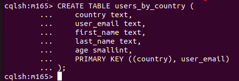{ width="600" }
  <figcaption></figcaption>
</figure>


Die erste Gruppe im `PRIMARY KEY` - Statement definiert den **Partition Key**. Alle weiteren Elemente bezeichnen die **Clustering Spalten**:

<figure markdown="span">
  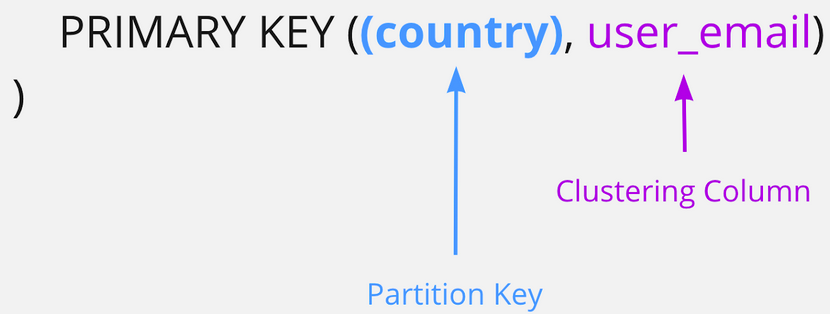{ width="600" }
  <figcaption></figcaption>
</figure>

Laden wir einige Daten in die Tabelle:

```
cqlsh> 
INSERT INTO users_by_country (country,user_email,first_name,last_name,age)
  VALUES('US', 'john@email.com', 'John','Wick',55);

INSERT INTO users_by_country (country,user_email,first_name,last_name,age)
  VALUES('UK', 'peter@email.com', 'Peter','Clark',65);

INSERT INTO users_by_country (country,user_email,first_name,last_name,age)
  VALUES('UK', 'bob@email.com', 'Bob','Sandler',23);

INSERT INTO users_by_country (country,user_email,first_name,last_name,age)
  VALUES('UK', 'alice@email.com', 'Alice','Brown',26);
```
  
  Pasten Sie wiederum die INSERT-Statements in den `cqlsh`-Prompt und schliessen Sie die Eingabe mit `Enter` ab.
  

<figure markdown="span">
  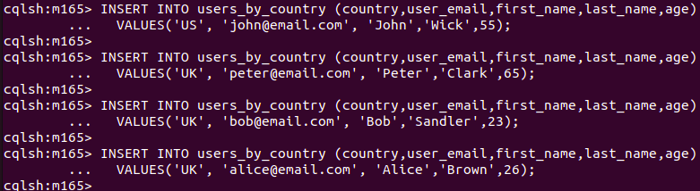{ width="600" }
  <figcaption></figcaption>
</figure>


Vielleicht stellen Sie sich hier die Frage, warum `country` als essentiellen Teil des Primary Keys verwendet wird? In einer relationalen DB hätten Sie das wohl nie gemacht.

Dies wird klar, nachdem Sie hier die Basics von Cassandra  durchgearbeitet haben.
  
Das **Konzept des Partitioning** ist die **Grundlage für die enorme Skalierungsfähigkeit** von Cassandra.
In diesem Beispiel basieren die Partitionen auf dem `country`. Alle Zeilen (Rows) mit `country`=US werden in ein und derselben Partition gehalten. Alle andern Zeilen mit `country`=UK werden in einer andern Partition verwaltet.

Neben dem Begriff *Partitioning* wird auch der Begriff *Shard* verwendet. Die Bedeutung ist dieselbe.


<figure markdown="span">
  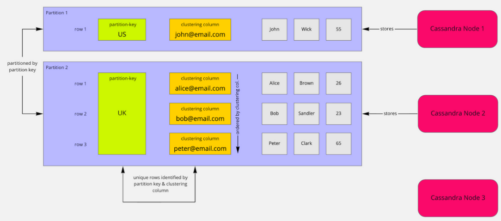{ width="600" }
  <figcaption></figcaption>
</figure>


Basierend auf dem Wert des Partition Keys werden Partitionen mit entsprechenden Daten gefüllt.
**Diese Partition Keys sind also zuständig, welche Nodes welche Partitionen verwalten.**
Das Verteilen der Daten auf mehrere Nodes ist die Basis der Skalierbarkeit von Cassandra.

Der User / die Anwendung liest oder schreibt die Daten, indem dazu **mehrere Nodes** involviert sind. Der Partition Key ist immer dafür verantwortlich, dass die richtigen Nodes angesprochen werden.

Das Verständnis der Datenverteilung, basierend auf Partitionen, ist sehr wichtig beim Design einer Applikation.

**Hier unterscheidet sich Cassandra sehr stark gegenüber den klassischen relationalen Datenbanken.**


!!! info "Was bedeutet horizontale Skalierung??"

    Horizontal scaling means you can increase throughput by adding more nodes. If your data is distributed to more servers, then more CPU, memory, and network capacity is available.


Warum braucht man dann `eMail` als Primary Key?

Der PK definiert die Spalte, um Records eindeutig zu identifizieren. Nur `country` würde eine Zeile nicht eindeutig identifizieren.

Der Partition Key ist wichtig, um Daten gleichmässig zwischen Nodes zu verteilen und wichtig, um die Daten effizient lesen zu können. Das definierte Schema wurde so festgelegt, dass die Daten meist pro Land abgefragt werden sollen, deshalb wurde `country` als Partition Key definiert:
`PRIMARY KEY ((country), user_email)`

Eine Abfrage über alle Zeilen mit Selektion des Landes *performed* damit sehr gut: 

`cqlsh> SELECT * FROM users_by_country WHERE country='US';`
  
<figure markdown="span">
  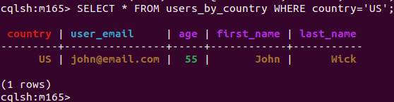{ width="400" }
  <figcaption></figcaption>
</figure>
  
Ihre `cqlsh`-shell sendet den Request nur an einen Casandra-Node - by default.
Dies bezeichnet man als *Consitency Level of One*.


 
!!! info "Was bedeutet eine  *Consitency Level of One*?"

    A consistency level of one means that only a single node is asked to return the data. With this approach, you will lose strong consistency guarantees and instead experience eventual consistency.
    Eventual consistency erklären wir später.


Kreieren wir eine weitere Tabelle. Hier ist der Partition Key die E-Mail-Adresse:

```
cqlsh> 
CREATE TABLE users_by_email (
    user_email text,
    country text,
    first_name text,
    last_name text,
    age smallint,
    PRIMARY KEY (user_email)
);
```

<figure markdown="span">
  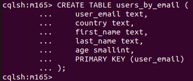{ width="600" }
  <figcaption></figcaption>
</figure>

... und noch einige Daten einfügen:

```
cqlsh> 
INSERT INTO users_by_email (user_email, country,first_name,last_name,age)
  VALUES('john@email.com', 'US', 'John','Wick',55);

INSERT INTO users_by_email (user_email,country,first_name,last_name,age)
  VALUES('peter@email.com', 'UK', 'Peter','Clark',65); 

INSERT INTO users_by_email (user_email,country,first_name,last_name,age)
  VALUES('bob@email.com', 'UK', 'Bob','Sandler',23);

INSERT INTO users_by_email (user_email,country,first_name,last_name,age)
  VALUES('alice@email.com', 'UK', 'Alice','Brown',26);
```

<figure markdown="span">
  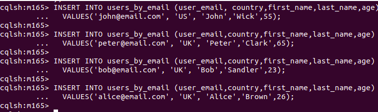{ width="600" }
  <figcaption></figcaption>
</figure>

Hier erhält jeder Record eine eigene Partition, weil jede E-Mail-Adresse einmalig ist. Dies wurde beim Kreieren der Tabelle so festgelegt:
```
...
...
PRIMARY KEY (user_email));
```

<figure markdown="span">
  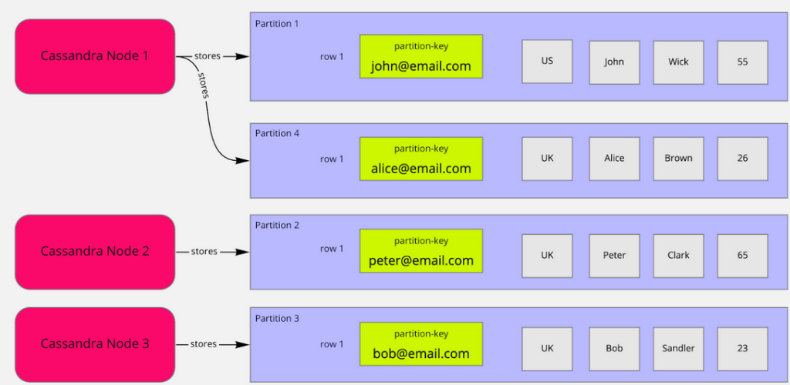{ width="600" }
  <figcaption></figcaption>
</figure>

Wenn es darum geht, dass Records sehr schnell aufgrund der E-Mail-Adresse abgefragt werden sollen, ist das eine gute Idee, den Partition Key so zu definieren!
`SELECT * FROM users_by_email WHERE user_email='alice@email.com';`

<figure markdown="span">
  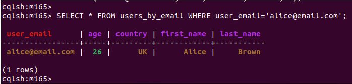{ width="600" }
  <figcaption></figcaption>
</figure>

Wenn die Daten mit dem Partition Key   `user_email`  eingefügt wurden und eine Abfrage nach `age` erfolgt, müssten die Daten über alle Partitionen "gesucht" werden!

Dies hätte Performance-Einbussen zur Folge. Insbesondere dann, wenn der Cluster aus sehr vielen Nodes besteht.

Cassandra versucht dies zu verhindern. Wenn eine Abfrage mit einem Spaltennamen erfolgt, welcher nicht ein Partition Key ist, muss Cassandra dies explizit mitgeteilt werden, indem das Keyword `ALLOW FILTERING` verwendet wird. Das geht so:
```
cqlsh> 
SELECT * FROM users_by_email WHERE age=26 ALLOW FILTERING;
```

Ohne  `ALLOW FILTERING` würde der Query **nicht** ausgeführt werden, bzw. eine Fehlermeldung wird dabei generiert. Dies soll verhindern, dass "expensive Queries", also Queries, welche eine hohe Last auf den Nodes erzeugen, abgesetzt werden.

Fehlermeldung, wenn `ALLOW FILTERING` nicht verwendet wird:

`InvalidRequest: Error from server: code=2200 [Invalid query] message="Cannot execute this query as it might involve data filtering and thus may have unpredictable performance. If you want to execute this query despite the performance unpredictability, use ALLOW FILTERING"`


<figure markdown="span">
  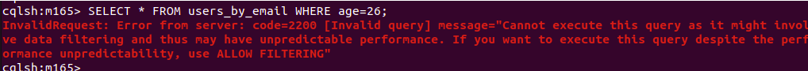{ width="800" }
  <figcaption></figcaption>
</figure>

#### Bedeutung des Partition Keys - Zusammenfassung

!!! info "Zusammenfassung - Bedeutung des Partition Keys"

    Der Partition Key spielt eine zentrale Rolle bei der Organisation und Verwaltung von Daten in Apache Cassandra. Hier sind einige wichtige Aspekte und Bedeutungen des Partition Keys:

    1. **Datenverteilung**: Der Partition Key bestimmt, auf welchem Knoten im Cassandra-Cluster die Daten gespeichert werden. Dies geschieht durch einen *Hashing-Mechanismus*, der sicherstellt, dass Daten gleichmässig über alle Knoten verteilt werden. Dadurch wird eine optimale Lastverteilung und Skalierbarkeit erreicht.
    2. **Performance und Abfrageoptimierung**: Da der Partition Key verwendet wird, um Daten auf spezifischen Knoten zu speichern, können Abfragen, die den Partition Key verwenden, sehr effizient und schnell ausgeführt werden. Abfragen, die den Partition Key nicht enthalten, können jedoch langsamer sein, da sie alle Knoten im Cluster durchsuchen müssen.
    3. **Datenlokalisierung**: Daten, die denselben Partition Key teilen, werden auf demselben Knoten gespeichert. Dies erleichtert das Abrufen und die Verarbeitung zusammenhängender Daten. Zum Beispiel können alle Informationen zu einem spezifischen Benutzer unter einem einzigen Partition Key gespeichert werden, was schnelle und effiziente Abfragen ermöglicht.
    4. **Replikation und Fehlertoleranz**: Der Partition Key spielt auch eine Rolle bei der Replikation von Daten. Cassandra verwendet den Partition Key, um zu bestimmen, auf welchen Knoten Daten repliziert werden, basierend auf der Konfiguration des *Replikationsfaktors*. Dies erhöht die Fehlertoleranz und die Verfügbarkeit der Daten.
    5. **Datenmodellierung**: Bei der Gestaltung des Datenmodells in Cassandra ist die Wahl des Partition Keys von entscheidender Bedeutung. Ein gut gewählter Partition Key kann die Abfrageleistung erheblich verbessern und die Effizienz der Datenverteilung sicherstellen.

    Zusammengefasst ist der *Partition Key* ein **kritischer Bestandteil von Cassandra**, der die Datenverteilung, Abfrageleistung, Fehlertoleranz und die gesamte Effizienz des Systems beeinflusst.


### Replication

Skalierbarkeit mit nur Partitionierung ist limitiert! Dieses Element wird ergänzt mit dem **Konzept der Replikation**!

Betrachten Sie write requests, welche nur eine Partition betreffen. Alle requests würden an einen einzigen Node gesendet werden, welcher für diese Partition zuständig ist. Seine CPU, das Memory, der I/O-Durchsatz wären sehr belastet. Zusätzlich möchten Sie auch, dass der Request bearbeitet wird, wenn der Node nicht verfügbar ist.

Hier kommt das Konzept der Replikation zum Zug. Durch das Duplizieren der Daten auf mehrere Nodes, sog. *Replicas*, kann der Durchsatz erhöht werden, indem Nodes simultan Daten bereitstellen können. Auch erhöht dieses Konzept die Verfügbarkeit, weil ein Ausfall eines Nodes von andern Nodes abgefangen werden kann.

In Cassandra kann deshalb **für jeden Keyspace ein Replication Factor (RF)** definiert werden.
Unseren Keyspace `M165` haben wir mit eine RF von 3 festgelegt.

```
cqlsh> CREATE KEYSPACE M165
  WITH REPLICATION = { 
   'class' : 'NetworkTopologyStrategy',
   'datacenter1' : 3 
  };
```
  
**RF=1:** Nur eine Kopie eines Records wird im Cluster gehalten. Wenn der Node mit dieser Kopie ausfällt, dass der Record nicht abgefragt werden.

**RF=2:** Ein Record wird auf 2 verschiedenen Nodes gehalten. Jeder Node ist gleichgestellt. Es gibt keinen "Master"-Replica-Node. Ein Node kann auch ausfallen und die Abfrage wird trotzdem erfolgreich sein.

Als generelle Regel sollte der Replication Factor **RF nie grösser als die Anzahl Nodes** in einem Cluster sein. Man kann aber den Replication Factor zu Beginn höher einstellen und dann später die gewünschte Anzahl Nodes hinzufügen.
  
In produktiven Umgebungen ist ein **RF von 3 empfohlen**. Dies gewährt Sicherheit, dass es sehr unwahrscheinlich wird, dass Daten verloren gehen oder kein Zugriff darauf erfolgen kann.

Auch im Fall von inkonsistenten Daten (die Replicas haben unterschiedliche Daten), können die einzelnen Nodes nach dem Daten-Status abgefragt werden. Es kann dann entschieden werden, ob der Status der Mehrheit der Nodes der gültige sein soll.

In unserem Cassandra Setup besteht der Cluster aus 3 Nodes mit 3 Replicas. Die Mehrheit der Nodes ist somit 2. Dies erlaubt uns, einige Überlegungen zum Konsistenz-Level im nächsten Kapitel anzustellen.

  
### Consistency Level

Nach dem **Partitioning** und der **Replikation** nehmen wir uns dem Thema der **Datenkonsistenz** an.
Cassandra hat in diesem Bereich viel zu bieten. Der Begriff hier ist: **Tunable Consistency**.

Das Konsistenz-Level für Read/Write-Queries kann eingestellt werden. Settings dazu sind [hier](https://docs.datastax.com/en/cassandra-oss/3.x/cassandra/dml/dmlConfigConsistency.html) ausführlich dokumentiert.

Schauen wir uns das bekannteste Setting zuerst an.
Nehmen wir an, wir haben 3 Replicas definiert. 

Erste Frage: 
Haben wir einen Bedarf an hoher Datenkonsistenz?


!!! info "Was bedeutet Strong Consistency?"

    In contrast to eventual consistency, strong consistency means only one state of your data can be observed at any time in any location.
    
    For example, when consistency is critical, like in a banking domain, you want to be sure that everything is correct. You would rather accept a decrease in availability and increase of latency to ensure correctness.


Hier spielt das  [CAP Theorem](https://en.wikipedia.org/wiki/CAP_theorem) eine wichtige Rolle. Es ist unmöglich in einem bestimmten Zeitpunkt gleichzeitig **Verfügbarkeit UND Konsistenz** zu garantieren, wenn Verbindungs- oder andere technische Probleme in einem Cluster auftauchen.

Beispiel:
Sie schreiben einen einzelnen Wert in eine Tabelle. Die Daten werden auf 2 Nodes repliziert.
Jetzt entsteht zwischen den Nodes ein Unterbruch.
Zuerst wird der Write-Request an Node 1 gesendet. Dann werden Daten von Node 2 gelesen.

Wie verhalten wir uns in dieser Situation?

<figure markdown="span">
  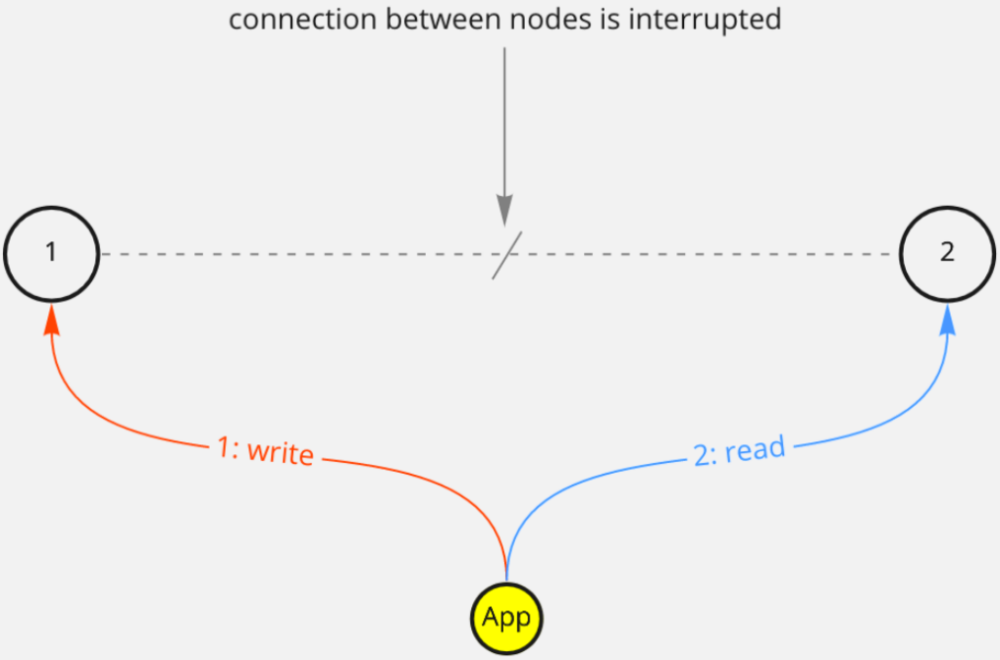{ width="800" }
  <figcaption></figcaption>
</figure>

1. Soll das Schreiben verhindert werden, weil Node 2 nicht erreichbar ist? Dies würde bedeuten, dass wir die Verfügbarkeit opfern zugunsten der Datenkonsistenz.
2. Akzeptiren wir den Schreibzugriff auf Node 1 und lassen wir Lesezugriffe von Node 1 und 2 zu? Das System wäre mit diesem Entscheid weiterhin verfügbar. Wir riskieren jedoch, dass Daten nicht auf jedem Replication Node identisch ist, weil ja hier in unserem Beispiel Node 1 mit Node 2 nicht replizieren kann. In diesem Fall opfern wir Datenkonsistenz zugunsten der Verfügbarkeit.

**Die entscheidende Frage ist: Wollen wir Verfügbarkeit oder Datenkonsistenz?**

Ein anderer Faktor ist folgender: 
Das Garantieren von Konsistenz bedingt, dass wir mehrere Nodes anfragen müssen. Dies versursacht eine "Wartezeit", um alle Antworten der Nodes auswerten zu können. Wollen wir diese Wartezeit (Latency) zugunsten der Konsistenz akzeptieren?


### Tune for Consistency by Setting up a Strong Consistency Application

Es gibt eine wichtige Formel, welche eine hohe Dastenkonsistenz garantiert: 

`[read-consistency-level] + [write-consistency-level] > [replication-factor]`


!!! info "Was heisst Konsistenz Level?"

    Consistency level means ***how many nodes*** need to acknowledge a read or a write query.


Das Read- und Write-Konsistez-Level können damit festgelegt werden.
Das Konsistenzlevel kann aber auch zugunsten der Perfomance reduziert werden:


<figure markdown="span">
  { width="800" }
  <figcaption></figcaption>
</figure>

Für **read-intensive Anwendungen**, wird empfohlen die Read-Konsistenz tief zu halten, weil Read-IOs häufiger sind als Write-IOs.
Nehmen wir an, wir haben einen Replication Factor von 3. 
Die Formel würde dann lauten:
`1 + [write-consistency-level] > 3`

Die write-Konsistenz wäre in diesem Fall 3, um ein stark konsistentes System zu betreiben.

Für  **write-intensive Anwendungen** wäre gemäss Formel das write-consistence-level = 1 und somit das read-consistence-level = 3.

Entweder wird bei einem Read jeder Node überprüft, ob jeder Node den gleichen Datenstatus hat - oder - bei einem Write wird überprüft, dass alle Nodes die Daten in ihrem lokalen Storage geschrieben haben.
Diese Checks garantieren, dass Daten zum Lesen und Schreiben korrekt sind.

In unserem Beispiel haben wir einen RF von 3.
Wir können so den Konsistenz Level maximal definieren mit  `ALL` oder `THREE`:

```
cqlsh> 
   CONSISTENCY ALL;
   SELECT * FROM users_by_country WHERE country='US';
```
   
   
<figure markdown="span">
  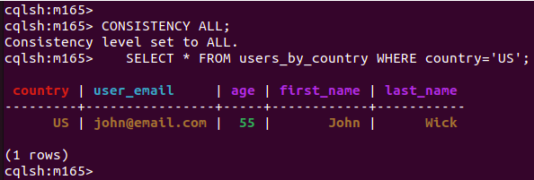{ width="600" }
  <figcaption></figcaption>
</figure>

### Tune for Performance by Using Eventual Consistency

Um Performance zu gewinnen, kann der Konsistenz-Level für Queries reduziert werden, z. Bsp auf 1:
```
cqlsh> 
   CONSISTENCY ONE;
   SELECT * FROM users_by_country WHERE country='US';
```
   
Damit gewinnt man Performance, steht aber im Risiko mit der Datenkonsistenz, welche durch viele Faktoren beieinträchtigt werden kann.

Cassandra hat in diesem Bereich viele Einstellungsmöglichkeiten, wie Inkonsistenzen behandelt werden sollen.

### Optimize Data Storage for Reading or Writing

Writes are cheaper than reads in Cassandra due to its storage engine. Writing data means simply appending something to a so-called commit-log.

Commit-logs are append-only logs of all mutations local to a Cassandra node and reduce the required I/O to a minimum.

Reading is more expensive, because it might require checking different disk locations until all the query data is eventually found. 

But this does not mean Cassandra is terrible at reading. Instead, Cassandra's storage engine can be tuned for reading performance or writing performance.

### Understanding Compaction

For every write operation, data is written to disk to provide durability. This means that if something goes wrong, like a power outage, data is not lost.

The foundation for storing data are the so-called  [SSTables](https://docs.datastax.com/en/archived/cassandra/3.0/cassandra/dml/dmlHowDataWritten.html) . SSTables are immutable data files Cassandra uses to persist data on disk.

You can set various strategies for a table that define how data should be merged and compacted. These strategies affect read and write performance:

* `SizeTieredCompactionStrategy` is the default, and is especially performant if you have more writes than reads,
* `LeveledCompactionStrategy` optimizes for reads over writes. This optimization can be costly and needs to be tried out in production carefully
* `TimeWindowCompactionStrategy` is for Time-series data

By default, tables use the `SizeTieredCompactionStrategy`:

```
cqlsh> 
   DESCRIBE TABLE users_by_country;
```


<figure markdown="span">
  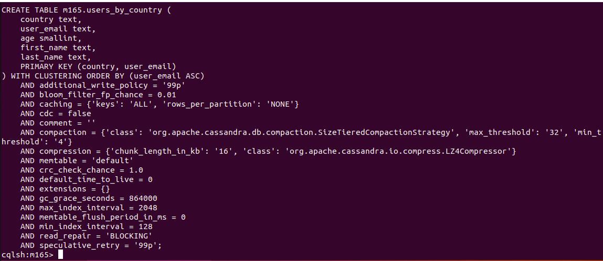{ width="800" }
  <figcaption></figcaption>
</figure>

Although you can alter the compaction strategy of an existing table, I would not suggest doing so, because all Cassandra nodes start this migration simultaneously. This will lead to significant performance issues in a production system.

Instead, define the compaction strategy explicitly during table creation of your new table:

```
cqlsh> 
CREATE TABLE users_by_country_with_leveled_compaction (
    country text,
    user_email text,
    first_name text,
    last_name text,
    age smallint,
    PRIMARY KEY ((country), user_email)
) WITH
  compaction = { 'class' :  'LeveledCompactionStrategy'  };
```
<figure markdown="span">
  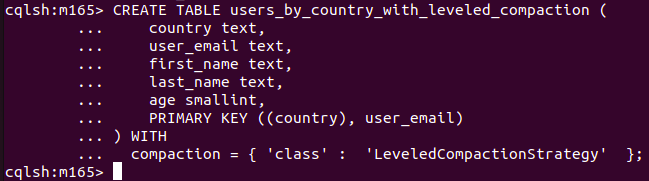{ width="600" }
  <figcaption></figcaption>
</figure>


Let’s check the result:

`DESCRIBE TABLE users_by_country_with_leveled_compaction;`

<figure markdown="span">
  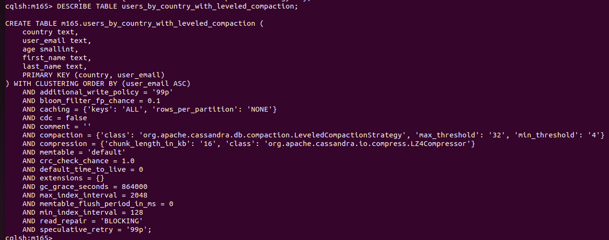{ width="600" }
  <figcaption></figcaption>
</figure>

The strategies define when and how compaction is executed. Compaction means rearranging data on disk to remove old data and keep performance as good as possible when more data needs to be stored.

Check out the excellent [DataStax documentation about compaction](https://docs.datastax.com/en/dse/5.1/dse-arch/datastax_enterprise/dbInternals/dbIntHowDataMaintain.html#dbIntHowDataMaintain__dml_types_of_compaction)   for details. There may even be better strategies in the future for the performance of your use-case.


### Presorting Data on Cassandra Nodes

A table always requires a primary key. A primary key consists of 2 parts:

* At least 1 column(s) as partition key and
* Zero or more clustering columns for nesting rows of the data.

All columns of the partition key together are used to identify partitions. All primary key columns, meaning partition key and clustering columns, identify a specific row within a partition.

In Cassandra, data is already sorted on disk. So if you want to avoid sorting data later, you can make sure sorting is applied as needed. This can be ensured on the table level and avoids having to sort data in the client applications that query Cassandra.

In our `users_by_country` table, you can define `age` as another clustering column to sort stored data:

```
cqlsh> 
CREATE TABLE users_by_country_sorted_by_age_asc (
    country text,
    user_email text,
    first_name text,
    last_name text,
    age smallint,
    PRIMARY KEY ((country), age, user_email)
) WITH CLUSTERING ORDER BY (age ASC);
```

<figure markdown="span">
  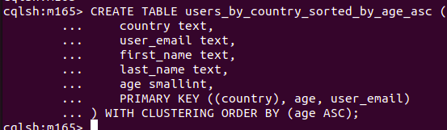{ width="600" }
  <figcaption></figcaption>
</figure>

Let’s add the same data again:

```
cqlsh> 
INSERT INTO users_by_country_sorted_by_age_asc (country,user_email,first_name,last_name,age)
  VALUES('US','john@email.com', 'John','Wick',10);

INSERT INTO users_by_country_sorted_by_age_asc (country,user_email,first_name,last_name,age)
  VALUES('UK', 'peter@email.com', 'Peter','Clark',30);

INSERT INTO users_by_country_sorted_by_age_asc (country,user_email,first_name,last_name,age)
  VALUES('UK', 'bob@email.com', 'Bob','Sandler',20);

INSERT INTO users_by_country_sorted_by_age_asc (country,user_email,first_name,last_name,age)
  VALUES('UK', 'alice@email.com', 'Alice','Brown',40);
```

<figure markdown="span">
  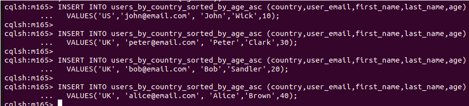{ width="600" }
  <figcaption></figcaption>
</figure>

And get the data by country:

```
cqlsh> 
      SELECT * FROM users_by_country_sorted_by_age_asc WHERE country='UK';
```

In this example, the clustering columns are `age` and `user_email`. So the data is first sorted by `age` and then by `user_email`. At its core, Cassandra is still like a key-value store. Therefore, you can only query the table by:

* `country`
* `country` and `age`
* `country`, `age`, and `user_email`

But never by `country` and `user_email`.

After learning about partitioning, replication and consistency levels, let's head into data modeling and have more fun with the Cassandra cluster.

### Data Modeling für das Erstellen einer To-Do-Liste

You've already learned a lot about the fundamentals of Cassandra.


Let's put your knowledge into practice and design a **to-do list application** that receives many more reads than writes.

The best approach is to analyze some user stories you want to fulfill with your table design:

1. As a user, I want to create a to-do element 

**Note:** 
This is only about creating data. For now, you can delay some decisions because you want to focus on how data is read.

2. As a user, I want to list all my to-do elements in ascending order

First, you need to query by `user_email`. Create a table called `todos_by_user_email`.

You need 1 table that contains all the information of a to-do element of a user. Data should be partitioned by `user_email` for efficient read and writes by `user_email`.

Also, the oldest records should be displayed first, which means using the creation date as a clustering column. The `creation_date` also ensures uniqueness.:

```
cqlsh> 
CREATE TABLE todo_by_user_email (
    user_email text,
    name text,
    creation_date timestamp,
    PRIMARY KEY ((user_email), creation_date)
) WITH CLUSTERING ORDER BY (creation_date DESC)
AND compaction = { 'class' :  'LeveledCompactionStrategy'  };
```

<figure markdown="span">
  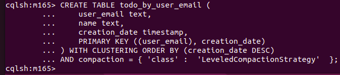{ width="600" }
  <figcaption></figcaption>
</figure>


3. As a user, I want to share a to-do element with another user

To get all the to-dos shared with a user, you need to create a table called `todos_shared_by_target_user_email` to display all shared to-dos for the target user. 

The table contains the to-do name to display it.

But the user also wants to see the to-dos they shared with other users. This is another table, `todos_shared_by_source_user_email`.

Both tables have, according to the use-case, the required `user_email` as partition keys to allow efficient queries. Also, `creation_date` is added as a clustering column for sorting and uniqueness:

```
cqlsh> 
CREATE TABLE todos_shared_by_target_user_email (
    target_user_email text,
    source_user_email text,
    creation_date timestamp,
    name text,
    PRIMARY KEY ((target_user_email), creation_date)
) WITH CLUSTERING ORDER BY (creation_date DESC)
AND compaction = { 'class' :  'LeveledCompactionStrategy'  };

CREATE TABLE todos_shared_by_source_user_email (
    target_user_email text,
    source_user_email text,
    creation_date timestamp,
    name text,
    PRIMARY KEY ((source_user_email), creation_date)
) WITH CLUSTERING ORDER BY (creation_date DESC)
AND compaction = { 'class' :  'LeveledCompactionStrategy'  };
```

<figure markdown="span">
  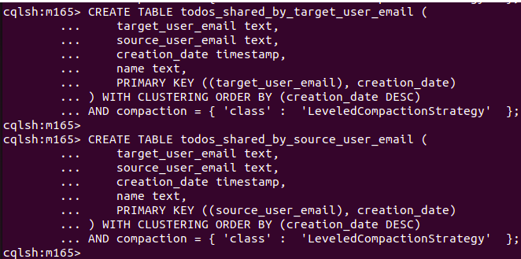{ width="400" }
  <figcaption></figcaption>
</figure>

This type of modeling is different than thinking about foreign keys and primary keys that you might know from traditional databases. In the beginning, it's all about defining tables and thinking about what values you want to filter and need to display.

You need to set a partition key to ensure the data is organised for efficient read and write operations. Also, you need to set clustering columns to ensure uniqueness, sort order, and optional query parameters.

### Keep Data in Sync Using `BATCH` Statements

Due to the duplication, you need to take care to **keep data consistent**. In Cassandra, you can do that by using `BATCH` statements that give you an all-at-once guarantee, also called *atomicity*.

This might sound like a lot of work, and yes, it is a lot of work! If you have a table schema with many relationships, you will have more work compared to a normalized table schema.


!!! info "What is a normalized table schema?"

    A normalized table schema is optimized to contain no duplications. Instead, data is referenced by ID and needs to be joined later. In Cassandra, you **try to avoid normalized tables**. **It is not even possible to write a query that contains a join**.


Batch statements are cheap on a single partition, but dangerous when you execute them on different partitions, because:


* Data mutations will not be applied at the same time to all partitions, with no isolation
* It is expensive for the coordinator node, because you have to talk to multiple nodes and prepare for a rollback if something goes wrong
* There is a batch query size limit of 50kb to avoid overloading the coordinator. This limit can be increased, but this is not recommended

In general, batches are costly.

There are other ways to apply changes eventually. If you need to execute them very often, consider using *async queries* instead with a proper retry mechanism. 

Depending on the way you access your Cassandra, the driver might already offer you retry capabilities.

Still, this approach requires thinking about what will happen if a query is never executed. If every query really needs to be executed eventually, how can you make sure that it does not get lost if your service goes down?

The key learning here is: 

* Single partition batches are cheap and should be used
* Batches that include different partitions are expensive, and if there are a lot of reads/writes, this might be the reason why a Cassandra cluster is exhausted.

Let’s create a `BATCH` statement that contains a to-do element that is shared with a user:

cqlsh> 

```
BEGIN BATCH
  INSERT INTO todo_by_user_email (user_email,creation_date,name) VALUES('alice@email.com', toTimestamp(now()), 'My first todo entry')

  INSERT INTO todos_shared_by_target_user_email (target_user_email, source_user_email,creation_date,name) VALUES('bob@email.com', 'alice@email.com',toTimestamp(now()), 'My first todo entry')

  INSERT INTO todos_shared_by_source_user_email (target_user_email, source_user_email,creation_date,name) VALUES('alice@email.com', 'bob@email.com', toTimestamp(now()), 'My first todo entry')

APPLY BATCH;
```

<figure markdown="span">
  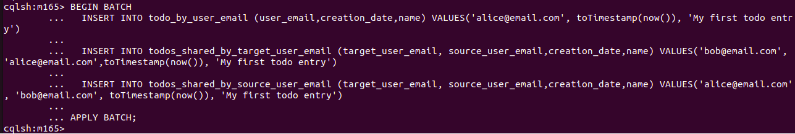{ width="600" }
  <figcaption></figcaption>
</figure>


Let’s look into one of the tables:


`SELECT * FROM todos_shared_by_target_user_email WHERE target_user_email='bob@email.com';`

<figure markdown="span">
  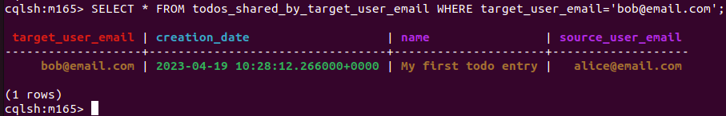{ width="600" }
  <figcaption></figcaption>
</figure>

All the data exists and can be accessed in a performant way using all the defined tables.


### Tombstones

Cassandra is a multi-node cluster that contains **replicated data on different nodes**. **Therefore, a delete can not simply delete a particular record**.

For a delete operation, a new entry is added to the commit-log like for any other insert and update mutation. These deletes are called *tombstones*, and they **flag a specific value for deletion.**

Tombstones exist only on disk and can be analyzed and traced as described in this blog post: [About Deletes and Tombstones in Cassandra.](https://thelastpickle.com/blog/2016/07/27/about-deletes-and-tombstones.html)

In Cassandra, you can set a time to live on inserted data. After the time passed, the record will be automatically deleted. When you set a time to live (`TTL`), a tombstone is created with a date in the future.

In comparison, a regular delete query is the same with the difference that the time date of the tombstone is set to the moment the delete is executed.

Let’s create a tombstone by setting a `TTL` in seconds which basically function as a **delayed delete**:


```
cqlsh>     
INSERT INTO todo_by_user_email (user_email,creation_date,name) VALUES('john@email.com', toTimestamp(now()), 'This entry should be removed soon') USING TTL 60;
```


Prüfe mit:
```
SELECT * FROM todo_by_user_email WHERE user_email='john@email.com';
```
Nach 60 Sekunden sollte der Record nicht mehr vorhanden sein:

<figure markdown="span">
  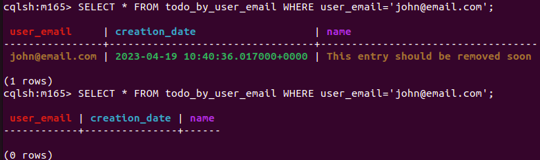{ width="600" }
  <figcaption></figcaption>
</figure>

Setting a TTL is one of many ways to  create and execute tombstones.


Unfortunately, there are also others.

For example, when you insert a null value, a tombstone is created for the given cell. And as mentioned for delete requests, different types of tombstones are stored. 

By default, after 10 days, data that is marked by a tombstone is freed with a *compaction execution*. This time can be configured and reduced using the `gc_grace_seconds` option in the Cassandra configuration.


!!! info "When is a compaction executed?"

    When the operation is executed depends mainly on the selected strategy. In general, a compaction execution takes SSTables and creates new SSTables out of it.
    The most common executions are:    

    * When conditions for a compaction are true, that triggers compaction execution when data is inserted
    * A manually executed major compaction using the `nodetool`

Sometimes, tombstones are not deleted for the following reasons:

* **Null values mark** values to be deleted and are stored as tombstones. This can be avoided by either replacing null with a static value, or not setting the value at all if the value is null
* **Empty lists and sets** are similar to null for Cassandra and create a tombstone, so don’t insert them if they’re empty. Take care to avoid null pointer exceptions when storing and retrieving data in your application
* **Updated lists and sets** create tombstones. If you update an entity and the list or set does not change, it still creates a tombstone to empty the list and set the same values. Therefore, only update necessary fields to avoid issues. The good thing is, they are compacted due to the new values

If you have many tombstones, you might run into another Cassandra issue that prevents a query from being executed.

This happens when the `tombstone_failure_threshold` is reached, which is set by default to 100,000 tombstones. This means that, when a query has iterated over more than 100,000 tombstones, it will be aborted.

The issue here is, once a query stops executing, it’s not easy to tidy things up because Cassandra will stop even when you execute a delete, as it has reached the tombstone limit.


Usually you would never have that many tombstones. But mistakes happen, and you should take care to avoid this case.

### UPDATEs sind INSERTs und INSERTs sind UPDATEs !

In Cassandra, **everything is append-only**. There is **no difference between an update and insert**.

You already learned that a primary key defines the uniqueness of a row. If there is no entry yet, a new row will appear, and if there is already an entry, the entry will be updated. It does not matter if you execute an update or insert a query.

The primary key in our example is set to `user_email` and `creation_date` that defines record uniqueness.

Let’s insert a new record:

```
cqlsh>      
INSERT INTO todo_by_user_email (user_email, creation_date, name) VALUES('john@email.com', '2021-03-14 16:07:19.622+0000', 'Insert query');
```


And execute an update with a new `todo_uuid`:

```
cqlsh>    
UPDATE todo_by_user_email SET 
    name = 'Update query'
  WHERE user_email = 'john@email.com' AND creation_date = '2021-03-14 16:10:19.622+0000';
```
  
  
2 new rows appear in our table:

`SELECT * FROM todo_by_user_email WHERE user_email='john@email.com';`

<figure markdown="span">
  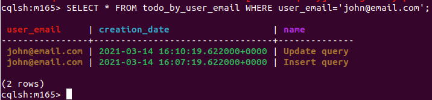{ width="600" }
  <figcaption></figcaption>
</figure>

So you inserted a row using an update, and you can also use an insert to update:

`INSERT INTO todo_by_user_email (user_email,creation_date,name) VALUES('john@email.com', '2021-03-14 16:07:19.622+0000', 'Insert query updated');`

Let’s check our updated row:
```
SELECT * FROM todo_by_user_email WHERE user_email='john@email.com';
```

<figure markdown="span">
  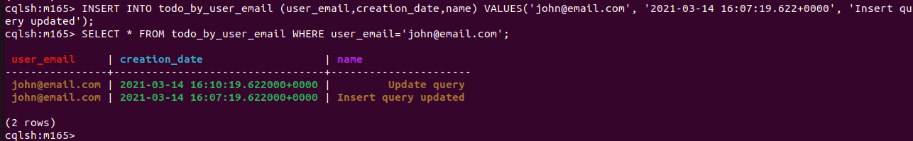{ width="600" }
  <figcaption></figcaption>
</figure>

So `UPDATE` and `INSERT` are technically the same. Don’t think that an `INSERT` fails if there is already a row with the same primary key.

The same applies to an `UPDATE` — it will be executed, even if the row doesn’t exist.

**The reason for this is because, by design, Cassandra rarely reads before writing to keep performance high.**