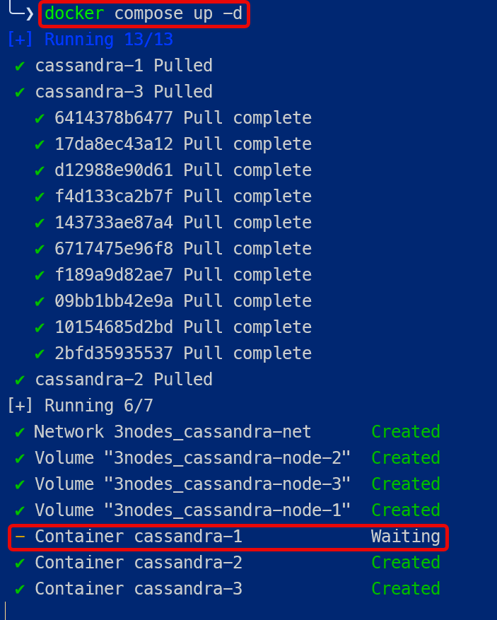
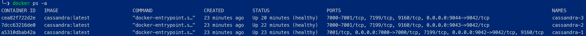
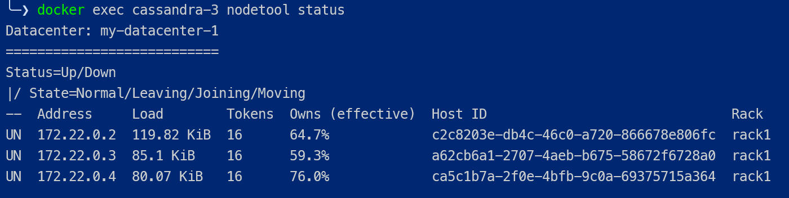

# Apache Cassandra als 3-node Cluster mit docker installieren

das Vorgehen ist gleich, wie bei den vorheregehenden docker-Installationsarbeiten. Verwenden Sie für die aktuellste Version von Cassandra folgendes `docker-compose.yml`

```yaml title="docker-compose.yml"
networks:
  cassandra-net:
    driver: bridge

services:

  cassandra-1:
    image: "cassandra:latest"  # cassandra:5.0.2
    container_name: "cassandra-1"
    ports:
      - 7000:7000
      - 9042:9042
    networks:
      - cassandra-net
    environment:
      - CASSANDRA_START_RPC=true       # default
      - CASSANDRA_RPC_ADDRESS=0.0.0.0  # default
      - CASSANDRA_LISTEN_ADDRESS=auto  # default, use IP addr of container # = CASSANDRA_BROADCAST_ADDRESS
      - CASSANDRA_CLUSTER_NAME=my-cluster
      - CASSANDRA_ENDPOINT_SNITCH=GossipingPropertyFileSnitch
      - CASSANDRA_DC=my-datacenter-1
    volumes:
      - cassandra-node-1:/var/lib/cassandra:rw
    restart:
      on-failure
    healthcheck:
      test: ["CMD-SHELL", "nodetool status"]
      interval: 2m
      start_period: 2m
      timeout: 10s
      retries: 3

  cassandra-2:
    image: "cassandra:latest"
    container_name: "cassandra-2"
    ports:
      - 9043:9042
    networks:
      - cassandra-net
    environment:
      - CASSANDRA_START_RPC=true       # default
      - CASSANDRA_RPC_ADDRESS=0.0.0.0  # default
      - CASSANDRA_LISTEN_ADDRESS=auto  # default, use IP addr of container # = CASSANDRA_BROADCAST_ADDRESS
      - CASSANDRA_CLUSTER_NAME=my-cluster
      - CASSANDRA_ENDPOINT_SNITCH=GossipingPropertyFileSnitch
      - CASSANDRA_DC=my-datacenter-1
      - CASSANDRA_SEEDS=cassandra-1
    depends_on:
      cassandra-1:
        condition: service_healthy
    volumes:
      - cassandra-node-2:/var/lib/cassandra:rw
    restart:
      on-failure
    healthcheck:
      test: ["CMD-SHELL", "nodetool status"]
      interval: 2m
      start_period: 2m
      timeout: 10s
      retries: 3

  cassandra-3:
    image: "cassandra:latest"  # cassandra:5.0.2
    container_name: "cassandra-3"
    ports:
      - 9044:9042
    networks:
      - cassandra-net
    environment:
      - CASSANDRA_START_RPC=true       # default
      - CASSANDRA_RPC_ADDRESS=0.0.0.0  # default
      - CASSANDRA_LISTEN_ADDRESS=auto  # default, use IP addr of container # = CASSANDRA_BROADCAST_ADDRESS
      - CASSANDRA_CLUSTER_NAME=my-cluster
      - CASSANDRA_ENDPOINT_SNITCH=GossipingPropertyFileSnitch
      - CASSANDRA_DC=my-datacenter-1
      - CASSANDRA_SEEDS=cassandra-1
    depends_on:
      cassandra-2:
        condition: service_healthy
    volumes:
      - cassandra-node-3:/var/lib/cassandra:rw
    restart:
      on-failure
    healthcheck:
      test: ["CMD-SHELL", "nodetool status"]
      interval: 2m
      start_period: 2m
      timeout: 10s
      retries: 3

volumes:
  cassandra-node-1:
  cassandra-node-2:
  cassandra-node-3:

```

Hinweise zum compose-file:

Die Blöcke

``` yaml
healthcheck:
      test: ["CMD-SHELL", "nodetool status"]
      interval: 2m
      start_period: 2m
      timeout: 10s
      retries: 3
```

und


``` yaml
depends_on:
      cassandra-1:
        condition: service_healthy
```
und

``` yaml
depends_on:
      cassandra-2:
        condition: service_healthy
```

bewirken, dass `cassandra-3` (node3) erst startet, wenn `cassandra-2` (node2) healty ist. `cassandra-2` (node2) startet erst, wenn `cassandra-1` (node1) ok ist.

Weitere Checks:

* mit dem Befehl `nodetool` innerhalb eines Containers wird der Status nach 2 Min. geprüft. Die nodes haben also 2 Min Zeit zu booten.
* wenn die Antwort innerhalb von 10 sec eintrifft, wird der node als healthy betrachtet
* Die Checks werden alle 2 Minuten gemacht. Max. 3x.


Wenn alle nodes auf einem Rechner laufen, muss jeder Node einen eigenen Port besitzen, ansonsten wird der Cluster, bzw. die 3 Container nicht starten.

```yaml
cassandra-1:
    ...
    ports:
      - 7000:7000
      - 9042:9042

  cassandra-2:
    ...
    ports:
      - 9043:9042

  cassandra-3:
    ...
    ports:
      - 9044:9042
```


nach `docker compose up -d` kann es einen Moment dauern bis alle Cluster-Nodes up sind:

<figure markdown="span">
  { width="300" }
  <figcaption>Das Starten der 3 Cluster-nodes dauert max. 1 Minute </figcaption>
</figure>


Kontrolle im docker-Desktop, ob alle Container laufen. Punkte sind grün!
<figure markdown="span">
  { width="800" }
  <figcaption>3 Cassandra Container-Nodes bilden den Cluster</figcaption>
</figure>

oder mit `docker ps -a`

<figure markdown="span">
  { width="800" }
  <figcaption>Check mit CLI</figcaption>
</figure>


Überprüfen Sie die Stati aller 3 nodes mit

`docker exec cassandra-3 nodetool status`

Erst wenn alle 3 Nodes up sind, ist der Cluster bereit. Jeder Node hat eine eigene IP-Adresse. Diese wird für die Kommunikation unter den Cluster-Nodes verwendet. 

`UN` heisst: `Up` and `Normal`

<figure markdown="span">
  { width="800" }
  <figcaption>Status der Cluster-Nodes</figcaption>
</figure>