# Praktische Aufgaben

## Phasenmodell für den Datenbankentwurf

Die Aufgaben unterliegen dem Modell des Datenbankentwurfs. Hier nochmals in einer grafischen Darstellung.

<figure markdown="span">
  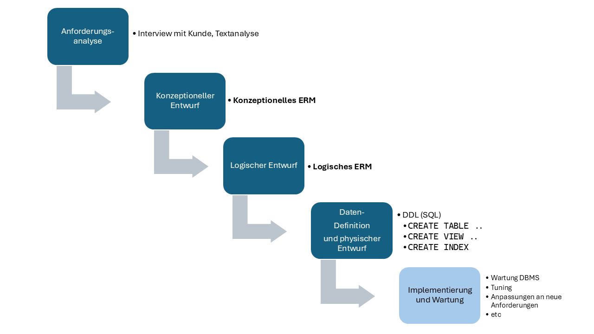{ width="1000" }
  <figcaption>Phasenmodell für den Datenbankentwurf</figcaption>
</figure>


## Aufgabe 1: BIBLIOTHEK

!!! question "UE13-Praxis1 - BIBLIOTHEK"

    ERM1:
    Sie wurden beauftragt, eine Datenbank für eine Bibliothek zu entwerfen. Die Bibliothek möchte ihre Bücher, Autoren, Verlage,     Mitglieder und Ausleihen effizient verwalten. Ihre Aufgabe ist es, ein ERM zu erstellen, das alle relevanten Entitäten und deren     Beziehungen abbildet.
    
    Ihre Aufgabe ist es für folgende Anforderungen ein **konzeptionelles** und ein **logisches** ERM zu erstellen.
    
    Anforderungen:
    
    1.  Entitäten und Attribute:
    
        1.  Buch: ISBN, Titel, Erscheinungsjahr, Seitenzahl, Verlags-ID (Fremdschlüssel)
        2.  Autor: Autor-ID, Vorname, Nachname, Geburtsdatum
        3.  Verlag: Verlags-ID, Name, Adresse
        4.  Mitglied: Mitglied-ID, Vorname, Nachname, Geburtsdatum, Mitgliedsdatum
        5.  Ausleihe: Ausleih-ID, Buch-ISBN (Fremdschlüssel), Mitglieds-ID (Fremdschlüssel), Ausleihdatum Rückgabedatum
    
    
    2.  Beziehungen
    
        1.  Ein Buch kann von mehreren Autoren geschrieben werden, und ein Autor kann mehrere Bücher schreiben.
        2.  Ein Buch wird von einem Verlag verlegt.
        3.  Ein Mitglied kann mehrere Bücher ausleihen, und jedes Buch kann von verschiedenen Mitgliedern ausgeliehen werden.
    
    
??? success "Lösungsvorschlag - BIBLIOTHEK"

    **konzeptionelles ERM**
  
    **Kardinalitäten**

    1.  Ein Buch kann von mehreren Autoren geschrieben werden, und ein Autor kann mehrere Bücher schreiben. (Many-to-Many Beziehung). 
        1.  Daraus folgt, dass eine Zwischentabelle erstellt werden muss: ***Buch_Autor*** mit `Buch-ISBN` und `Autor-ID` als Fremdschlüssel. Kombiniert ergeben sie den Primärschlüssel. **Anmerkung** **hier**: aus einem PK, der aus mehreren FK zusammengesetzt ist, kann ein eigener *künstlicher* PK erstellt werden, z.Bsp. Buch_Autor_ID. Dieser PK wird dann einfach von 1 hochgezählt. Funktional ist diese Methode identisch mit einem zusammengesetzten PK. Die Entscheidung dazu fällen wir beim Erstellen des logischen ERM.
    2.  Ein Buch wird von einem Verlag verlegt und ein Verlag verlegt mehrere Bücher. (One-to-Many Beziehung)
        1.  Ein Buch hat eine `Verlags-ID` als Fremdschlüssel.
    3.  Ein Mitglied kann mehrere Bücher ausleihen, und jedes Buch kann von verschiedenen Mitgliedern ausgeliehen werden. (Many-to-Many Beziehung). 
        1.  Hier wird die Beziehung Buch - Mitglied als m:m beschrieben. Die Beziehung ist die Ausleihe!
        2.  Hier ist etwas offen gelassen: Was ist genau eine Ausleihe? Hat eine Ausleihe mehrere Bücher oder gilt eine Ausleihe pro Buch? Falls eine Ausleihe mehrere Bücher umfassen kann, dann entsteht eine zusätzliche Entität "Ausleihe", in welcher mehrere Bücher erfasst werden können. Wenn jedoch jedes Buch das ausgeliehen wird, als Ausleihe verstanden wird, kann die Beziehung Buch-Mitglied (m:m) direkt als Ausleihe verstanden werden. Die Beziehung Buch - Mitglied ist die Ausleihe! 
        3.  Im Beispiel hier werden wir diesen Fall betrachten. Andernfalls müssten wir die Ausleihe als eigene Entität modellieren und die Beziehungen Ausleihe-Buch und Ausleihe - Mitglied untersuchen.
    
    <figure markdown="span">
    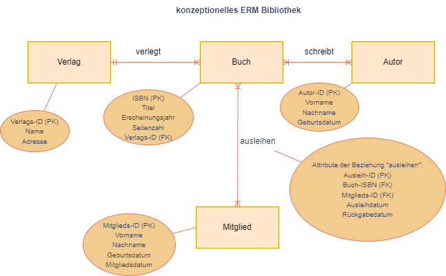{ width="700" }
    <figcaption>Konzeptionelles ERM Bibliothek</figcaption>
    </figure>
    
    **logisches ERM**
    
    <figure markdown="span">
    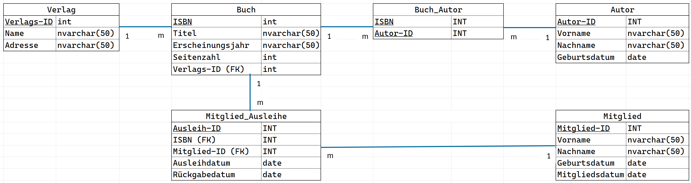{ width="1000" }
    <figcaption>logisches ERM Bibliothek</figcaption>
    </figure>
    

    **ERM mit Beispiel-Records**
    
    diese Darstellungsart zeigt sehr schnell, ob sich die Problemstellung in der DB-Struktur abbilden lässt. 
    Man hat hier nicht so schön Platz, um die Datentypen zu spezifizieren.

    Es ist aber ein guter Test, um sein eigenes Modell zu prüfen. Es ist ebanfalls ein gutes Kommunikationsmittel, um  mit dem Auftraggeber die Problemstellung zu verifizieren. Habe ich das Problem in allen Details verstanden? 

    <figure markdown="span">
    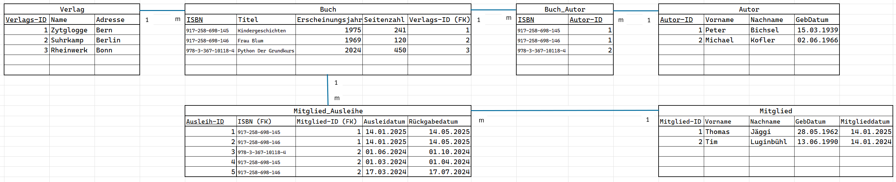{ width="1000" }
    <figcaption>logisches ERM mit Datensätzen als Beispiele</figcaption>
    </figure>


## Aufgabe 2: UNIHOCKEY

!!! question "UE13-Praxis2 - UNIHOCKEY"
    ERM 2:
    
    Ein Unihockeyclub nimmt mit seinem Team, bestehend aus mehreren Spielern, an verschiedenen Turnieren teil. Bei den Turnieren gibt es jeweils mehrere Spiele, die gegen andere Klubs ausgetragen werden. Pro gewonnenes Spiel gibt es 3 Punkte für das     siegreiche Team und pro unentschiedenes Spiel jeweils 1 Punkt für beide Teams. Pro Spiel, werden die erzielten Punkte/Goals protokolliert: der Schütze und die Zeit.
    
    Am Schluss soll eine Übersicht erstellt werden darüber, welche Teams am besten waren.
    
    Beispiel:
    
    ``` bash
    SVSE Unihockey Schweizermeisterschaft
    Name        Gewonnen  Unentschieden  Verloren  Punkte
    Team H          6           0            0       18
    Team F          5           1            0       16
    ....
    Team B          1           2            3       5
    Team I          0           1            5       1
    
    Plauschturnier Misch-Masch-Master
    Name        Gewonnen  Unentschieden  Verloren  Punkte
    Team X          4           0            0       12
    Team Y          3           0            1       9
    ....
    Team W          2           0            2       6
    Team Z          1           1            2       4
    ```
    
    Mit dieser Ausgangslage bekommst Du den Auftrag eine dazugehörige Applikation samt relationalem Datenbank(-Schema) umzusetzen. 
    
    - Aufgabe
    
        * Erstelle die physische Umsetzung der DB mit SQL-Befehlen in MySQL oder SQLite. Füge auch Beispieldatensätze hinzu. Als Grundlage und Hilfestellung, greifst Du auf das vorher erstellte logische ERM zurück.
        * Erstelle ein Python Skript, welches Abfragen auf die erstellte DB ausführt und textlich darstellt.
    

??? success "Lösungsvorschlag - Unihockey-Turnier"
    
    **Kardinalitäten**

    1.  Ein Team besteht aus mehreren Spielern, und jeder Spieler gehört genau zu einem Team. (One-to-Many Beziehung)
    2.  Ein Turnier hat mehrere Spiele, und jedes Spiel gehört zu genau einem Turnier. (One-to-Many Beziehung)
    3.  Jedes Spiel hat zwei Teams, und ein Team kann an mehreren Spielen teilnehmen. (Many-to-Many Beziehung mit Attributen)
    4.  Ein Tor wird in einem bestimmten Spiel von einem bestimmten Spieler erzielt. (One-to-Many Beziehung)
    
    
    **Konzeptionelles ERM**

    <figure markdown="span">
      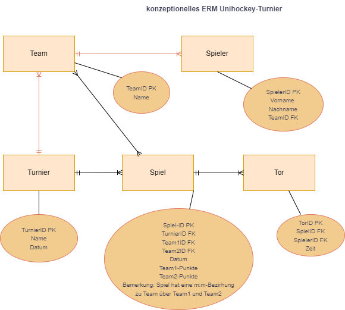{ width="700" }
      <figcaption>Konzeptionelles ERM Unihockey-Turnier</figcaption>
    </figure>

    
    - `Team` hat eine 1:m Beziehung zu `Spieler`.
    - `Spiel` hat eine m:m Beziehung zu `Team` (über Team1 und Team2).
    - `Spiel` hat eine 1:m Beziehung zu `Tor`.
    - `Tor` hat eine 1:m Beziehung zu `Spieler`


    **Logisches ERM mit Demorecords**

    <figure markdown="span">
      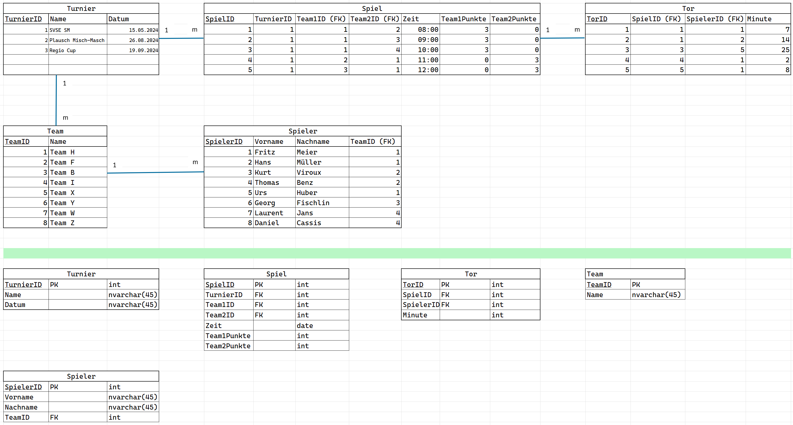{ width="1000" }
      <figcaption>logisches ERM Unihockey-Turnier mit Demo-Records</figcaption>
    </figure>
    
    **Physische Datenbank**

    DATENBANK ERSTELLEN mit

    `sqlite3  .\unihockey-DB.db`

    oder mit 

    DB Browser (SQLite)


    CREATE TABLES:


    ``` SQL
    CREATE TABLE "Team" (
	"TeamID"	INTEGER,
	"Name"	TEXT,
	PRIMARY KEY("TeamID")
    );


    CREATE TABLE "Turnier" (
	"TurnierID"	INTEGER,
	"Name"	TEXT,
	"Datum"	TEXT,
	PRIMARY KEY("TurnierID")
    );

    CREATE TABLE "Team" (
	"TeamID"	INTEGER,
	"Name"	TEXT,
	PRIMARY KEY("TeamID")
    );


    CREATE TABLE "Spieler" (
	"SpielerID"	INTEGER,
	"Vorname"	TEXT,
	"Name"	TEXT,
	"TeamID"	INTEGER,
	PRIMARY KEY("SpielerID"),
	FOREIGN KEY(TeamID) REFERENCES Team(TeamID)
    );
    
    CREATE TABLE "Spiel" (
	"SpielID"	INTEGER,
	"TurnierID"	INTEGER,
	"Team1ID"	INTEGER,
	"Team2ID"	INTEGER,
	"Zeit"	TEXT,
	"Team1Punkte"	INTEGER,
	"Team2Punkte"	INTEGER,
	PRIMARY KEY("SpielID"),
	FOREIGN KEY(TurnierID) REFERENCES Turnier(TurnierID),
	FOREIGN KEY(Team1ID) REFERENCES Team(TeamID),
	FOREIGN KEY(Team2ID) REFERENCES Team(TeamID)
    );


    CREATE TABLE "Tor" (
	"TorID"	INTEGER,
	"SpielID"	INTEGER,
	"SpielerID"	INTEGER,
	"Minute"	INTEGER,
	PRIMARY KEY("TorID"),
	FOREIGN KEY(SpielID) REFERENCES Spiel(SpielID),
	FOREIGN KEY(SpielerID) REFERENCES Spieler(SpielerID)
    );

    


    ```
    
    
    INSERT DEMO DATA:


    ``` SQL
    INSERT INTO Team (TeamID,Name) VALUES (1,"Team H");
    INSERT INTO Team (TeamID,Name) VALUES (2,"Team F");
    INSERT INTO Team (TeamID,Name) VALUES (3,"Team B");
    INSERT INTO Team (TeamID,Name) VALUES (4,"Team I");
    INSERT INTO Team (TeamID,Name) VALUES (5,"Team X");
    INSERT INTO Team (TeamID,Name) VALUES (6,"Team Y");
    INSERT INTO Team (TeamID,Name) VALUES (7,"Team W");
    INSERT INTO Team (TeamID,Name) VALUES (8,"Team Z");

    INSERT INTO Turnier (TurnierID,Name,Datum) VALUES (1,"SVSE SM","2024-07-01");
    INSERT INTO Turnier (TurnierID,Name,Datum) VALUES (2,"Plausch MischMasch","2024-08-02");
    INSERT INTO Turnier (TurnierID,Name,Datum) VALUES (3,"RegioCup","2024-09-11");
    INSERT INTO Turnier (TurnierID,Name,Datum) VALUES (4,"Mix Turnier 24","2024-12-12");
    

    INSERT INTO Spieler (SpielerID,Vorname,Name,TeamID) VALUES (1,"Fritz","Meier",1);
    INSERT INTO Spieler (SpielerID,Vorname,Name,TeamID) VALUES (2,"Hans","Müller",1);
    INSERT INTO Spieler (SpielerID,Vorname,Name,TeamID) VALUES (3,"Kurt","Viroux",2);
    INSERT INTO Spieler (SpielerID,Vorname,Name,TeamID) VALUES (4,"Thomas","Benz",2);
    INSERT INTO Spieler (SpielerID,Vorname,Name,TeamID) VALUES (5,"Urs","Huber",1);
    INSERT INTO Spieler (SpielerID,Vorname,Name,TeamID) VALUES (6,"Georg","Fischlin",3);
    INSERT INTO Spieler (SpielerID,Vorname,Name,TeamID) VALUES (7,"Laurent","Jans",4);
    INSERT INTO Spieler (SpielerID,Vorname,Name,TeamID) VALUES (8,"Daniel","Cassis",4);

    INSERT INTO Spiel (SpielID,TurnierID,Team1ID,Team2ID,Zeit,Team1Punkte,Team2Punkte) VALUES (1,1,1,2,"08:00",3,0);
    INSERT INTO Spiel (SpielID,TurnierID,Team1ID,Team2ID,Zeit,Team1Punkte,Team2Punkte) VALUES (2,1,1,3,"09:00",3,0);
    INSERT INTO Spiel (SpielID,TurnierID,Team1ID,Team2ID,Zeit,Team1Punkte,Team2Punkte) VALUES (3,1,1,4,"10:00",3,0);
    INSERT INTO Spiel (SpielID,TurnierID,Team1ID,Team2ID,Zeit,Team1Punkte,Team2Punkte) VALUES (4,1,2,1,"11:00",0,3);
    INSERT INTO Spiel (SpielID,TurnierID,Team1ID,Team2ID,Zeit,Team1Punkte,Team2Punkte) VALUES (5,1,3,1,"12:00",0,3);


    INSERT INTO Tor (TorID,SpielID,SpielerID,Minute) VALUES (1,1,1,7);
    INSERT INTO Tor (TorID,SpielID,SpielerID,Minute) VALUES (2,1,2,14);
    INSERT INTO Tor (TorID,SpielID,SpielerID,Minute) VALUES (3,3,5,25);
    INSERT INTO Tor (TorID,SpielID,SpielerID,Minute) VALUES (4,4,1,2);
    INSERT INTO Tor (TorID,SpielID,SpielerID,Minute) VALUES (5,5,1,8);
    ```

    SQL-QUERY: *Wie erhält man die Punkte pro Team?*

    ``` SQL
    SELECT 
        team.name,
        SUM(CASE 
            WHEN spiel.team1punkte > spiel.team2punkte THEN 
                CASE WHEN team.teamid = spiel.team1id THEN 3 ELSE 0 END
            WHEN spiel.team1punkte < spiel.team2punkte THEN 
                CASE WHEN team.teamid = spiel.team2id THEN 3 ELSE 0 END
            WHEN spiel.team1punkte = spiel.team2punkte THEN 
                CASE WHEN team.teamid = spiel.team1id OR team.teamid = spiel.team2id THEN 1 ELSE 0 END
        END) AS punkte
    FROM 
        team
    LEFT JOIN 
        spiel ON team.teamid = spiel.team1id OR team.teamid = spiel.team2id
    GROUP BY 
        team.name;    

    ```

    Resultat mit vorhandenen Demo-Daten:

    <figure markdown="span">
      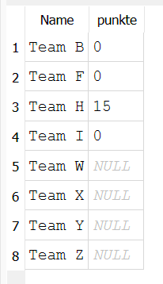{ width="100" }
      <figcaption>Punkte pro Team</figcaption>
    </figure>

    Und nun noch ein Python-Skript, welches die Datenbank mit den Tabellen erstellt, Demodatensätze einfügt und eine Abfrage macht:

    ```py linenums="1" title="Python-Skript zum Erstellen der SQLite-DB mit Tabellen, Demorecords und Query"
    
    import sqlite3
    
    # Verbindung zur SQLite-Datenbank herstellen (oder erstellen, falls sie nicht existiert)
    connection = sqlite3.connect('UniHockeyTurnier.db')    

    # Einen Cursor erstellen, um SQL-Befehle auszuführen
    cursor = connection.cursor()    

    # SQL-Befehle zum Erstellen der Tabellen
    create_tables_query = """
    CREATE TABLE IF NOT EXISTS Team (
        TeamID INTEGER PRIMARY KEY,
        Name TEXT
    );    

    CREATE TABLE IF NOT EXISTS Turnier (
        TurnierID INTEGER PRIMARY KEY,
        Name TEXT,
        Datum TEXT
    );    

    CREATE TABLE IF NOT EXISTS Spieler (
        SpielerID INTEGER PRIMARY KEY,
        Vorname TEXT,
        Name TEXT,
        TeamID INTEGER,
        FOREIGN KEY(TeamID) REFERENCES Team(TeamID)
    );    

    CREATE TABLE IF NOT EXISTS Spiel (
        SpielID INTEGER PRIMARY KEY,
        TurnierID INTEGER,
        Team1ID INTEGER,
        Team2ID INTEGER,
        Zeit TEXT,
        Team1Punkte INTEGER,
        Team2Punkte INTEGER,
        FOREIGN KEY(TurnierID) REFERENCES Turnier(TurnierID),
        FOREIGN KEY(Team1ID) REFERENCES Team(TeamID),
        FOREIGN KEY(Team2ID) REFERENCES Team(TeamID)
    );    

    CREATE TABLE IF NOT EXISTS Tor (
        TorID INTEGER PRIMARY KEY,
        SpielID INTEGER,
        SpielerID INTEGER,
        Minute INTEGER,
        FOREIGN KEY(SpielID) REFERENCES Spiel(SpielID),
        FOREIGN KEY(SpielerID) REFERENCES Spieler(SpielerID)
    );
    """    

    # Ausführung der SQL-Befehle
    cursor.executescript(create_tables_query)    

    # Datensätze einfügen
    insert_data_query = """
    INSERT INTO Team (TeamID, Name) VALUES 
    (1, 'Team H'), (2, 'Team F'), (3, 'Team B'), (4, 'Team I'), 
    (5, 'Team X'), (6, 'Team Y'), (7, 'Team W'), (8, 'Team Z');    

    INSERT INTO Turnier (TurnierID, Name, Datum) VALUES 
    (1, 'SVSE SM', '2024-07-01'), (2, 'Plausch MischMasch', '2024-08-02'), 
    (3, 'RegioCup', '2024-09-11'), (4, 'Mix Turnier 24', '2024-12-12');    

    INSERT INTO Spieler (SpielerID, Vorname, Name, TeamID) VALUES 
    (1, 'Fritz', 'Meier', 1), (2, 'Hans', 'Müller', 1), (3, 'Kurt', 'Viroux', 2), 
    (4, 'Thomas', 'Benz', 2), (5, 'Urs', 'Huber', 1), (6, 'Georg', 'Fischlin', 3), 
    (7, 'Laurent', 'Jans', 4), (8, 'Daniel', 'Cassis', 4);    

    INSERT INTO Spiel (SpielID, TurnierID, Team1ID, Team2ID, Zeit, Team1Punkte, Team2Punkte) VALUES 
    (1, 1, 1, 2, '08:00', 3, 0), (2, 1, 1, 3, '09:00', 3, 0), (3, 1, 1, 4, '10:00', 3, 0), 
    (4, 1, 2, 1, '11:00', 0, 3), (5, 1, 3, 1, '12:00', 0, 3);    

    INSERT INTO Tor (TorID, SpielID, SpielerID, Minute) VALUES 
    (1, 1, 1, 7), (2, 1, 2, 14), (3, 3, 5, 25), (4, 4, 1, 2), (5, 5, 1, 8);
    """    

    # Ausführung der SQL-Befehle
    cursor.executescript(insert_data_query)    

    # Abfrage ausführen und Ergebnisse anzeigen
    query = """
    SELECT team.name, SUM(
        CASE 
            WHEN spiel.team1punkte > spiel.team2punkte THEN 
                CASE WHEN team.teamid = spiel.team1id THEN 3 ELSE 0 END
            WHEN spiel.team1punkte < spiel.team2punkte THEN 
                CASE WHEN team.teamid = spiel.team2id THEN 3 ELSE 0 END
            WHEN spiel.team1punkte = spiel.team2punkte THEN 
                CASE WHEN team.teamid = spiel.team1id OR team.teamid = spiel.team2id THEN 1 ELSE 0 END
        END) AS punkte
    FROM team
    LEFT JOIN spiel ON team.teamid = spiel.team1id OR team.teamid = spiel.team2id
    GROUP BY team.name;
    """    

    cursor.execute(query)
    results = cursor.fetchall()    

    # Ergebnisse ausgeben
    for row in results:
        print(f"Team: {row[0]}, Punkte: {row[1]}")    

    # Änderungen speichern und Verbindung schliessen
    connection.commit()
    connection.close()    

    print("Datenbank und Tabellen erfolgreich erstellt, Datensätze eingefügt und Abfrage ausgeführt.")
    ```
    
    Ausgabe:

    <figure markdown="span">
      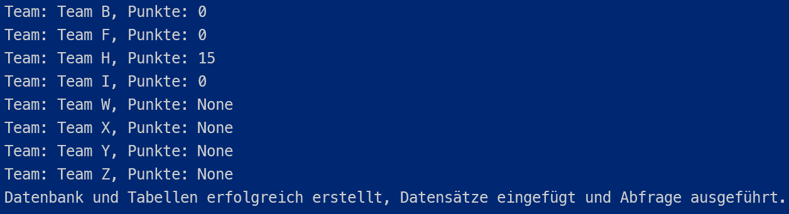{ width="500" }
      <figcaption>Ausgabe der Punkte pro Team</figcaption>
    </figure>

    
    und hier noch ein Python-Skript, welches die Punktestände pro Team mit Hilfe von Pandas durchführt:


    ```py linenums="1" title="Python-Skript-Auswertung der Punktestände mit Pandas"
    import sqlite3
    import pandas as pd    

    # Verbindung zur SQLite-Datenbank herstellen
    connection = sqlite3.connect('UniHockeyTurnier.db')    

    # Name und Datum des Turniers
    turnier_name = 'SVSE SM'
    turnier_datum = '2024-07-01'    

    # Abfrage der relevanten Tabellen in DataFrames laden
    teams_df = pd.read_sql_query("SELECT * FROM Team", connection)
    spiele_df = pd.read_sql_query(f"""
    SELECT * 
    FROM Spiel 
    WHERE TurnierID = (SELECT TurnierID FROM Turnier WHERE Name = '{turnier_name}' AND Datum = '{turnier_datum}')
    """, connection)    

    # Berechnung der Punkte pro Team
    punkte_df = pd.DataFrame()
    punkte_df['TeamID'] = teams_df['TeamID']
    punkte_df['Name'] = teams_df['Name']
    punkte_df['Punkte'] = 0    

    for index, row in spiele_df.iterrows():
        if row['Team1Punkte'] > row['Team2Punkte']:
            punkte_df.loc[punkte_df['TeamID'] == row['Team1ID'], 'Punkte'] += 3
        elif row['Team1Punkte'] < row['Team2Punkte']:
            punkte_df.loc[punkte_df['TeamID'] == row['Team2ID'], 'Punkte'] += 3
        else:
            punkte_df.loc[punkte_df['TeamID'] == row['Team1ID'], 'Punkte'] += 1
            punkte_df.loc[punkte_df['TeamID'] == row['Team2ID'], 'Punkte'] += 1    

    # Überschrift erstellen
    print(f"Punktestände für Turnier {turnier_name} vom {turnier_datum}")    

    # Ergebnisse anzeigen
    print(punkte_df[['Name', 'Punkte']])    

    # Verbindung schliessen
    connection.close()

    ```

    Resultat:

    <figure markdown="span">
    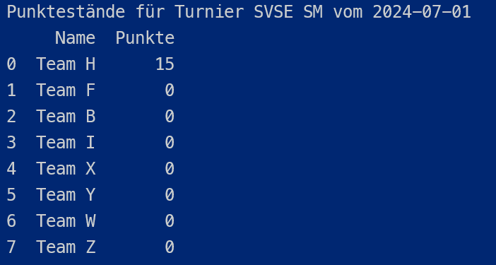{ width="400" }
    <figcaption>Ausgabe der Punkte pro Team mit Überschrift</figcaption>
    </figure>


## Aufgabe 3: CHATAPPLIKATION

!!! question "UE13-Praxis3 - CHATAPPLIKATION"

    Eine Chatapplikation erlaubt es Nutzern sich zu unterhalten. Die Konversationen sind jeweils zwischen zwei oder mehr Teilnehmer. Sobald mehr als zwei Teilnehmer dabei sind, ist es ein Gruppenchat. Es können natürlich Nachrichten im Textformat verschickt werden. Neuerdings werden aber auch Bilder und GIFs unterstützt. Bilder/GIFs werden nicht in der Datenbank abgelegt, sondern jeweils nur ein String, welcher den Pfad der Datei (Bild/GIF) repräsentiert.    

    Am Schluss soll über alle Konversationen hinweg ein Verlauf (nach Zeit sortiert) der Konversation angezeigt werden.    

    Beispiel:    

    ```
    Konversation von Seb + Max
    --------------------------
    16:04 Seb: "Hast Du mir die Lösung für Aufgabe A?"
    16:07 Max: "Ich schicke dir einen Screenshot!"
    16:08 Max: (Media-Nachricht) path/to/file.jpeg    
    

    Gruppenchat zwischen Seb + Dan + Max
    -------------------------
    15:52 Dan: "Habt ihr morgen Abend schon was vor?"
    15:55 Seb: "Nein, was willst Du unternehmen?"
    15:57 Max: "Weihnachstmarkt?"
    ```    
    

    - Aufgabe    

        * Erstelle die physische Umsetzung der DB mit SQL-Befehlen in MySQL oder SQLite. Füge auch Beispieldatensätze hinzu. Als Grundlage und Hilfestellung, greifst Du auf das vorher erstellte konzeptionelle und logische ERM zurück.
        * Erstelle ein Python Skript, welches Abfragen auf die erstellte DB ausführt und textlich darstellt.

??? success "Lösungsvorschlag - Chat-Applikation"

    Dieser Lösungsvorschlag fehlt noch. Wird nachgereicht.

## Aufgabe 4: FORMULA 1

!!! question "UE13-Praxis4 - FORMULA 1"

    Nachfolgend steht Dir eine SQLite-Datenbank zur Verfügung. Es ist Teil der Aufgabe herauszufinden, wie die Datenbank aufgebaut ist und wo welche Informationen gespeichert sind. Die Datenbank hat einige Beziehungen und Tabellen mit ähnlichen (aber nicht gleichen) Informationen. Für Dich bedeutet das, dass es mehrere korrekte Lösungsansätze gibt. Lass Dich also nicht verwirren - studiere die Datenbank und wenn Du die nötigen Informationen hast, schreibe das SELECT dazu.

    - Als Tool um die Datenbank zu öffnen und zu analysieren, kannst Du verschiedene Tools verwenden:
    
        * [DB Browser (SQLite)](https://sqlitebrowser.org/){:target="_blank"} 
        * Eine Alternative ist auch [DBeaver Community](https://dbeaver.io//){:target="_blank"}.
        * Auch die Verwendung von SQLite in der Konsole ist möglich:
        <figure markdown="span">
        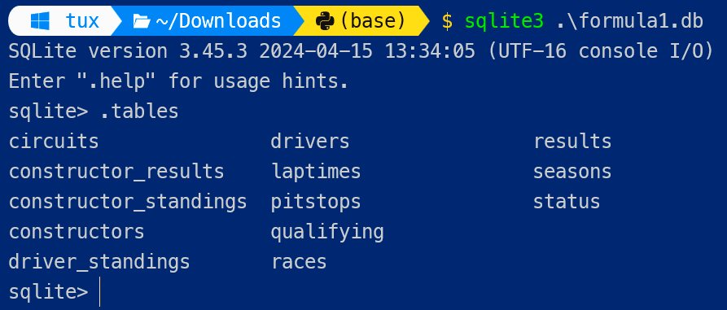{ width="600" }
        <figcaption>SQLite in der Konsole</figcaption>
        </figure>

    !!! danger "Bitte beachten!"
        Es wird an der Prüfung erwartet, dass ein Tool für SQLite und MySQL auf dem Notebook lauffähig ist und bedient werden kann.


    [Download SQLite formula1.db](../static/formula1.db){:download="formula1.db"}


    Dein SELECT soll folgende Übersicht produzieren. Es sollen die erreichten Punkte aller Rennen absteigend sortiert der Season im Jahre **2009** dargestellt werden. Also die erste Zeile soll der Weltmeister mit den meisten Punkten sein: Jenson Button mit 95 Punkten.

    ```
    forename |surname        |total_points|
    ---------+---------------+------------+
    Jenson   |Button         |          95|
    Sebastian|Vettel         |          84|
    Rubens   |Barrichello    |          77|
    Mark     |Webber         |        69.5|
    Lewis    |Hamilton       |          49|
    Kimi     |Kimi Räikkönen |          48|
    Nico     |Rosberg        |        34.5|
    Jarno    |Trulli         |        32.5|
    Fernando |Alonso         |          26|
    Timo     |Glock          |          24|
    Felipe   |Massa          |          22|
    Heikki   |Kovalainen     |          22|
    Nick     |Heidfeld       |          19|
    Robert   |Kubica         |          17|
    .
    .
    ```

    - Hinweise
    
        * Sonderzeichen müssen nicht korrekt dargestellt werden!
        * Die Reihenfolge bei Punktegleichheit spielt keine Rolle!
        * Idealerweise muss nur eine einzelne Zahl (2009) angepasst werden und Dein SQLite produziert auch ein korrektes Resultat für andere Jahre
    
    
### Hilfestellung FORMULA 1-DB

??? info "Hilfestellung"
    Hier siehst Du das ERM der Formula1-DB. 
    
    Hinweis: In der Prüfungsaufgabe war diese Hilfestellung nicht vorhanden.
    
    <figure markdown="span">
    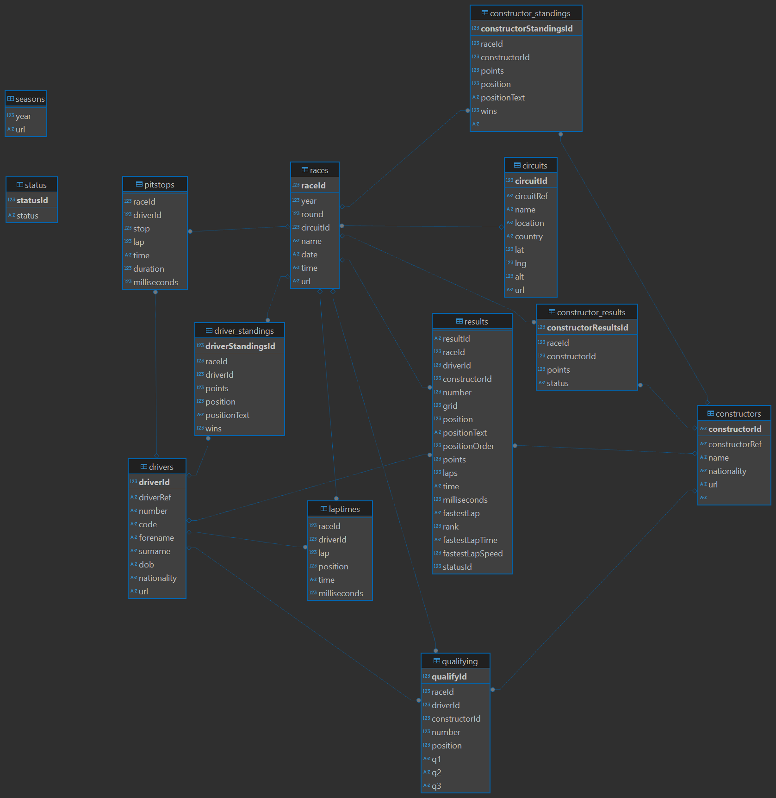{ width="1000" }
    <figcaption>ERM Formula1 Datenbank</figcaption>
    </figure>

    
??? success "Lösungsvorschlag - Formula 1"

    ```SQL
    
    SELECT 
        drivers.forename,drivers.surname, SUM(results.points) as total_points
    FROM 
        drivers
    JOIN 
        results ON drivers.driverId = results.driverId
    JOIN
        races ON races.raceId = results.raceId 
    WHERE 
        races.year  = 2009
    GROUP BY 
        drivers.surname
    ORDER BY 
        total_points DESC
    LIMIT 100
    
    ```
    
    Erklärungen

    * `JOIN`: Verknüpft die `drivers`-Tabelle mit der `results`-Tabelle basierend auf der `driver_id`.
    * `SUM`: Summiert die Punkte (points) für jeden Fahrer. Dies ist eine Aggregatsfunktion, welche von `GROUP BY` benötigt wird.
    * `GROUP BY`: Gruppiert die Ergebnisse nach Fahrernamen. 
    * `ORDER BY`: Sortiert die Ergebnisse nach der Gesamtsumme der Punkte in absteigender Reihenfolge.
    * `LIMIT 1`: Gibt nur den Fahrer mit den meisten Punkten zurück.


    Eine Abfrage auf dem Command-prompt, ohne SQlite starten zu müssen, könnte so gemacht werden:

    `sqlite3  -init abfrage.sql .\formula1.db .quit`

    Hier enthält die Datei `abfrage.sql` das Query und `.quit` verlässt gleich wieder die SQLite-Umgebung:

    <figure markdown="span">
      { width="600" }
      <figcaption>SQLite-Abfrage in einer Zeile</figcaption>
    </figure>
    


## Aufgabe 5: SMARTWATCHES

!!! question "UE13-Praxis5 - SMARTWATCHES"

    Die Auswahl für Smartwatches soll in einem standardisierten Format abgespeichert werden. Die verschiedenen Hersteller haben verschiedene Produkte, welche zu unterschiedlichen Zeitpunkten auf dem Markt erschienen sind. Jede dieser Uhren hat meist spezifische physische Gegebenheiten (Grösse, Gewicht, Display, etc). Die Uhren haben auch Eigenschaften, welche sie teilen. Nennen wir sie verschiedene Funktionalitäten (Features). Ein Beispiel könnte sein Pulssensor, Wasserdichtheit und viele weitere.
    
    - Aufgabe
    
        * Erstellen Sie dazu ein konzeptionelles und logisches ERM
        * Erstellen Sie die Datenbank physisch mit einer DB und einem Tool ihrer Wahl inkl. Demodaten. Erstellen Sie dazu ein SQL-Skript, welches alles enthält: Erstellung des Schemas, Kreieren der Tabellen mit Constraints, Laden von Demodatensätzen.
        * Auch hier sollten sie mit Python auf die DB zugreifen können und Abfragen ausühren.

??? success "Lösungsvorschlag - SMARTWATCHES"

    **KARDINALITÄTEN**

    * Ein Hersteller hat mehrere Produkte. (One-to-Many Beziehung)
    * Ein Produkt kann mehrere Features haben, und ein Feature kann zu mehreren Produkten gehören. (Many-to-Many Beziehung). Features bezeichnen physische Eigenschaften der Uhr, welche in der Beziehung Produkt-Feature als Attribut erfasst werden kann.


    
    **Konzeptionelles ERM SMARTWATCHES**

    <figure markdown="span">
      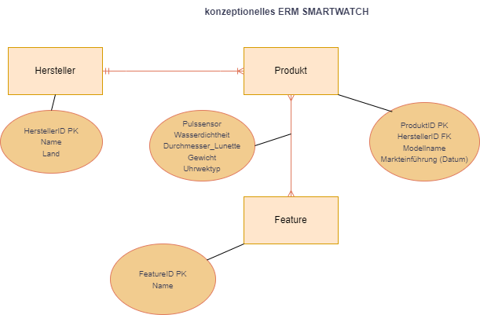{ width="700" }
      <figcaption>konzeptionelles ERM SMARTWATCHES</figcaption>
    </figure>

    Die m:m - Beziehung bedingt eine Zwischentabelle `Produkt_Feature`. Darin können wir die physischen Eigenschaften mit Attributen abbilden.

    **Logisches ERM SMARTWATCHES**

    <figure markdown="span">
      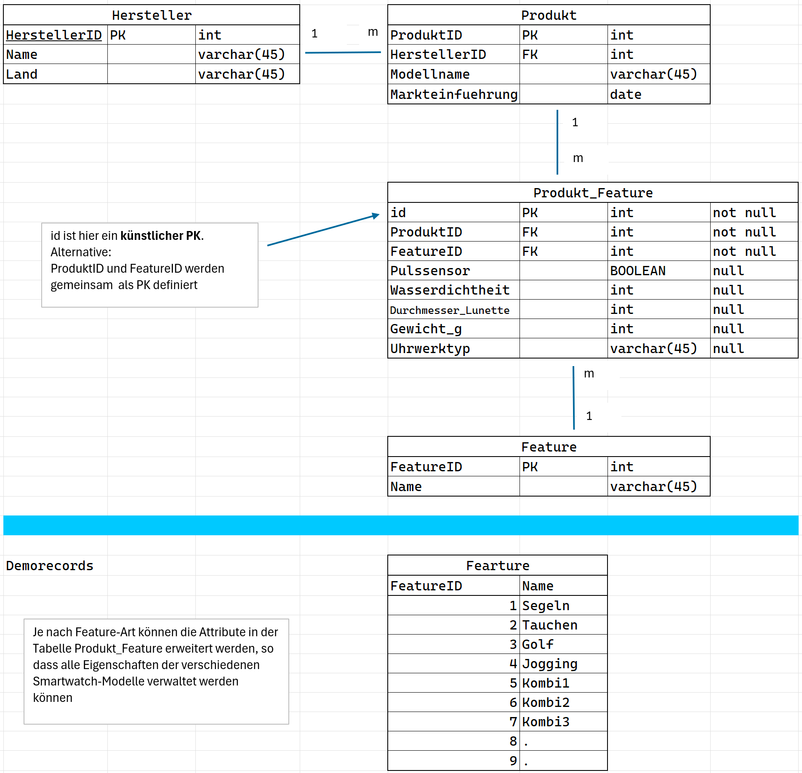{ width="700" }
      <figcaption>logisches ERM SMARTWATCHES</figcaption>
    </figure>

    **Python-Skript zum Erstellen einer MySQL-Datenbank und der Tabellen**

    ```py linenums="1" title="Erstellung der Smartwatch-Datenbank mit Tabellen"
    import mysql.connector
    from mysql.connector import errorcode
    
    # Verbindung zur MySQL-Datenbank herstellen
    try:
        connection = mysql.connector.connect(
            host='localhost',
            user='tom',
            password='passwort'
        )
    
        cursor = connection.cursor()
    
        # Datenbank erstellen
        try:
            cursor.execute("CREATE DATABASE SMARTWATCHES_V1")
            print("Datenbank 'SMARTWATCHES_V1' erfolgreich erstellt.")
        except mysql.connector.Error as err:
            if err.errno == errorcode.ER_DB_CREATE_EXISTS:
                print("Datenbank 'SMARTWATCHES_V1' existiert bereits.")
            else:
                print(f"Fehler beim Erstellen der Datenbank: {err}")
    
        # Verbindung zur erstellten Datenbank
        connection.database = 'SMARTWATCHES_V1'
    
        # Tabelle Hersteller erstellen
        create_table_hersteller_query = """
        CREATE TABLE Hersteller (
            HerstellerID INT AUTO_INCREMENT PRIMARY KEY,
            Name VARCHAR(255),
            Land VARCHAR(255)
        )
        """
        cursor.execute(create_table_hersteller_query)
        print("Tabelle 'Hersteller' erfolgreich erstellt.")
    
        # Tabelle Produkt erstellen
        create_table_produkt_query = """
        CREATE TABLE Produkt (
            ProduktID INT AUTO_INCREMENT PRIMARY KEY,
            HerstellerID INT,
            Modellname VARCHAR(255),
            Markteinführung DATE,
            FOREIGN KEY (HerstellerID) REFERENCES Hersteller(HerstellerID)
        )
        """
        cursor.execute(create_table_produkt_query)
        print("Tabelle 'Produkt' erfolgreich erstellt.")
    
        # Tabelle Feature erstellen
        create_table_feature_query = """
        CREATE TABLE Feature (
            FeatureID INT AUTO_INCREMENT PRIMARY KEY,
            Name VARCHAR(255)
        )
        """
        cursor.execute(create_table_feature_query)
        print("Tabelle 'Feature' erfolgreich erstellt.")
    
        # Zwischentabelle Produkt_Feature erstellen
        create_table_produkt_feature_query = """
        CREATE TABLE Produkt_Feature (
            id INT AUTO_INCREMENT PRIMARY KEY,
            ProduktID INT,
            FeatureID INT,
            Pulssensor BOOLEAN NULL,
            Wasserdichtheit INT NULL,
            Durchmesser_Lunette INT NULL,
            Gewicht_g INT NULL,
            Uhrwerktyp TEXT NULL,
            FOREIGN KEY (ProduktID) REFERENCES Produkt(ProduktID),
            FOREIGN KEY (FeatureID) REFERENCES Feature(FeatureID)
        )
        """
        cursor.execute(create_table_produkt_feature_query)
        print("Tabelle 'Produkt_Feature' erfolgreich erstellt.")
    
    except mysql.connector.Error as err:
        print(f"Fehler: {err}")
        connection = None
    finally:
        if connection and connection.is_connected():
            cursor.close()
            connection.close()
            print("MySQL-Verbindung geschlossen.")
    ```


    
    **Python-Skript zum Laden von Demodaten in die MySQL-DB**
    

    ```py linenums="1" title="Laden von Demodaten"

    import mysql.connector
    from mysql.connector import errorcode
    
    # Verbindung zur MySQL-Datenbank herstellen
    try:
        connection = mysql.connector.connect(
            host='dbserver.winglabs.ch',
            user='meinuser',
            password='meinpasswort',
            database='SMARTWATCHES_V1'
        )
    
        cursor = connection.cursor()
    
        # Demodaten für die Tabelle Hersteller einfügen
        insert_hersteller_query = """
        INSERT INTO Hersteller (Name, Land) VALUES
        ('Apple', 'USA'),
        ('Samsung', 'Südkorea'),
        ('Garmin', 'Schweiz'),
        ('Fitbit', 'USA'),
        ('Huawei', 'China')
        """
        cursor.execute(insert_hersteller_query)
        print("Demodaten in Tabelle 'Hersteller' eingefügt.")
    
        # Demodaten für die Tabelle Produkt einfügen
        insert_produkt_query = """
        INSERT INTO Produkt (HerstellerID, Modellname, Markteinführung) VALUES
        (1, 'Apple Watch Series 7', '2021-09-14'),
        (2, 'Samsung Galaxy Watch 4', '2021-08-11'),
        (3, 'Garmin Fenix 6', '2019-08-29'),
        (4, 'Fitbit Charge 5', '2021-08-25'),
        (5, 'Huawei Watch GT 2', '2019-10-23')
        """
        cursor.execute(insert_produkt_query)
        print("Demodaten in Tabelle 'Produkt' eingefügt.")
    
        # Demodaten für die Tabelle Feature einfügen
        insert_feature_query = """
        INSERT INTO Feature (Name) VALUES
        ('Pulsmessung'),
        ('Schlaftracking'),
        ('GPS'),
        ('Wasserdicht'),
        ('Bluetooth')
        """
        cursor.execute(insert_feature_query)
        print("Demodaten in Tabelle 'Feature' eingefügt.")
    
        # Demodaten für die Tabelle Produkt_Feature einfügen
        insert_produkt_feature_query = """
        INSERT INTO Produkt_Feature (ProduktID, FeatureID, Pulssensor, Wasserdichtheit, Durchmesser_Lunette, Gewicht_g,     Uhrwerktyp) VALUES
        (1, 1, TRUE, 50, 44, 38, 'Elektronisch'),
        (1, 4, NULL, 50, NULL, NULL, NULL),
        (2, 1, TRUE, 50, 44, 30, 'Elektronisch'),
        (2, 3, NULL, NULL, NULL, NULL, 'Elektronisch'),
        (3, 3, NULL, 100, 47, 83, 'Elektronisch'),
        (4, 1, TRUE, 50, 35, 24, 'Elektronisch'),
        (5, 2, NULL, 50, 46, 41, 'Elektronisch'),
        (5, 4, NULL, 50, NULL, NULL, NULL)
        """
        cursor.execute(insert_produkt_feature_query)
        print("Demodaten in Tabelle 'Produkt_Feature' eingefügt.")
    
        connection.commit()
    
    except mysql.connector.Error as err:
        print(f"Fehler: {err}")
    finally:
        if connection.is_connected():
            cursor.close()
            connection.close()
            print("MySQL-Verbindung geschlossen.")
    ```


    ```py linenums="1" title="einfache Query: Liste der Modelle mit Feature"

    import mysql.connector

    # Verbindung zur MySQL-Datenbank herstellen
    try:
        connection = mysql.connector.connect(
            host='localhost',
            user='dein_user',
            password='passwort',
            database='SMARTWATCHES_V1'
        )
    
        cursor = connection.cursor()
    
        # Abfrage erstellen
        query = """
        SELECT Produkt.Modellname, Feature.Name AS Feature
        FROM Produkt_Feature
        JOIN Produkt ON Produkt_Feature.ProduktID = Produkt.ProduktID
        JOIN Feature ON Produkt_Feature.FeatureID = Feature.FeatureID
        """
    
        cursor.execute(query)
        results = cursor.fetchall()
    
        # Ergebnisse anzeigen
        for row in results:
            print(f"Modellname: {row[0]}, Feature: {row[1]}")
    
    except mysql.connector.Error as err:
        print(f"Fehler: {err}")
    finally:
        if connection.is_connected():
            cursor.close()
            connection.close()
            print("MySQL-Verbindung geschlossen.")
    


    ```

    **Resultat der Abfrage:**

    <figure markdown="span">
      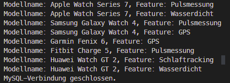{ width="1000" }
      <figcaption>einfache Abfrage der Smartwatch-DB</figcaption>
    </figure>

    

    

